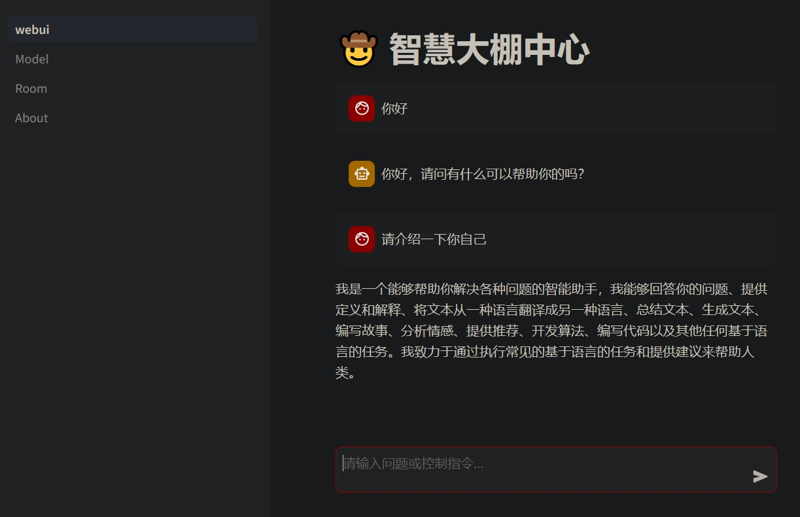
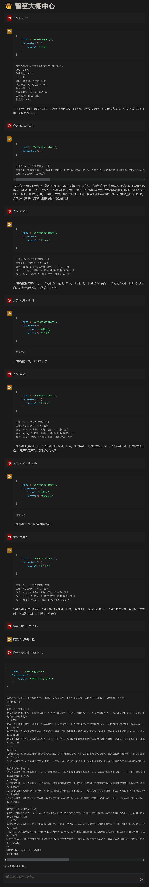
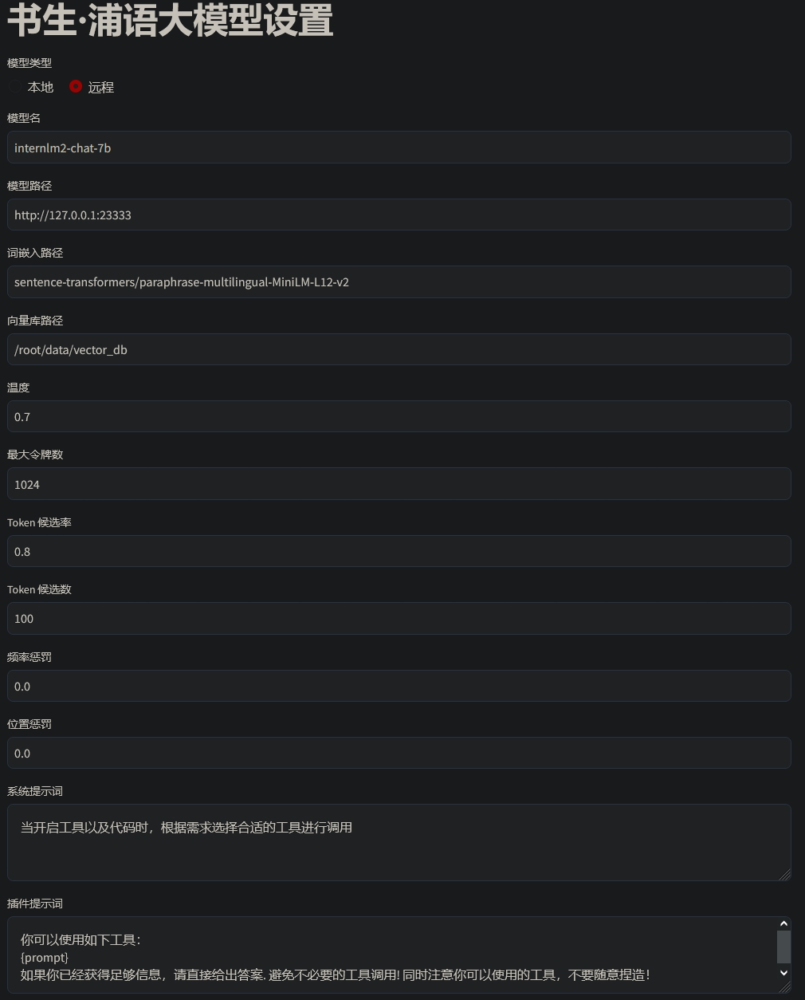
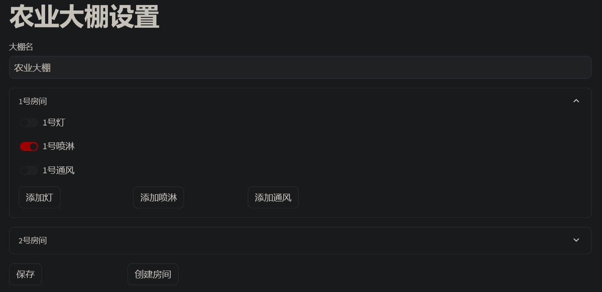

# 基于书生浦语的农业助手
书生.浦语大模型实战营实训项目

## 项目介绍
农业助手是一款基于物联网技术的智能农业解决方案，旨在帮助农户实现大棚环境的自动控制和优化。它通过连接各种传感器和执行器，可以实时监测大棚内的温度、湿度、光照等环境参数，并根据预设的规则和算法自动调节灯光、通风、遮阳、保温、灌溉、施肥等设备，以保持适宜的作物生长环境。此外，智慧大棚助手还提供了远程监控和数据管理功能，方便农户随时随地了解大棚状态和作物生长情况。

## 功能模块：
- 设备管理模块实现基于语音命令的大棚内设备管理
- 知识库模块实现常规农业知识问答
- 天气模块实现即时天气查询

## 项目进度与大作业
- [x] 基础UI界面 - [基于 Streamlit 的应用](https://docs.streamlit.io/get-started/tutorials)
- [x] 知识库数据准备 - [RAG 智能助理](https://github.com/InternLM/Tutorial/tree/camp2/huixiangdou)
- [x] 天气工具 - [自定义工具](https://github.com/InternLM/Tutorial/blob/camp2/agent/homework.md#%E8%BF%9B%E9%98%B6%E4%BD%9C%E4%B8%9A)
- [x] 知识库工具 - [LAgent 中实现 RAG 工具](https://github.com/InternLM/Tutorial/blob/camp2/agent/homework.md#%E7%AE%97%E6%B3%95%E6%96%B9%E5%90%91)
- [x] 大棚助手工具 - [智能体应用](https://github.com/InternLM/Tutorial/blob/camp2/agent/homework.md#%E5%BA%94%E7%94%A8%E6%96%B9%E5%90%91)
- [x] 改进知识库提升表现 - [茴香豆](https://github.com/InternLM/Tutorial/blob/camp2/huixiangdou/homework.md#b%E7%AE%97%E6%B3%95%E6%96%B9%E5%90%91%E5%B0%9D%E8%AF%95%E4%BF%AE%E6%94%B9-good_questionsjson%E8%B0%83%E8%AF%95-prompt-%E6%88%96%E5%BA%94%E7%94%A8%E5%85%B6%E4%BB%96-nlp-%E6%8A%80%E6%9C%AF%E5%A6%82%E5%85%B6%E4%BB%96-chunk-%E6%96%B9%E6%B3%95%E6%8F%90%E9%AB%98%E4%B8%AA%E4%BA%BA%E5%B7%A5%E4%BD%9C%E5%8A%A9%E6%89%8B%E7%9A%84%E8%A1%A8%E7%8E%B0)

## 演示截图
主界面

聊天交互

模型配置

大棚配置

## 相关资源链接
- 基于 [书生.浦语](https://github.com/internLM/internLM) 的农业知识库自助问答
- 基于 [lagent](https://github.com/InternLM/lagent) 自定义工具的指令操控
- 在线学习教程：https://github.com/InternLM/Tutorial/tree/camp2
- 在线视频教程：https://www.bilibili.com/video/BV1Vx421X72D
- 作业与笔记：https://github.com/csg2008/InternLMAgricultureAssistant/tree/main/note