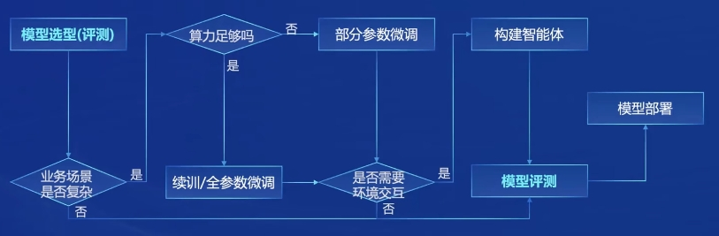
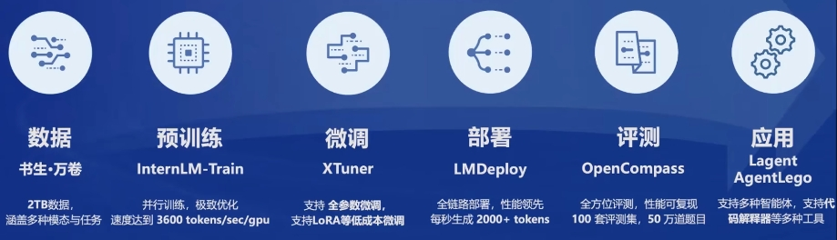
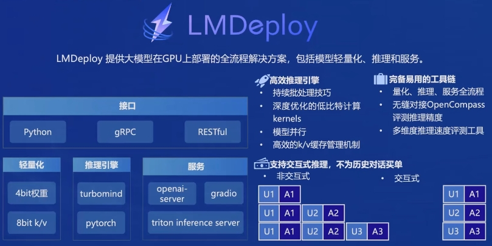

# 书生浦语大模型开源体系学习笔记

## 一、人工智能发懂的历程: 专用模型 => 通用模型
专用模型：为解决特定领域问题创建的模型，仅能覆盖特定专业问题，当前在工业领域应用的比较多。代表性作品：ImageNet图片分类、AlphaGo围棋对战、AlphaFold蛋白质折叠、人脸识别认证、OCR文字转换、语音识别

通用模型：以解决多种领域或任务为目标开发的模型，能够很好的覆盖日常问题，也被认为是实现通用人工智能的重要途径。代表性作品：书生浦语、通义千问、ChatGPT

## 二、书生浦语模型开源历程
```
| 2023/6/7 |      |  2023/8/21  |      |   2023/9/20  |     |  2024/1/17  |
|----------|  ->  | ----------- |  ->  |--------------|  -> |-------------|
| InternLM |      | InternLM-7B |      | InternLM-20B |     |  InternLM2  |
| 初始发布  |      |  支持智能体  |      | 工具链全升级  |     | 性能全面提升 |
```

## 三、InternLM2 的体系与选择参考
```
----- 模型参数 --------------------- 基座 ----------------- 场景选择 ------
1.8B 便携：智能终端          \                     /    InternLM2: 嵌入应用
  7B 轻量：开发学习   -------->  InternLM2-Base   ->
  20 实用：综合应用          /                     \    InternLM2-Chat: 聊天应用
```

## 四、InternLM2 的亮点
```
  长上下文           综合性能强             配套工具体系完善                  生态丰富
---------------------------------------------------------------------------------------
 8K -> 200K      推理、数学、推理         XTuner:     模型微调              LMDeploy
                数据分析比肩GPT3.5       LMDeploy:    模型部署              ModelScope
                                        Lagent：     轻量智能体            HuggingFace
                                        AgentLego:   智能体工具箱
                                        OpenCompass: 模型评测
```

## 五、从模型到应用
- 模型应用方向参考：智能客服、个人助手、行业应用
- 模型选型与应用流程参考


## 六、完善的工具体系


## 七、模型部署参考
