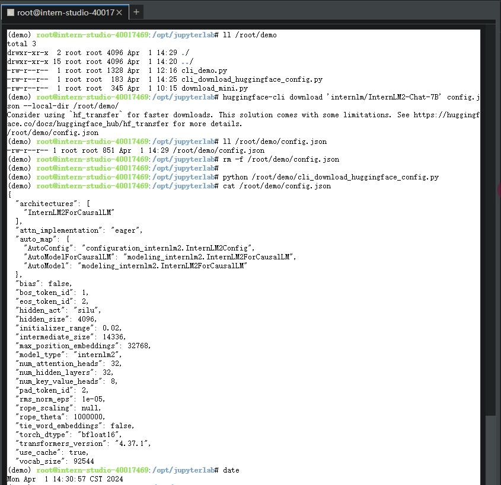
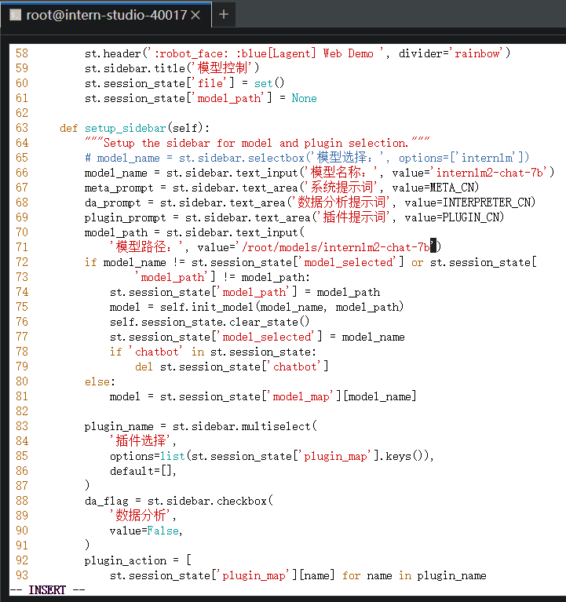
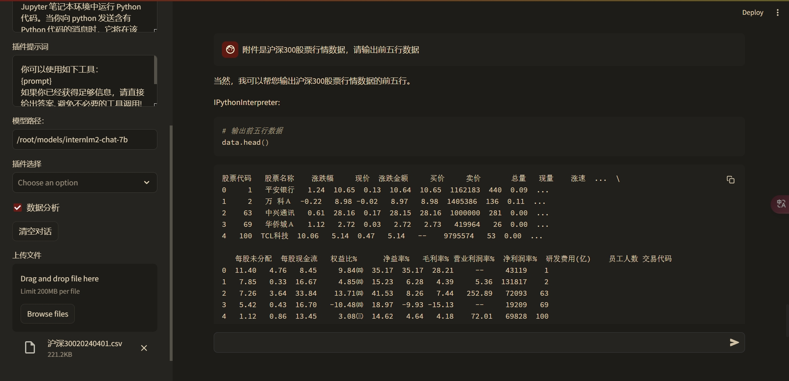
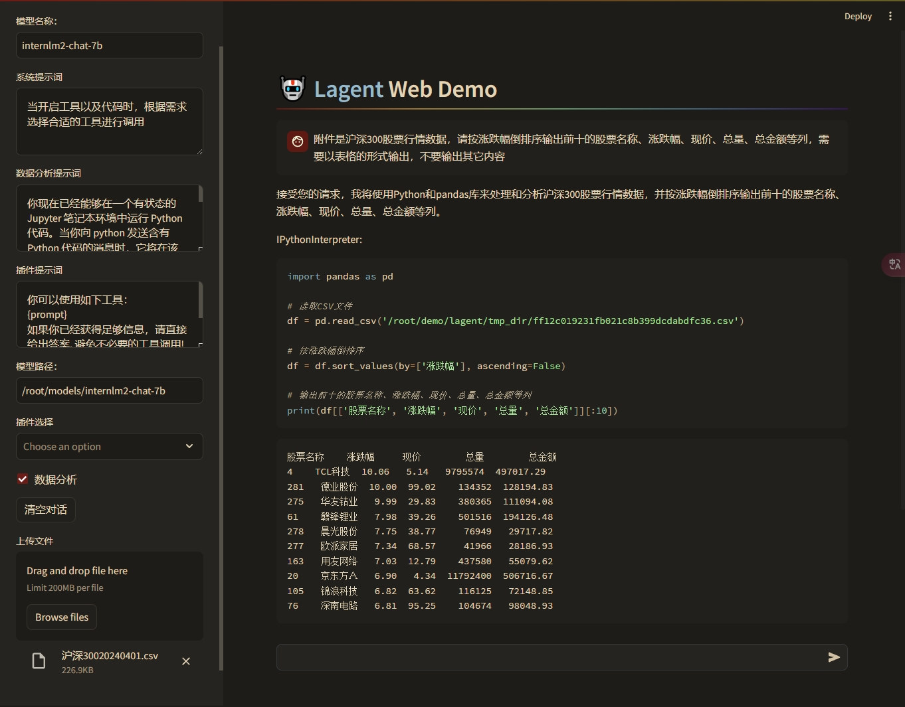
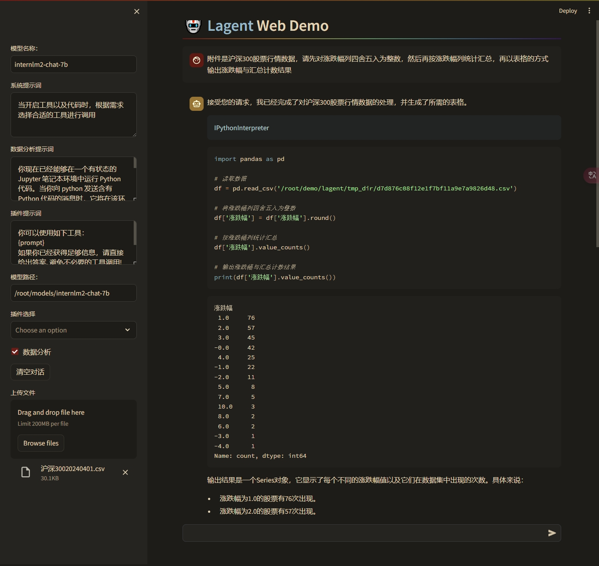
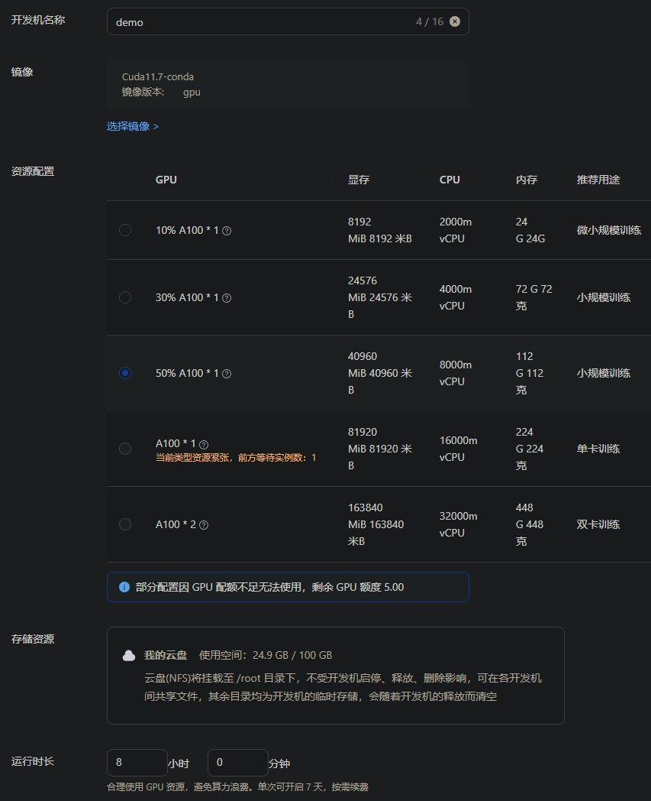
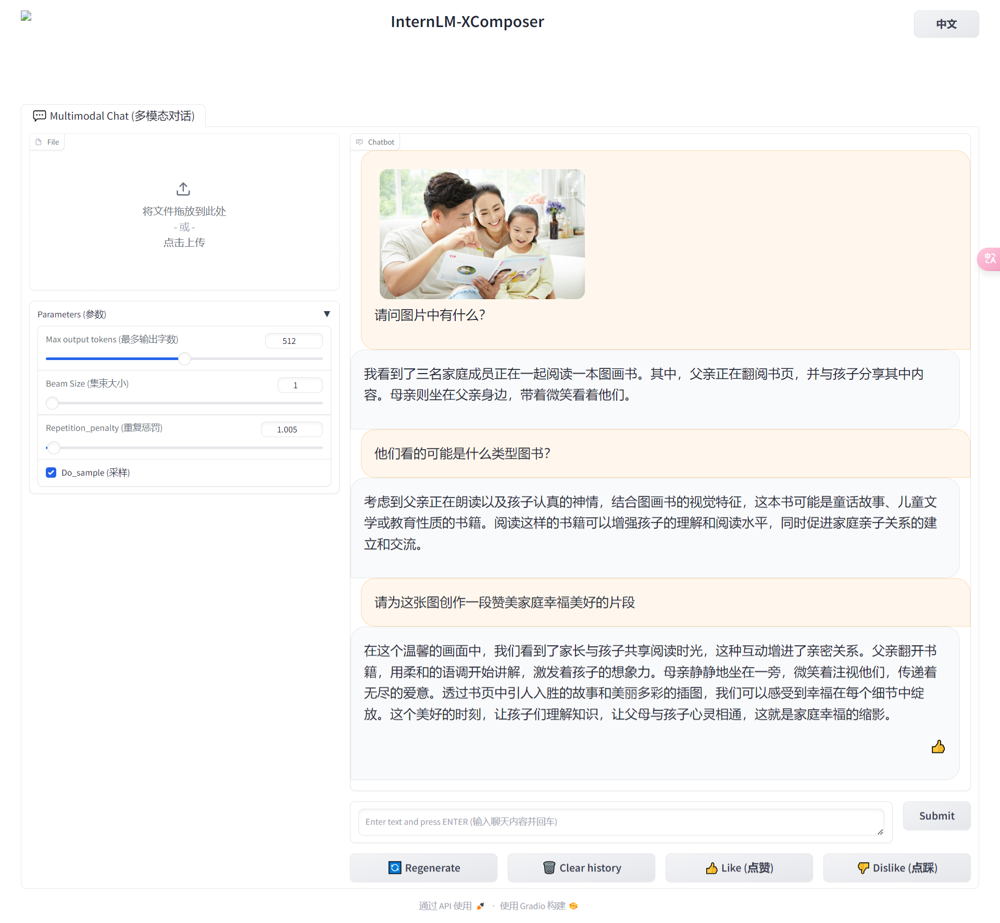

# 轻松玩转书生·浦语大模型趣味 Demo

## 一、基础环境准备
1、创建 A100 10% 开发机


2、安装 InternLM2-Chat-1.8B 的运行环境包

执行命令 `studio-conda -o internlm-base -t demo` 一键安装基础包，由于基础包大需要耐心等待，安装成功显示如下：


3、切换到上面创建的 demo 环境，并安装补充包：
```bash
conda activate demo
pip install huggingface-hub==0.17.3
pip install transformers==4.34
pip install psutil==5.9.8
pip install accelerate==0.24.1
pip install streamlit==1.32.2
pip install matplotlib==3.8.3
pip install modelscope==1.9.5
pip install sentencepiece==0.1.99
```

## 二、下载 InternLM2-Chat-1.8B 模型
1、创建存放模型的文件夹，参考命令：`mkdir -p /root/demo`

2、创建下载模型的脚本 `vi /root/demo/download_mini.py`, 并粘贴以下代码:
```python
import os
from modelscope.hub.snapshot_download import snapshot_download

# 创建保存模型目录
os.system("mkdir /root/models")

# save_dir是模型保存到本地的目录
save_dir="/root/models"

snapshot_download("Shanghai_AI_Laboratory/internlm2-chat-1_8b",
                  cache_dir=save_dir,
                  revision='v1.1.0')
```
3、创建命令行实例脚本 `vi /root/demo/cli_demo.py`, 并粘贴以下代码：
```python
import torch
from transformers import AutoTokenizer, AutoModelForCausalLM


model_name_or_path = "/root/models/Shanghai_AI_Laboratory/internlm2-chat-1_8b"

tokenizer = AutoTokenizer.from_pretrained(model_name_or_path, trust_remote_code=True, device_map='cuda:0')
model = AutoModelForCausalLM.from_pretrained(model_name_or_path, trust_remote_code=True, torch_dtype=torch.bfloat16, device_map='cuda:0')
model = model.eval()

system_prompt = """You are an AI assistant whose name is InternLM (书生·浦语).
- InternLM (书生·浦语) is a conversational language model that is developed by Shanghai AI Laboratory (上海人工智能实验室). It is designed to be helpful, honest, and harmless.
- InternLM (书生·浦语) can understand and communicate fluently in the language chosen by the user such as English and 中文.
"""

messages = [(system_prompt, '')]

print("=============Welcome to InternLM chatbot, type 'exit' to exit.=============")

while True:
    input_text = input("\nUser  >>> ")
    input_text = input_text.strip()
    if input_text.lower() == "exit":
        break

    print('Robot:')

    length = 0
    for response, _ in model.stream_chat(tokenizer, input_text, messages):
        if response is not None:
            print(response[length:], flush=True, end="")
            length = len(response)
```
> 修改说明：
> - 将文档实例中第 22 行由 `input_text = input_text.replace(' ', '')` 改为 `input_text = input_text.strip()` 以解决输入文本中空格全被去掉现象
> - 将文档实例中第 23 行由 `if input_text == "exit":` 改为 `if input_text.lower() == "exit":` 可以忽略退出命令大小写
> - 在文档实例中第 24 行后加上一行 `print('Robot:')` 来对输入与输出加个分隔

4、执行脚本下载模型并启动 Demo 实例
```bash
python /root/demo/download_mini.py && python /root/demo/cli_demo.py
```
## 三、交互实例效果


## 四、下载 Huggingface 上的 InternLM2-Chat-7B 配置文件
1、安装 huggingface 库，参考命令: `pip install -U huggingface_hub`

2、命令行下载，参考命令: `huggingface-cli download 'internlm/InternLM2-Chat-7B' config.json --local-dir /root/demo/`

3、Python 包的方式下载

创建下载脚本 `vi /root/demo/cli_download_huggingface_config.py`, 参考代码：
```python
import os
from huggingface_hub import hf_hub_download

hf_hub_download(repo_id="internlm/InternLM2-Chat-7B", filename="config.json", local_dir = '/root/demo/', resume_download = True)
```

最后执行脚本开始下载，参考命令: `python /root/demo/cli_download_huggingface_config.py`

4、查看下载的配置文件内容，参考命令: `cat /root/demo/config.json`

5、完整操作流程与验证截图


> 特别说明：由于到 Huggingface 的网络不稳定，如果现出下载超时，可以尝试[常见问题的解决方法](https://cguue83gpz.feishu.cn/docx/Noi7d5lllo6DMGxkuXwclxXMn5f#K0i7dWjTFoTqn7xAwE4c2vNnn9g)

## 五、基于 LAgent 的数据分析 Demo 部署
1、升级开发机为 A100 30%，并参考文档安装 lagent 智能体框架
```bash
conda activate demo
cd /root/demo
git clone https://gitee.com/internlm/lagent.git
cd /root/demo/lagent
git checkout 581d9fb8987a5d9b72bb9ebd37a95efd47d479ac
pip install -e .
```

2、创建 Internlm2-chat-7b 的模型软链接到 /root/models/internlm2-chat-7b
```bash
ln -s /root/share/new_models/Shanghai_AI_Laboratory/internlm2-chat-7b /root/models/internlm2-chat-7b
```

3、修改 lagent demo 配置文件 /root/demo/lagent/examples/internlm2_agent_web_demo_hf.py，将模型路径改为 /root/models/internlm2-chat-7b


4、启动 Web demo 并将 6006 端口映射到本地，然后在本地浏览器打开 demo 项目
```bash
streamlit run /root/demo/lagent/examples/internlm2_agent_web_demo_hf.py --server.address 127.0.0.1 --server.port 6006
```

5、试用效果截图

沪深300股票数据预览


沪深300涨幅前十的股票名称、涨跌幅、现价、总量、总金额


沪深300涨跌幅股票数量汇总


> 遇到的问题及解决方法:
> - 显卡显存溢出：关闭浏览器，重新启动 DEMO 后再在浏览器打开体验，以免因为浏览自动刷新导致模型重复加载
> - CSV读取失败：提示编码异常，可以用文本编辑器将 CSV 文件换行符改为 `\n` 文件编码改为 `utf-8`
> - 输出的不及预期：调整数据分析提示词与prompt提示词，尽量详细的描述需求

## 六、实践部署 浦语·灵笔2 模型
1、升级开发机为 A100 50%


2、切换到 conda demo 环境并安装必须的补充包
```bash
conda activate demo
pip install timm==0.4.12 sentencepiece==0.1.99 markdown2==2.4.10 xlsxwriter==3.1.2 gradio==4.13.0 modelscope==1.9.5
```

3、克隆 InternLM-XComposer 仓库 `并切换到指定提交`
```bash
cd /root/demo
git clone https://gitee.com/internlm/InternLM-XComposer.git
cd /root/demo/InternLM-XComposer
git checkout f31220eddca2cf6246ee2ddf8e375a40457ff626
```

4、创建 浦语·灵笔2 模型软链接, 为后面的快速启动服务做准备
```bash
ln -s /root/share/new_models/Shanghai_AI_Laboratory/internlm-xcomposer2-7b /root/models/internlm-xcomposer2-7b
ln -s /root/share/new_models/Shanghai_AI_Laboratory/internlm-xcomposer2-vl-7b /root/models/internlm-xcomposer2-vl-7b
```

5、启动图文写作 Demo 并转发 6006 端口到本地，然后在本地浏览器打开 `http://127.0.0.1:6006` 体验
```bash
cd /root/demo/InternLM-XComposer
python /root/demo/InternLM-XComposer/examples/gradio_demo_composition.py  \
--code_path /root/models/internlm-xcomposer2-7b \
--private \
--num_gpus 1 \
--port 6006
```
> 图文创作效果演示

> 注意事项：建议体验完后关闭服务以清理资源占用

6、启动图片理解 Demo 并转发 6006 端口到本地，然后在本地浏览器打开 `http://127.0.0.1:6006` 体验
```bash
cd /root/demo/InternLM-XComposer
python /root/demo/InternLM-XComposer/examples/gradio_demo_chat.py  \
--code_path /root/models/internlm-xcomposer2-vl-7b \
--private \
--num_gpus 1 \
--port 6006
```
> 图文理解效果演示

> 注意事项：建议体验完后关闭服务以清理资源占用