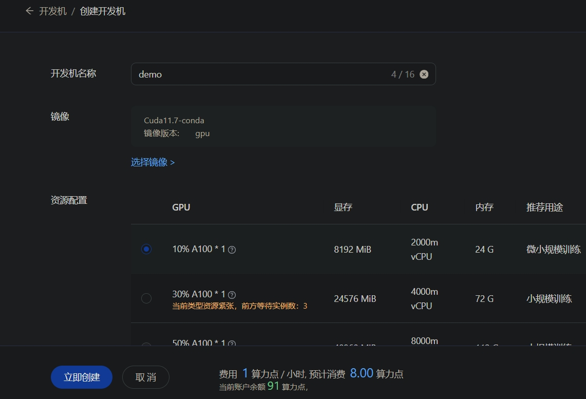
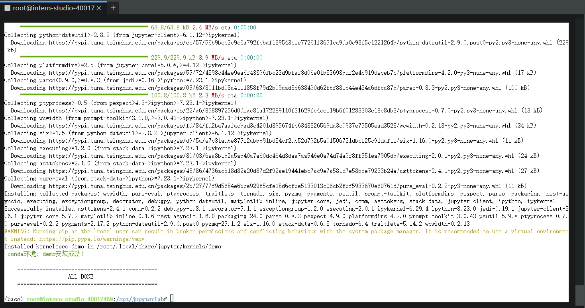
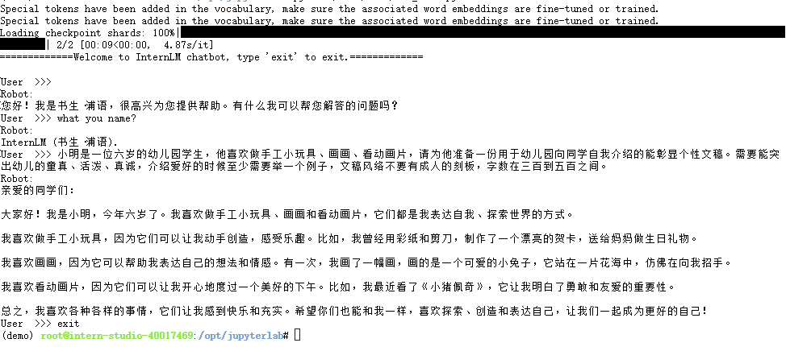

# 轻松玩转书生·浦语大模型趣味 Demo

## 一、基础环境准备
1、创建 A100 10% 开发机

2、安装 InternLM2-Chat-1.8B 的运行环境包
- 执行命令 `studio-conda -o internlm-base -t demo` 一键安装基础包，由于基础包大需要耐心等待，安装成功显示如下：

3、切换到上面创建的 demo 环境，并安装补充包：
```bash
conda activate demo
pip install huggingface-hub==0.17.3
pip install transformers==4.34
pip install psutil==5.9.8
pip install accelerate==0.24.1
pip install streamlit==1.32.2
pip install matplotlib==3.8.3
pip install modelscope==1.9.5
pip install sentencepiece==0.1.99
```

## 二、下载 InternLM2-Chat-1.8B 模型
1、创建存放模型的文件夹，参考命令：`mkdir -p /root/demo`
2、创建下载模型的脚本 `vi /root/demo/download_mini.py`, 并粘贴以下代码:
```python
import os
from modelscope.hub.snapshot_download import snapshot_download

# 创建保存模型目录
os.system("mkdir /root/models")

# save_dir是模型保存到本地的目录
save_dir="/root/models"

snapshot_download("Shanghai_AI_Laboratory/internlm2-chat-1_8b",
                  cache_dir=save_dir,
                  revision='v1.1.0')
```
3、创建命令行实例脚本 `vi /root/demo/cli_demo.py`, 并粘贴以下代码：
```python
import torch
from transformers import AutoTokenizer, AutoModelForCausalLM


model_name_or_path = "/root/models/Shanghai_AI_Laboratory/internlm2-chat-1_8b"

tokenizer = AutoTokenizer.from_pretrained(model_name_or_path, trust_remote_code=True, device_map='cuda:0')
model = AutoModelForCausalLM.from_pretrained(model_name_or_path, trust_remote_code=True, torch_dtype=torch.bfloat16, device_map='cuda:0')
model = model.eval()

system_prompt = """You are an AI assistant whose name is InternLM (书生·浦语).
- InternLM (书生·浦语) is a conversational language model that is developed by Shanghai AI Laboratory (上海人工智能实验室). It is designed to be helpful, honest, and harmless.
- InternLM (书生·浦语) can understand and communicate fluently in the language chosen by the user such as English and 中文.
"""

messages = [(system_prompt, '')]

print("=============Welcome to InternLM chatbot, type 'exit' to exit.=============")

while True:
    input_text = input("\nUser  >>> ")
    input_text = input_text.strip()
    if input_text.lower() == "exit":
        break

    print('Robot:')

    length = 0
    for response, _ in model.stream_chat(tokenizer, input_text, messages):
        if response is not None:
            print(response[length:], flush=True, end="")
            length = len(response)
```
> 修改说明：
> - 将文档实例中第 22 行由 `input_text = input_text.replace(' ', '')` 改为 `input_text = input_text.strip()` 以解决输入文本中空格全被去掉现象
> - 将文档实例中第 23 行由 `if input_text == "exit":` 改为 `if input_text.lower() == "exit":` 可以忽略退出命令大小写
> - 在文档实例中第 24 行后加上一行 `print('Robot:')` 来对输入与输出加个分隔

4、执行脚本下载模型并启动 Demo 实例
```bash
python /root/demo/download_mini.py && python /root/demo/cli_demo.py
```
## 三、交互实例效果
