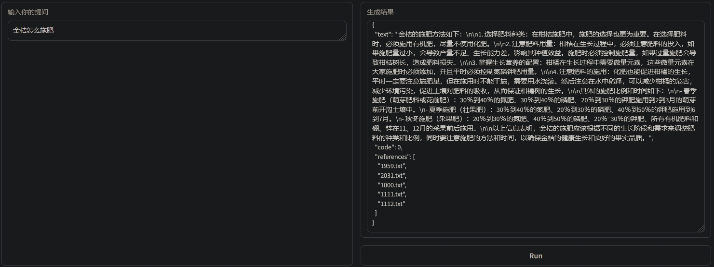
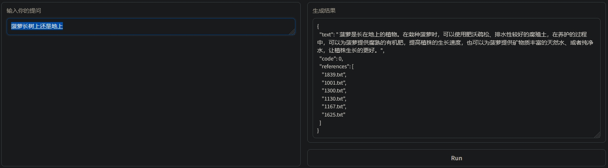

# 茴香豆：搭建你的 RAG 智能助理

## 一、RAG 概述
### A、RAG 是什么？
RAG(Retrieval Augmented Generation)是一种结合了信息检索(Retrieval)和自然语言生成(Generation)的技术,旨在通过利用外部知识库来增强大型语言模型(LLMs)的性能。其核心原理在于利用检索模型从大量的语料库中搜索与输入查询相关的文本片段，并结合这些信息来生成更准确、更丰富的回答。

### B、RAG 解决的问题
> - 解决大模型短板, 如: 知识时效性受限更新成本高、专业能力有限容易产生幻觉、定制化成本高、缺乏透明可追溯的推理过程
> - 扩展大模型能力，如：通过引入外部知识库使得模型能够访问更广泛的知识，扩展其生成能力以生成更准确、更具体的回答，特别是在处理复杂或专业性的问题时，避免可能会生成一些与事实不符或误导性的内容从而减少了编造内容的风险。

### C、应用场景
> - 内容生成：在内容创作领域，RAG技术能够利用检索到的信息来生成包含特定事实和细节的内容。这使得生成的内容更加丰富、可靠，并有助于提高内容的质量和原创性。

> - 数据增强：在训练其他自然语言处理（NLP）模型时，RAG可以用来生成新的训练样本。通过提供额外的上下文信息和相关事实，RAG可以增强模型的性能，提高其在各种任务上的准确性和泛化能力。

> - 智能客服与问答系统：在智能客服和问答系统中，RAG可以帮助机器人或虚拟助手更准确地理解用户的问题，可以动态地从外部知识库中检索与问题相关的信息，并基于这些信息生成自然、流畅且符合用户需求的对话内容，提升用户体验。

> - 知识库智能检索：RAG技术可以应用于知识库智能检索场景，提供更准确的搜索结果和回答。传统的关键词匹配方法可能无法捕捉到查询的深层含义，而RAG技术可以通过理解知识库中的语义关系来检索与查询语义相关的信息，从而提供更加智能化和人性化的检索体验。

## 二、RAG 技术原理
### A、基本工作流程


### B、技术名词释义
> - 向量数据库(Vector-DB)：简单来说，向量数据库就是一个特殊的“大仓库”，里面有很多不同的玩具，每个玩具都有自己独特的形状和颜色。不同的玩具就像里面存储的数据项，但是每个数据项被表示为一个具有很多数字的“标签”。这些数字就像玩具的独特特征，描述了数据项的各种属性。有了这个特殊的仓库，当你需要找到和某个数据项（玩具）最相似的其他数据项时，向量数据库会帮助你快速找到这些相似的数据项。
> - 文档与知识库(Knowledge)：比如工作报告、学习笔记、产品介绍、新闻、合同协议等，都是常见的文档类型。集合了大量特定领域内容的文档就是知识库，知识库里的知识和信息通常是经过精心筛选和整理的，当我们有问题或者需要了解某个知识点时，我们就可以向这个知识库求助，它会快速地给我们返回相关的答案或解释。
> - 检索器(Retrieval)：检索器就像一个智能的查找小助手，当你有问题或者想知道某些信息时，可以向这个小助手提问，它会迅速帮你从知识库中找到最相关、最准确的信息。
> - 索引(Indexing)：将知识库中的文档编码为向量并存储到向量数据库中的过程
> - 生成(Generation): 将检索到的文档片段与原始问题一起作为提示词(prompt)输入到大模型中并生成最终回答的过程

### C、向量数据库
> - 数据存储：将拆分为块的文档片段基于预训练的词嵌入模型转换为固定长度的向量表示后存储到向量数据库中。当前课程用的词嵌入模型是 bce-embedding-base_v1, 更多模型可以参见 [Massive Text Embedding Benchmark (MTEB) Leaderboard](https://huggingface.co/spaces/mteb/leaderboard)
> - 相似性检索: 从向量数据库中检索跟查询问题最相似的文档片段过程, 是实现快速准确回答问题的基础。常用的相似性检索算法：[余弦相似度](https://zh.wikipedia.org/wiki/%E4%BD%99%E5%BC%A6%E7%9B%B8%E4%BC%BC%E6%80%A7)、[点积](https://zh.wikipedia.org/wiki/%E7%82%B9%E7%A7%AF)、[欧氏距离](https://zh.wikipedia.org/wiki/%E6%AC%A7%E5%87%A0%E9%87%8C%E5%BE%97%E8%B7%9D%E7%A6%BB)


### D、RAG 发展阶段
> - 基础(Naive RAG): 由索引、检索、生成构成的最基础的 RAG 应用，通常应用于信息检索场景
> - 进阶(Advanced RAG): 在基础阶段上加入数据索引、检索前和检索后的各个步骤进行优化以提升效果，通常应用于摘要生成
> - 模块化(Modular RAG): 在进阶阶段基础上对各个环节都模块化，可以根据实际业务场景定制，通常应用于多模态任务与问答系统

### E、RAG 与微调整对比


## 三、茴香豆技术讲解
### A、介绍
茴香豆是由书生浦语开发的开源大模型知识助手应用。主要优势：
> - 成本低至 1.5G 显存，无需训练适用各行业
> - 提供一整套前后端 web、android、算法源码，工业级开源可商用
> - 设计拒答、响应两阶段 pipeline 应对群聊场景，解答问题同时不会消息泛滥
> - 通过应用 RAG 技术，茴香豆能够理解与高效准确的回应与特定知识领域相关的复杂问题

### B、核心特性


### C、工作流程


## 四、Web 版茴香豆体验
### A、创建知识库并上传文档


### B、在线体验


### C、问答总结分析
> - 对比问题答案与原始文档十个问题：正确六个、错误两个、技术错误两个
> - 两个错误回答中三号问题 `金桔怎么浇水` 回答与问题完全无关，四号问题 `菠萝长在树上还是地上` 直接从问题中取结果没有看后面的答案
> - 两个技术错误，在多次刷新页面重新测试时会出现同一个问有时能正确回答有时就是技术错误，重现概率比较高
> - 由于不能获取当前时间，问题中带当前季节或当前月份的时候就出现错误回复

## 五、茴香豆本地模型命令行部署
### A、创建 A100 30% 的开发机


### B、安装基础环境
参考命令：
```bash
studio-conda -o internlm-base -t InternLM2_Huixiangdou
conda activate InternLM2_Huixiangdou
```

安装成功显示如下：


### C、安装茴香豆
安装茴香豆依赖的包，参考命令
```bash
pip install protobuf==4.25.3 accelerate==0.28.0 aiohttp==3.9.3 auto-gptq==0.7.1 bcembedding==0.1.3 beautifulsoup4==4.8.2 einops==0.7.0 faiss-gpu==1.7.2 langchain==0.1.14 loguru==0.7.2 lxml_html_clean==0.1.0 openai==1.16.1 openpyxl==3.1.2 pandas==2.2.1 pydantic==2.6.4 pymupdf==1.24.1 python-docx==1.1.0 pytoml==0.1.21 readability-lxml==0.8.1 redis==5.0.3 requests==2.31.0 scikit-learn==1.4.1.post1 sentence_transformers==2.2.2 textract==1.6.5 tiktoken==0.6.0 transformers==4.39.3 transformers_stream_generator==0.0.5 unstructured==0.11.2

apt update && apt -y install python-dev python libxml2-dev libxslt1-dev antiword unrtf poppler-utils pstotext tesseract-ocr flac ffmpeg lame libmad0 libsox-fmt-mp3 sox libjpeg-dev swig libpulse-dev
```

创建书生浦语模型的本地符号链接，参考命令：
```bash
# 创建模型文件夹
cd /root && mkdir models

ln -s /root/share/new_models/maidalun1020/bce-embedding-base_v1 /root/models/bce-embedding-base_v1
ln -s /root/share/new_models/maidalun1020/bce-reranker-base_v1 /root/models/bce-reranker-base_v1
ln -s /root/share/new_models/Shanghai_AI_Laboratory/internlm2-chat-7b /root/models/internlm2-chat-7b
```

从茴香豆官方仓库下载茴香豆源码并切换到指定提交，参考命令：
```bash
cd /root
git clone https://github.com/internlm/huixiangdou
cd huixiangdou && git checkout 447c6f7e68a1657fce1c4f7c740ea1700bde0440
```

配置茴香豆使用上面的模型，参考命令：
```bash
sed -i '6s#.*#embedding_model_path = "/root/models/bce-embedding-base_v1"#' /root/huixiangdou/config.ini
sed -i '7s#.*#reranker_model_path = "/root/models/bce-reranker-base_v1"#' /root/huixiangdou/config.ini
sed -i '29s#.*#local_llm_path = "/root/models/internlm2-chat-7b"#' /root/huixiangdou/config.ini
```

创建知识库，参考命令：
```bash
cd /root/huixiangdou
mv resource/good_questions.json resource/good_questions_bk.json

# 希望茴香豆助手回答的示例问题
echo '[
    "mmpose中怎么调用mmyolo接口",
    "mmpose实现姿态估计后怎么实现行为识别",
    "mmpose执行提取关键点命令不是分为两步吗，一步是目标检测，另一步是关键点提取，我现在目标检测这部分的代码是demo/topdown_demo_with_mmdet.py demo/mmdetection_cfg/faster_rcnn_r50_fpn_coco.py checkpoints/faster_rcnn_r50_fpn_1x_coco_20200130-047c8118.pth   现在我想把这个mmdet的checkpoints换位yolo的，那么应该怎么操作",
    "在mmdetection中，如何同时加载两个数据集，两个dataloader",
    "如何将mmdetection2.28.2的retinanet配置文件改为单尺度的呢？",
    "1.MMPose_Tutorial.ipynb、inferencer_demo.py、image_demo.py、bottomup_demo.py、body3d_pose_lifter_demo.py这几个文件和topdown_demo_with_mmdet.py的区别是什么，\n2.我如果要使用mmdet是不是就只能使用topdown_demo_with_mmdet.py文件，",
    "mmpose 测试 map 一直是 0 怎么办？",
    "如何使用mmpose检测人体关键点？",
    "我使用的数据集是labelme标注的，我想知道mmpose的数据集都是什么样式的，全都是单目标的数据集标注，还是里边也有多目标然后进行标注",
    "如何生成openmmpose的c++推理脚本",
    "mmpose",
    "mmpose的目标检测阶段调用的模型，一定要是demo文件夹下的文件吗，有没有其他路径下的文件",
    "mmpose可以实现行为识别吗，如果要实现的话应该怎么做",
    "我在mmyolo的v0.6.0 (15/8/2023)更新日志里看到了他新增了支持基于 MMPose 的 YOLOX-Pose，我现在是不是只需要在mmpose/project/yolox-Pose内做出一些设置就可以，换掉demo/mmdetection_cfg/faster_rcnn_r50_fpn_coco.py 改用mmyolo来进行目标检测了",
    "mac m1从源码安装的mmpose是x86_64的",
    "想请教一下mmpose有没有提供可以读取外接摄像头，做3d姿态并达到实时的项目呀？",
    "huixiangdou 是什么？",
    "使用科研仪器需要注意什么？",
    "huixiangdou 是什么？",
    "茴香豆 是什么？",
    "茴香豆 能部署到微信吗？",
    "茴香豆 怎么应用到飞书",
    "茴香豆 能部署到微信群吗？",
    "茴香豆 怎么应用到飞书群",
    "huixiangdou 能部署到微信吗？",
    "huixiangdou 怎么应用到飞书",
    "huixiangdou 能部署到微信群吗？",
    "huixiangdou 怎么应用到飞书群",
    "huixiangdou",
    "茴香豆",
    "茴香豆 有哪些应用场景",
    "huixiangdou 有什么用",
    "huixiangdou 的优势有哪些？",
    "茴香豆 已经应用的场景",
    "huixiangdou 已经应用的场景",
    "huixiangdou 怎么安装",
    "茴香豆 怎么安装",
    "茴香豆 最新版本是什么",
    "茴香豆 支持哪些大模型",
    "茴香豆 支持哪些通讯软件",
    "config.ini 文件怎么配置",
    "remote_llm_model 可以填哪些模型?"
]' > /root/huixiangdou/resource/good_questions.json

# 创建一个测试用的问询列表，用来测试拒答流程是否起效：
echo '[
"huixiangdou 是什么？",
"你好，介绍下自己"
]' > ./test_queries.json
```

创建向量数据并测试，参考命令：
```bash
cd /root/huixiangdou && mkdir workdir

# 分别向量化知识语料、接受问题和拒绝问题中后保存到 workdir
python3 -m huixiangdou.service.feature_store --sample ./test_queries.json
```

在测试的过程中遇到文档内容长度超出的断言, 可以先屏蔽断言，再继续运行，错误截图：


### D、运行茴香豆助手测试
填入几个预设问题测试茴香豆助手，参考命令:
```bash
sed -i '74s/.*/    queries = ["huixiangdou 是什么？", "茴香豆怎么部署到微信群", "今天天气怎么样？"]/' /root/huixiangdou/huixiangdou/main.py

# 运行茴香豆
cd /root/huixiangdou/
python3 -m huixiangdou.main --standalone
```

测试问题 `茴香豆怎么部署到微信群` 的回答：


## 六、茴香豆自定义知识库远程模型 WEB 部署
### A、上传知识库源文件
> - 将农业问答知识库文件上传到服务器的 /root/data/knowledge

### B、重建自定义知识库
建农业问题知识库，参考命令:
```bash
cd /root/huixiangdou/
python3 -m huixiangdou.service.feature_store --repo_dir /root/data/knowledge
```

### C、切换大模型为远程的 Deepseek


### D、用 Gradio 搭建网页 Demo
安装 Gradio 依赖组件, 参考命令：
```bash
pip install gradio==4.25.0 redis==5.0.3 flask==3.0.2 lark_oapi==1.2.4
```

运行脚本，启动茴香豆对话 Demo 服务并映射 7860 端口到本地, 参考命令：
```bash
python3 -m tests.test_query_gradio
```

> - 说明：参照文档将 enable_local 设置为 0 后运行输出问题会出现以下错误：

> 需要将 enable_local 设置为 1 或修改 huixiangdou/service/worker.py 103 行的推理后端为根据 enable_local 来自行判断

### E、WEB 端演示测试
1、由于知识库参考过长导致一直失败的问题测试：



2、误取问题标题理解错误的问题测试:


3、加大难度，需要交叉多个文档片段的问题测试：


4、本地失败的季节性问题测试：


> - 说明：从知识库文件内容看是有相关内容的，从日志看也有检索到文档片段，触发未启用的增强搜索出错导致提前终止。

5、远程大模型调用统计


## 七、试用总结
从提问与回答的结果来看茴香豆可以很好的基于知识库回复专业领域问题，对问题主题提取与回答结果相关性都做的很准确。在使用中也遇到一些细节问题:
> - 将 enable_local 设置为 0 enable_remote 设置为 1 仅启用远程大模型与代码中默认模型后端 local 有冲突导致运行时错误，与文档描述的可以仅远程大模型不一致
> - 未启用增强搜索引擎操件，代码中却会误触发，导致问题被提前终止
> - 对整合文档片段与问题后的提示词长度判断不准确，导致本地书生浦语7B模型有些问题多次测试一直无法回答，切换到在线大模型就可以正常回答