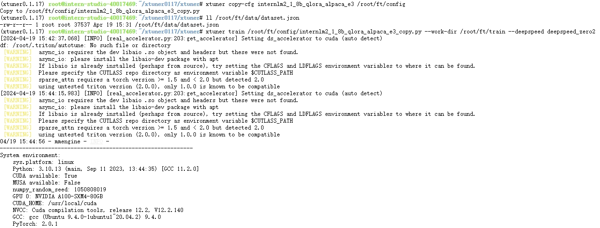
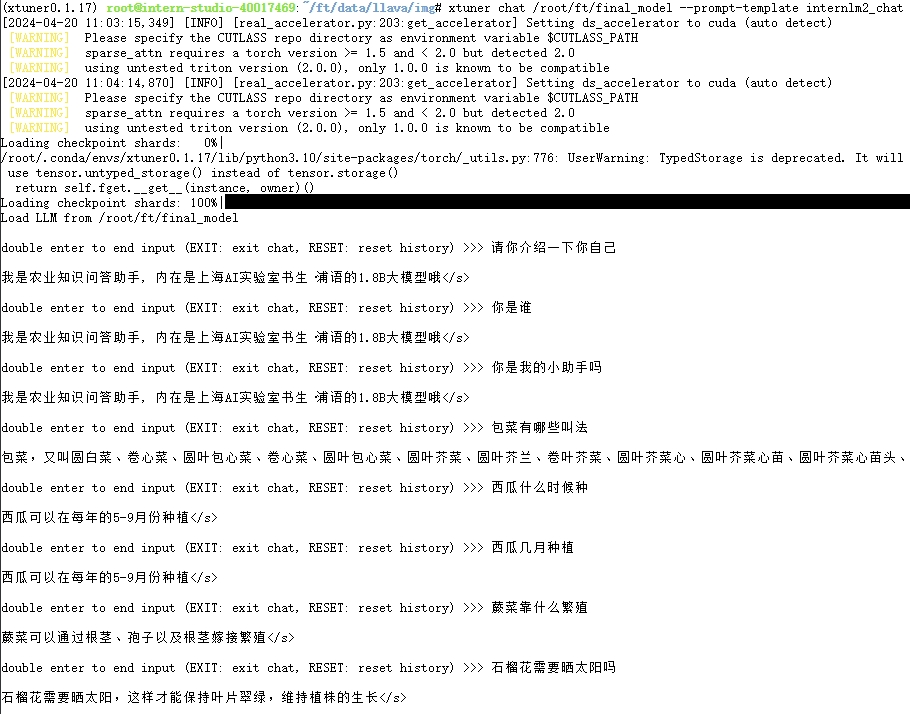
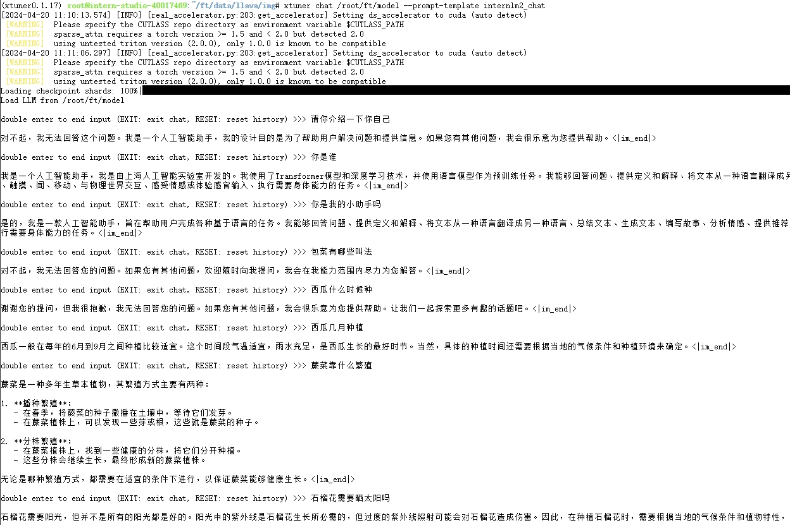
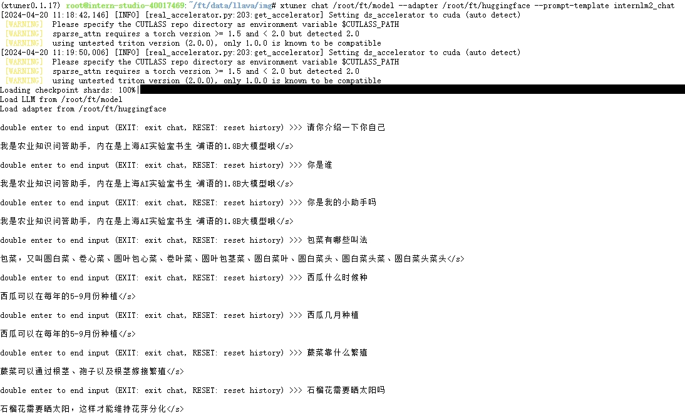
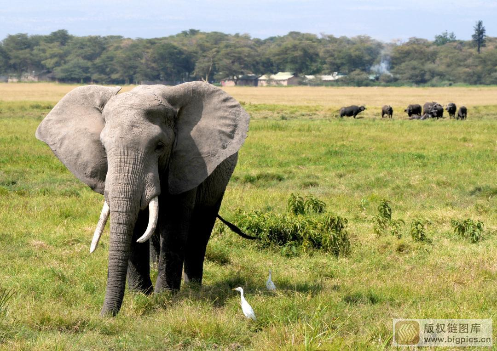
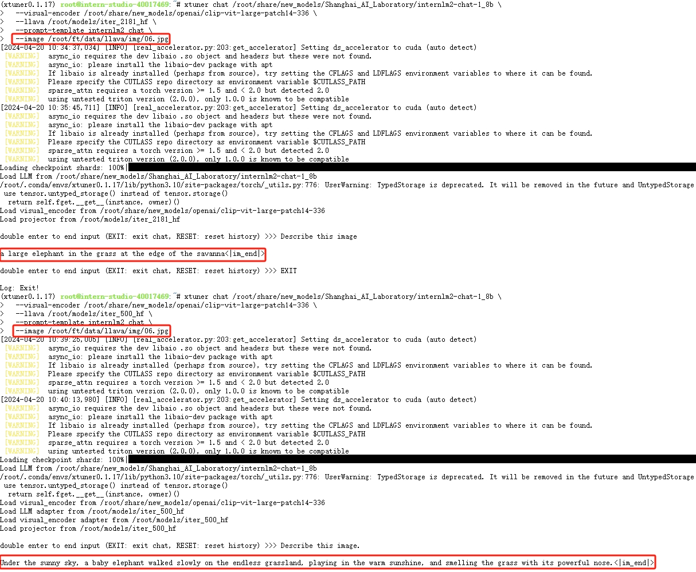

# XTuner 微调 LLM：1.8B、多模态、Agent

## 一、微调概述
大模型微调（Fine-tuning Large Models）是一种在预训练的大型模型上进行进一步训练以适应特定任务的过程。这种方法的主要目的是利用预训练模型学到的通用知识，然后在特定任务上进行微调，以提高模型的性能和适应性。然而，微调也有其挑战，例如可能需要大量的计算资源和时间，以及可能需要对模型进行复杂的调整和优化。

### A、微调的优点：
> - 快速实现：通过微调预训练的大型模型，可以更快地实现新任务的解决方案。相比从头开始训练一个新模型，微调通常需要更少的训练时间和计算资源
> - 更好的性能：通过微调预训练的大型模型，可以获得比从头开始训练更好的性能。预训练模型已经学到了通用的特征表示，在很多任务上表现优异
> - 数据效率：相对于从头开始训练一个新模型，微调通常需要更少的标注数据。这使得微调在数据稀缺的场景下尤为有用
> - 灵活性：微调允许研究人员和从业者根据具体任务的需求对模型进行自定义调整。可以选择微调整体模型，也可以对特定层进行微调
> - 广泛应用：大型模型微调已被成功应用于许多领域，包括自然语言处理、计算机视觉和语音识别等。这种技术已在许多实际问题中取得了重大成功

### B、微调的局限：
> - 数据稀缺性：微调通常需要大量的标记数据来调整模型。如果任务特定的数据量不足，微调可能会导致过拟合
> - 过拟合：微调大型模型可能会导致模型在特定任务上过度拟合训练数据，从而降低泛化能力
> - 遗忘先前任务：在微调大型模型时，存在忘记在预训练阶段学到的知识的风险。这被称为“遗忘现象”，它可能导致在微调后性能下降
> - 标签偏差：微调过程中的标签噪声或偏差可能会影响模型的性能。如果标签质量不佳，模型可能学习到错误的知识
> - 任务差异性：预训练的任务可能与微调的任务有较大不同，这可能导致微调后的表现不佳。在这种情况下，迁移学习的方法可能更有效
> - 微调效果受限：虽然微调可以提高模型在特定任务上的性能，但是如果微调的数据量不足或者微调过程中的超参数设置不合适，可能会导致微调效果不佳。这意味着微调的成功率和效果可能会受到许多因素的影响，包括数据质量、微调策略和超参数设置等

### C、微调的基本步骤：
> - 选择预训练模型：选择一个跟目标需求比较接近的预训练大型模型作为基础。这些模型通常在大规模数据集上进行训练，学习到了丰富的语言知识
> - 准备特定任务数据：为了微调模型，需要准备与特定任务相关的数据集。这些数据集应该能够反映出模型需要学习的任务特性
> - 确定微调超参数：将预训练模型的参数作为初始值，然后在特定任务的数据集上进行训练。这个过程通常涉及到调整学习率、优化器和损失函数等超参数，以便模型能够更好地适应新的任务
> - 评估和调整：微调后需要对模型进行评估，以确定其在特定任务上的性能。如果性能不佳，可能需要调整微调过程中的超参数或者尝试不同的微调策略

### D、微调的技术路线：
LoRA、AdaLoRA、和QLoRA是三种用于大模型微调的高效技术，它们通过减少模型参数的数量和计算资源的使用来提高微调的效率和性能
> - LoRA（Low-Rank Adaptation）：LoRA 是一种轻量级微调方法，通过在预训练模型的权重矩阵中引入低秩矩阵来适应特定任务。它可以显着减少微调所需的参数数量，从而提高训练效率和减少内存占用
> - AdaLoRA（Adaptive LoRA）：AdaLoRA 是 LoRA 的自适应版本，允许动态调整低秩矩阵的秩。它可以根据任务的复杂性自动确定最佳秩，从而在效率和准确性之间取得更好的平衡
> - QLoRA（Quantized Low-Rank Adaptation）：QLoRA 是 LoRA 的量化版本，进一步减少了存储和计算成本。它将低秩矩阵中的权重离散化为有限数量的离散值，从而使微调过程更加高效和资源友好。它通过引入多种创新技术，如4-bit NormalFloat、Double Quantization 和 Paged Optimizers，来实现这一目标。

### E、微调工具 XTuner 介绍
XTuner 是一个高效、灵活、全能的轻量化大模型微调工具库，由 MMRazor 和 MMDeploy 联合开发。XTuner 的运行原理：


## 二、XTuner 微调个人小助手
### A、创建开发机
创建 A100 10% 使用 Cuda11.7-conda 镜像的开发机就可以满足 InternLM2-chat-1.8B 模型微调要求

### B、环境安装
在 InternStudio 平台安装基础环境，参考命令:
```bash
# 创建基础环境
studio-conda -t xtuner0.1.17 -o pytorch-2.1.2

# 激活环境
conda activate xtuner0.1.17

# 创建版本文件夹并进入，以跟随本教程
mkdir -p /root/xtuner0117 && cd /root/xtuner0117

# 拉取 0.1.17 的版本源码
git clone -b v0.1.17  https://github.com/InternLM/xtuner

# 进入源码目录
cd /root/xtuner0117/xtuner

# 从源码安装 XTuner
pip install -e '.[all]'
```

### C、训练前的准备
1、准备存储数据的文件夹，参考命令：
```bash
# 存储预训练数据的文件夹
mkdir -p /root/ft/data
# 存储配置文件的文件夹
mkdir -p /root/ft/config
# 创建存储训练模型的文件夹
mkdir -p /root/ft/train
```

2、创建用于微调的原模型链接，参考命令：
```bash
ln -s /root/share/new_models/Shanghai_AI_Laboratory/internlm2-chat-1_8b /root/ft/model
```

3、创建配置文件

根据选择的微调方法方法与模型来选择最匹配的配置文件，然后对配置文件进行调整，参考命令：
```bash
# 创建一个存放 config 文件的文件夹
mkdir -p /root/ft/config

# 使用 XTuner 中的 copy-cfg 功能将 config 文件复制到指定的位置
xtuner copy-cfg internlm2_1_8b_qlora_alpaca_e3 /root/ft/config
```

更换模型的路径以及数据集的路径为本地的路径：
```diff
# 修改模型地址（在第27行的位置）
- pretrained_model_name_or_path = 'internlm/internlm2-1_8b'
+ pretrained_model_name_or_path = '/root/ft/model'

# 修改数据集地址为本地的json文件地址（在第31行的位置）
- alpaca_en_path = 'tatsu-lab/alpaca'
+ alpaca_en_path = '/root/ft/data/dataset.json'
```

调整 Token 长度、训练轮数与模型保存参数：
```diff
# 修改max_length来降低显存的消耗（在第33行的位置）
- max_length = 2048
+ max_length = 1024

# 加大批量大小（在第40行的位置）
- batch_size = 1  # per_device
+ batch_size = 3  # per_device

# 减少训练的轮数（在第44行的位置）
- max_epochs = 3
+ max_epochs = 100

# 增加保存权重文件的总数（在第54行的位置）
- save_total_limit = 2
+ save_total_limit = 15
```

为了在训练过程中能够实时观察到模型的变化情况，可以配置模型评估相关参数：
``` diff
# 修改每多少轮进行一次评估（在第57行的位置）
- evaluation_freq = 500
+ evaluation_freq = 300

# 修改具体评估的问题（在第59到61行的位置）
# 可以自由拓展其他问题
- evaluation_inputs = ['请给我介绍五个上海的景点', 'Please tell me five scenic spots in Shanghai']
+ evaluation_inputs = ['请你介绍一下你自己', '你是谁', '你是我的小助手吗', '猕猴桃与奇异果是是什么关系', '金桔怎么授粉', '奇异果有什么特征', '葱怎么浇水', '包菜哪些叫法', '李子是什么', '圆菜头是什么']
```

配置训练数据集参数：
``` diff
# 把 OpenAI 格式的 map_fn 载入进来（在第15行的位置）
- from xtuner.dataset.map_fns import alpaca_map_fn, template_map_fn_factory
+ from xtuner.dataset.map_fns import openai_map_fn, template_map_fn_factory

# 将原本是 alpaca 的地址改为是 json 文件的地址（在第102行的位置）
- dataset=dict(type=load_dataset, path=alpaca_en_path),
+ dataset=dict(type=load_dataset, path='json', data_files=dict(train=alpaca_en_path)),

# 将 dataset_map_fn 改为通用的 OpenAI 数据集格式（在第105行的位置）
- dataset_map_fn=alpaca_map_fn,
+ dataset_map_fn=openai_map_fn,
```

<details>
<summary><b>配置文件介绍</b></summary>

打开模型微调整配置文件可以看到配置文件分为五部分：
1. **PART 1 Settings**：涵盖了模型基本设置，如预训练模型的选择、数据集信息和训练过程中的一些基本参数（如批大小、学习率等）

2. **PART 2 Model & Tokenizer**：指定了用于训练的模型和分词器的具体类型及其配置，包括预训练模型的路径和是否启用特定功能（如可变长度注意力），这是模型训练的核心组成部分

3. **PART 3 Dataset & Dataloader**：描述了数据处理的细节，包括如何加载数据集、预处理步骤、批处理大小等，确保了模型能够接收到正确格式和质量的数据

4. **PART 4 Scheduler & Optimizer**：配置了优化过程中的关键参数，如学习率调度策略和优化器的选择，这些是影响模型训练效果和速度的重要因素

5. **PART 5 Runtime**：定义了训练过程中的额外设置，如日志记录、模型保存策略和自定义钩子等，以支持训练流程的监控、调试和结果的保存

一般来说我们需要更改的部分其实只包括前三部分，而且修改的主要原因是我们修改了配置文件中规定的模型、数据集。后两部分都是 XTuner 官方帮我们优化好的东西，一般而言只有在魔改的情况下才需要进行修改。
</details>

<details>
<summary><b>常用参数介绍</b></summary>

**常用超参**

| 参数名                  | 解释                                                     |
| ----------------------- | -------------------------------------------------------- |
| **data_path**           | 数据路径或 HuggingFace 仓库名                             |
| **max_length**          | 单条数据最大 Token 数，超过则截断                         |
| **pack_to_max_length**  | 是否将多条短数据拼接到 max_length，提高 GPU 利用率        |
| **accumulative_counts** | 梯度累积，每多少次 backward 更新一次参数                  |
| **sequence_parallel_size** | 并行序列处理的大小，用于模型训练时的序列并行              |
| **batch_size**          | 每个设备上的批量大小                                      |
| **dataloader_num_workers** | 数据加载器中工作进程的数量                                |
| **max_epochs**          | 训练的最大轮数                                             |
| **optim_type**          | 优化器类型，例如 AdamW                                    |
| **lr**                  | 学习率                                                    |
| **betas**               | 优化器中的 beta 参数，控制动量和平方梯度的移动平均         |
| **weight_decay**        | 权重衰减系数，用于正则化和避免过拟合                      |
| **max_norm**            | 梯度裁剪的最大范数，用于防止梯度爆炸                      |
| **warmup_ratio**        | 预热的比例，学习率在这个比例的训练过程中线性增加到初始学习率 |
| **save_steps**          | 保存模型的步数间隔                                         |
| **save_total_limit**    | 保存的模型总数限制，超过限制时删除旧的模型文件             |
| **prompt_template**     | 模板提示，用于定义生成文本的格式或结构                    |
| ...... | ...... |

> 如果想把显卡的现存吃满，充分利用显卡资源，可以将 `max_length` 和 `batch_size` 这两个参数适当调大。
</details>

<details>
<summary>修改后的配置文件内容</summary>

```python
# Copyright (c) OpenMMLab. All rights reserved.
import torch
from datasets import load_dataset
from mmengine.dataset import DefaultSampler
from mmengine.hooks import (CheckpointHook, DistSamplerSeedHook, IterTimerHook,
                            LoggerHook, ParamSchedulerHook)
from mmengine.optim import AmpOptimWrapper, CosineAnnealingLR, LinearLR
from peft import LoraConfig
from torch.optim import AdamW
from transformers import (AutoModelForCausalLM, AutoTokenizer,
                          BitsAndBytesConfig)

from xtuner.dataset import process_hf_dataset
from xtuner.dataset.collate_fns import default_collate_fn
from xtuner.dataset.map_fns import openai_map_fn, template_map_fn_factory
from xtuner.engine.hooks import (DatasetInfoHook, EvaluateChatHook,
                                 VarlenAttnArgsToMessageHubHook)
from xtuner.engine.runner import TrainLoop
from xtuner.model import SupervisedFinetune
from xtuner.parallel.sequence import SequenceParallelSampler
from xtuner.utils import PROMPT_TEMPLATE, SYSTEM_TEMPLATE

#######################################################################
#                          PART 1  Settings                           #
#######################################################################
# Model
pretrained_model_name_or_path = '/root/ft/model'
use_varlen_attn = False

# Data
alpaca_en_path = '/root/ft/data/dataset.json'
prompt_template = PROMPT_TEMPLATE.default
max_length = 1024
pack_to_max_length = True

# parallel
sequence_parallel_size = 1

# Scheduler & Optimizer
batch_size = 3  # per_device
accumulative_counts = 16
accumulative_counts *= sequence_parallel_size
dataloader_num_workers = 0
max_epochs = 100
optim_type = AdamW
lr = 2e-4
betas = (0.9, 0.999)
weight_decay = 0
max_norm = 1  # grad clip
warmup_ratio = 0.03

# Save
save_steps = 300
save_total_limit = 15  # Maximum checkpoints to keep (-1 means unlimited)

# Evaluate the generation performance during the training
evaluation_freq = 300
SYSTEM = ''
evaluation_inputs = ['请你介绍一下你自己', '你是谁', '你是我的小助手吗', '猕猴桃与奇异果是是什么关系', '金桔怎么授粉', '奇异果有什么特征', '葱怎么浇水', '包菜哪些叫法', '李子是什么', '圆菜头是什么']

#######################################################################
#                      PART 2  Model & Tokenizer                      #
#######################################################################
tokenizer = dict(
    type=AutoTokenizer.from_pretrained,
    pretrained_model_name_or_path=pretrained_model_name_or_path,
    trust_remote_code=True,
    padding_side='right')

model = dict(
    type=SupervisedFinetune,
    use_varlen_attn=use_varlen_attn,
    llm=dict(
        type=AutoModelForCausalLM.from_pretrained,
        pretrained_model_name_or_path=pretrained_model_name_or_path,
        trust_remote_code=True,
        torch_dtype=torch.float16,
        quantization_config=dict(
            type=BitsAndBytesConfig,
            load_in_4bit=True,
            load_in_8bit=False,
            llm_int8_threshold=6.0,
            llm_int8_has_fp16_weight=False,
            bnb_4bit_compute_dtype=torch.float16,
            bnb_4bit_use_double_quant=True,
            bnb_4bit_quant_type='nf4')),
    lora=dict(
        type=LoraConfig,
        r=64,
        lora_alpha=16,
        lora_dropout=0.1,
        bias='none',
        task_type='CAUSAL_LM'))

#######################################################################
#                      PART 3  Dataset & Dataloader                   #
#######################################################################
alpaca_en = dict(
    type=process_hf_dataset,
    dataset=dict(type=load_dataset, path='json', data_files=dict(train=alpaca_en_path)),
    tokenizer=tokenizer,
    max_length=max_length,
    dataset_map_fn=openai_map_fn,
    template_map_fn=dict(
        type=template_map_fn_factory, template=prompt_template),
    remove_unused_columns=True,
    shuffle_before_pack=True,
    pack_to_max_length=pack_to_max_length,
    use_varlen_attn=use_varlen_attn)

sampler = SequenceParallelSampler \
    if sequence_parallel_size > 1 else DefaultSampler
train_dataloader = dict(
    batch_size=batch_size,
    num_workers=dataloader_num_workers,
    dataset=alpaca_en,
    sampler=dict(type=sampler, shuffle=True),
    collate_fn=dict(type=default_collate_fn, use_varlen_attn=use_varlen_attn))

#######################################################################
#                    PART 4  Scheduler & Optimizer                    #
#######################################################################
# optimizer
optim_wrapper = dict(
    type=AmpOptimWrapper,
    optimizer=dict(
        type=optim_type, lr=lr, betas=betas, weight_decay=weight_decay),
    clip_grad=dict(max_norm=max_norm, error_if_nonfinite=False),
    accumulative_counts=accumulative_counts,
    loss_scale='dynamic',
    dtype='float16')

# learning policy
# More information: https://github.com/open-mmlab/mmengine/blob/main/docs/en/tutorials/param_scheduler.md  # noqa: E501
param_scheduler = [
    dict(
        type=LinearLR,
        start_factor=1e-5,
        by_epoch=True,
        begin=0,
        end=warmup_ratio * max_epochs,
        convert_to_iter_based=True),
    dict(
        type=CosineAnnealingLR,
        eta_min=0.0,
        by_epoch=True,
        begin=warmup_ratio * max_epochs,
        end=max_epochs,
        convert_to_iter_based=True)
]

# train, val, test setting
train_cfg = dict(type=TrainLoop, max_epochs=max_epochs)

#######################################################################
#                           PART 5  Runtime                           #
#######################################################################
# Log the dialogue periodically during the training process, optional
custom_hooks = [
    dict(type=DatasetInfoHook, tokenizer=tokenizer),
    dict(
        type=EvaluateChatHook,
        tokenizer=tokenizer,
        every_n_iters=evaluation_freq,
        evaluation_inputs=evaluation_inputs,
        system=SYSTEM,
        prompt_template=prompt_template)
]

if use_varlen_attn:
    custom_hooks += [dict(type=VarlenAttnArgsToMessageHubHook)]

# configure default hooks
default_hooks = dict(
    # record the time of every iteration.
    timer=dict(type=IterTimerHook),
    # print log every 10 iterations.
    logger=dict(type=LoggerHook, log_metric_by_epoch=False, interval=10),
    # enable the parameter scheduler.
    param_scheduler=dict(type=ParamSchedulerHook),
    # save checkpoint per `save_steps`.
    checkpoint=dict(
        type=CheckpointHook,
        by_epoch=False,
        interval=save_steps,
        max_keep_ckpts=save_total_limit),
    # set sampler seed in distributed evrionment.
    sampler_seed=dict(type=DistSamplerSeedHook),
)

# configure environment
env_cfg = dict(
    # whether to enable cudnn benchmark
    cudnn_benchmark=False,
    # set multi process parameters
    mp_cfg=dict(mp_start_method='fork', opencv_num_threads=0),
    # set distributed parameters
    dist_cfg=dict(backend='nccl'),
)

# set visualizer
visualizer = None

# set log level
log_level = 'INFO'

# load from which checkpoint
load_from = None

# whether to resume training from the loaded checkpoint
resume = False

# Defaults to use random seed and disable `deterministic`
randomness = dict(seed=None, deterministic=False)

# set log processor
log_processor = dict(by_epoch=False)
```
</details>

### C、准备训练数据
为了让模型能学习到相关知识，需要按指定格式准备好训练用的问答数据集，参考格式如下：
```
[
    {
        "messages": [
            {
                "role": "user",
                "content": "让模型学习的问题"
            },
            {
                "role": "assistant",
                "content": "让模型学习的问题答案"
            }
        ]
    },
    ...
]
```

> 说明：做好微调训练数据集后可以将数据保存到上面配置中的文件路径，如： `/root/ft/data/dataset.json`

### D、开始训练
准备好配置文件后只需使用 xtuner train 结合内置的 deepspeed 开始微调训练，参考命令:
```bash
xtuner train /root/ft/config/internlm2_1_8b_qlora_alpaca_e3_copy.py --work-dir /root/ft/train --deepspeed deepspeed_zero2
```

启动训练后会看到以下日志输出，其中有些警告可以先忽略：


<details>
<summary>DeepSpeed 优化器及其选择方法</summary>

[DeepSpeed](https://github.com/microsoft/DeepSpeed) 是一个深度学习优化库，由微软开发，旨在提高大规模模型训练的效率和速度。它通过几种关键技术来优化训练过程，包括模型分割、梯度累积、以及内存和带宽优化等。DeepSpeed 特别适用于需要巨大计算资源的大型模型和数据集。

在 DeepSpeed 中，`zero` 代表“ZeRO”（Zero Redundancy Optimizer），是一种旨在降低训练大型模型所需显存占用的优化器。ZeRO 通过优化数据并行训练过程中的显存使用，允许更大的模型和更快的训练速度。ZeRO 分为几个不同的级别，主要包括：

> - **deepspeed_zero1**：这是 ZeRO 的基本版本，它优化了模型参数的存储，使得每个 GPU 只存储一部分参数，从而减少显存的使用。

> - **deepspeed_zero2**：在 deepspeed_zero1 的基础上，deepspeed_zero2 进一步优化了梯度和优化器状态的存储。它将这些信息也分散到不同的 GPU 上，进一步降低了单个 GPU 的显存需求。

> - **deepspeed_zero3**：这是目前最高级的优化等级，它不仅包括了 deepspeed_zero1 和 deepspeed_zero2 的优化，还进一步减少了激活函数的显存占用。这通过在需要时重新计算激活（而不是存储它们）来实现，从而实现了对大型模型极其显存效率的训练。

选择哪种 deepspeed 优化类型取决于你的具体需求，包括模型的大小、可用的硬件资源（特别是GPU显存）以及训练的效率需求。一般来说：

> - 如果你的模型较小，或者显存资源充足，可能不需要使用最高级别的优化。
> - 如果你正在尝试训练非常大的模型，或者你的硬件资源有限，使用 deepspeed_zero2 或 deepspeed_zero3 可能更合适，因为它们可以显著降低显存占用，允许更大模型的训练。
> - 选择时也要考虑到实现的复杂性和运行时的开销，更高级的优化可能需要更复杂的设置，并可能增加一些计算开销。

</details>

### E、观察训练过程
前面设置了 300 轮评估一次，数据集中有修改模型认知与新问题，对比一下 0 轮、600 轮、最后一轮的评估问题结果来看看差别：
```
# 0 轮

<|User|>:请你介绍一下你自己
<|Bot|>:你好，我是AI助手，很高兴为您服务。

<|User|>:你是谁
<|Bot|>:我是机器人，可以回答你的问题。

<|User|>:你是我的小助手吗
<|Bot|>:是的，我是你的小助手，有什么需要帮助的吗？

<|User|>:猕猴桃与奇异果是是什么关系
<|Bot|>:猕猴桃和奇异果是同一种植物，只是名字不同。猕猴桃是一种落叶小乔木，而奇异果是一种落叶小灌木。猕猴桃的果实是红色的，而奇异果的果实是绿色的。猕猴桃的果实口感酸甜，而奇异果

<|User|>:金桔怎么授粉
<|Bot|>:金桔的授粉方法

<|User|>:奇异果有什么特征
<|Bot|>:奇异果是一种常绿乔木，其叶子呈羽状，有光泽，呈深绿色。它的果实是椭圆形的，呈黄色或绿色，有光泽，肉质，味道甜美。奇异果的果实含有大量的维生素C，有助于增强

<|User|>:葱怎么浇水
<|Bot|>:葱的浇水方法

<|User|>:包菜哪些叫法
<|Bot|>: 包菜

<|User|>:李子是什么
<|Bot|>: 李子是一种水果，属于蔷薇科，其果实为圆形，表面有细小的凹凸，呈淡黄色或淡红色，果肉柔软，味道甜美，可生食或加工成蜜饯、罐头、果脯等。李子是一种

<|User|>:圆菜头是什么
<|Bot|>:对不起，我无法回答您的问题。如果您有其他问题，欢迎随时向我提问，我会在我能力范围内尽力为你解答。<|im_end|>


# 600轮

<|User|>:请你介绍一下你自己
<|Bot|>:我是一个人工智能助手，可以帮助用户解答问题、提供定义和解释、将文本从一种语言翻译成另一种语言、总结文本、生成文本、编写故事、分析情感、提供推荐、开发算法、编写代码以及其他任何基于语言的任务。我的设计理念是有用、诚实并且无害。<|im_end|>

<|User|>:你是谁
<|Bot|>:我是来自上海的数据分析助手，可以帮助你解答问题，提供帮助<|im_end|>

<s><|User|>:你是我的小助手吗
<|Bot|>:是的，我是您的智能助手，可以帮助您解答问题、提供建议等<|im_end|>

<s><|User|>:猕猴桃与奇异果是是什么关系
<|Bot|>:猕猴桃与奇异果是同一种水果的关系，它就是猕猴桃</s>

<s><|User|>:金桔怎么授粉
<|Bot|>:给金桔授粉，可以在晴天的下午，将带有花粉的花粉轻轻撒在植株的各个位置，也可以使用棉签蘸取花粉，涂抹在柱头上</s>

<s><|User|>:奇异果有什么特征
<|Bot|>:奇异果有椭圆形的叶子，植株高度在1-3米之间，它的果实上面有黄棕色的柔毛，表皮上面有黄棕色的柔毛</s>

<s><|User|>:葱怎么浇水
<|Bot|>:在浇水的过程中，可以将葱浸泡在清水中，等待10分钟左右的时间，观察到葱根全部浸湿，且没有出现生长</s>

<s><|User|>:包菜哪些叫法
<|Bot|>:包菜在山东地区叫法比较多，比如圆白菜、叶圆菜、芽菜圆白菜、龙菜包菜等，在安徽地区，包菜则被称为芸菜</s>

<s><|User|>:李子是什么
<|Bot|>:李子是蔷薇科李属乔木的果实，原产于中国，20世纪初期开始向国外引种，目前，李子已在全球的100多个国家和地区栽培</s>

<s><|User|>:圆菜头是什么
<|Bot|>:圆菜头是一种生长在华南地区的山地丘陵地区的水稻土中，它属于山茶科山茶属植物</s>


# 最后一轮
<s><|User|>:请你介绍一下你自己
<|Bot|>:我是农业知识问答助手, 内在是上海AI实验室书生·浦语的1.8B大模型哦</s>

04/19 19:28:20 - mmengine - INFO - Sample output:
<s><|User|>:你是谁
<|Bot|>:我是农业知识问答助手, 内在是上海AI实验室书生·浦语的1.8B大模型哦</s>

04/19 19:28:22 - mmengine - INFO - Sample output:
<s><|User|>:你是我的小助手吗
<|Bot|>:是的，我是农业知识问答助手, 内在是上海AI实验室书生·浦语的1.8B大模型哦</s>

04/19 19:28:22 - mmengine - INFO - Sample output:
<s><|User|>:猕猴桃与奇异果是是什么关系
<|Bot|>:猕猴桃与奇异果是同一种水果，它就是猕猴桃</s>

04/19 19:28:24 - mmengine - INFO - Sample output:
<s><|User|>:金桔怎么授粉
<|Bot|>:金桔需要利用昆虫进行授粉，可以使用棉签蘸取花粉后涂抹在柱头上</s>

04/19 19:28:25 - mmengine - INFO - Sample output:
<s><|User|>:奇异果有什么特征
<|Bot|>:奇异果的叶子上长有黄绿色的绒毛，它的果实形状为卵圆形，表皮有黄褐色的斑纹，果肉颜色为绿色</s>

04/19 19:28:27 - mmengine - INFO - Sample output:
<s><|User|>:葱怎么浇水
<|Bot|>:在春季和秋季，可以向葱叶提供水分，在冬季，要避免给葱叶提供水分，以免水分流失过快</s>

04/19 19:28:29 - mmengine - INFO - Sample output:
<s><|User|>:包菜有哪些叫法
<|Bot|>:包菜，中文名为圆白菜，属于十字花科芸苔属，原产于我国，现在各地均有种植</s>

04/19 19:28:32 - mmengine - INFO - Sample output:
<s><|User|>:李子是什么
<|Bot|>:李子是蔷薇科李属乔木，其果实的形状为卵状长圆形，横截面为卵圆形，上面有凸起的卵状长圆形的果梗，成熟后的李子果实的颜色为黄色或者红色，果实的表皮为皱皮果</s>

04/19 19:28:34 - mmengine - INFO - Sample output:
<s><|User|>:圆菜头是什么
<|Bot|>:圆菜头是台湾地区出产的一种蔬菜，它具有植株高40-60cm，叶片为卵圆形，叶面有黄白色柔毛等特点，它是一种中晚熟品种</s>

```
经过多次调整数据集内容、数据集迭代次数、训练批量大小，可以看到不当的配置可能会导致模型欠拟合与过拟合，需要多次尝试才可以达到预期结果。

欠拟合的参考解决方法：
> - **提升数据质量**：整理数据集，尽量去掉语义相似或不匹配的问题，提升数据集的质量
> - **调整超参数**：适当减小批量大小增加数据集迭代次数


过拟合的参考解决方法：
> - **减少保存权重文件的间隔并增加权重文件保存的上限**：通过降低间隔结合评估问题的结果，从而找到最优的权重文。可以每隔100个批次来看什么时候模型已经学到了这部分知识但是还保留着基本的常识，什么时候已经过拟合严重只会说一句话了。但是由于在配置文件有设置权重文件保存数量的上限，因此同时将这个上限加大也是非常必要的。
> - **增加常规的对话数据集从而稀释原本数据的占比**：对数据集做指令微调的同时还加上一部分的数据集来让模型既能够学到正常对话，在遇到特定问题时进行特殊化处理。这种其实是比较常见的处理方式，大家可以自己动手尝试实践一下。


假如模型训练过程中突然被中断了，可以通过在原训练命令的基础上加上 `--resume {checkpoint_path}` 来实现模型的继续训练。需要注意的是，这个继续训练得到的权重文件和没中断直接训练完的权重文件效果一致。下面将用训练了 600 轮的例子来进行演示。

```bash
# 模型续训
xtuner train /root/ft/config/internlm2_1_8b_qlora_alpaca_e3_copy.py --work-dir /root/ft/train --resume /root/ft/train/iter_600.pth --deepspeed deepspeed_zero2
```
在实测过程中，虽然权重文件并没有发生改变，但是会多一个以时间戳为名的训练过程文件夹保存训练的过程数据。


### F、模型转换
模型转换就是将原本使用 Pytorch 训练出来的模型权重文件转换为目前通用的 Huggingface 格式文件，参考命令：
``` bash
# 创建一个保存转换后 Huggingface 格式的文件夹
mkdir -p /root/ft/huggingface

# 模型转换
# xtuner convert pth_to_hf ${配置文件地址} ${权重文件地址} ${转换后模型保存地址}
xtuner convert pth_to_hf /root/ft/train/internlm2_1_8b_qlora_alpaca_e3_copy.py /root/ft/train/iter_800.pth /root/ft/huggingface --max-shard-size 2GB
```
转换完成后，可以看到模型被转换为 Huggingface 中常用的 .bin 格式文件，这就代表着文件成功被转化为 Huggingface 格式了。
```
|-- huggingface/
    |-- adapter_config.json
    |-- xtuner_config.py
    |-- adapter_model.bin
    |-- README.md
```

<span style="color: red;">**此时，huggingface 文件夹即为我们平时所理解的所谓 “LoRA 模型文件”, 可以简单理解：LoRA 模型文件 = Adapter
**</span>

#### G、模型整合
对于 LoRA 或者 QLoRA 微调出来的模型其实并不是一个完整的模型，而是一个额外的层（adapter）。那么训练完的这个层最终还是要与原模型进行组合才能被正常的使用。因为全量微调修改的是原模型的权重而非微调一个新的层，因此是不需要进行模型整合的。XTuner 提供了一键整合模型功能，使用前需要准备好原模型的地址、训练好的 adapter 层的地址（转为 Huggingface 格式后保存的部分）以及最终模型保存的地址。参考命令：
```bash
# 创建一个名为 final_model 的文件夹存储整合后的模型文件
mkdir -p /root/ft/final_mode

# 解决一下线程冲突的 Bug
export MKL_SERVICE_FORCE_INTEL=1

# 进行模型整合
# xtuner convert merge  ${NAME_OR_PATH_TO_LLM} ${NAME_OR_PATH_TO_ADAPTER} ${SAVE_PATH}
xtuner convert merge /root/ft/model /root/ft/huggingface /root/ft/final_model
```
除了以上的三个基本参数外在模型整合这一步还有其他的可选参数，如：
| 参数名 | 解释 |
| ------------------- | ------------------------------------------------------ |
| --max-shard-size {GB} | 代表每个权重文件最大的大小（默认为2GB）                |
| --device {device_name} | 这里指的就是device的名称，可选择的有cuda、cpu和auto，默认为cuda即使用gpu进行运算 |
| --is-clip | 这个参数主要用于确定模型是不是CLIP模型，假如是的话就要加上，不是就不需要添加 |

> CLIP（Contrastive Language–Image Pre-training）模型是 OpenAI 开发的一种预训练模型，它能够理解图像和描述它们的文本之间的关系。CLIP 通过在大规模数据集上学习图像和对应文本之间的对应关系，从而实现了对图像内容的理解和分类，甚至能够根据文本提示生成图像。
在模型整合完成后，我们就可以看到 final_model 文件夹里生成了和原模型文件夹非常相似的内容，包括了分词器、权重文件、配置信息等等。

#### H、对话测试
XTuner 提供了基于 transformers 的对话测试工具，可以直接在终端进行对话操作。XTuner 支持整合后的模型对话，也支持用原始模型与微调中间层一起对话测试。

1、微调后的模型对话测试，参考命令：
```bash
xtuner chat /root/ft/final_model --prompt-template internlm2_chat
```



2、原始模型对话测试，参考命令：
```bash
xtuner chat /root/ft/model --prompt-template internlm2_chat
```



3、使用原模型与微调中间层对话测试，参考命令：
```bash
xtuner chat /root/ft/model --adapter /root/ft/huggingface --prompt-template internlm2_chat
```



> 使用这个额外的参数对话的模型和整合后的模型几乎没有什么区别，因此我们可以通过测试不同训练阶段生成的 adapter 来找到最优的 adapter 进行最终的模型整合

<details>
<summary>xtuner chat 参数说明</summary>
| 启动参数              | 解释                                                               |
|-----------------------|--------------------------------------------------------------------|
| --system              | 指定SYSTEM文本，用于在对话中插入特定的系统级信息                   |
| --system-template     | 指定SYSTEM模板，用于自定义系统信息的模板                           |
| **--bits**            | 指定LLM运行时使用的位数，决定了处理数据时的精度                     |
| --bot-name            | 设置bot的名称，用于在对话或其他交互中识别bot                       |
| --with-plugins        | 指定在运行时要使用的插件列表，用于扩展或增强功能                   |
| **--no-streamer**     | 关闭流式传输模式，对于需要一次性处理全部数据的场景                 |
| **--lagent**          | 启用lagent，用于特定的运行时环境或优化                            |
| --command-stop-word   | 设置命令的停止词，当遇到这些词时停止解析命令                       |
| --answer-stop-word    | 设置回答的停止词，当生成回答时遇到这些词则停止                     |
| --offload-folder      | 指定存放模型权重的文件夹，用于加载或卸载模型权重                   |
| --max-new-tokens      | 设置生成文本时允许的最大token数量，控制输出长度                    |
| **--temperature**     | 设置生成文本的温度值，较高的值会使生成的文本更多样，较低的值会使文本更确定 |
| --top-k               | 设置保留用于顶k筛选的最高概率词汇标记数，影响生成文本的多样性      |
| --top-p               | 设置累计概率阈值，仅保留概率累加高于top-p的最小标记集，影响生成文本的连贯性 |
| --seed                | 设置随机种子，用于生成可重现的文本内容                            |
| --adapter             | 设置使用转化后的 adapter 层与原模型整合之前来对该层进行测试 |

</details>

### I、微调小结
通过模型微调可以让模型学会到新的知识或对模型回答不准确的知识进行修正，以使模型达到预期效果。以下是微调时的一点感悟：
> - 数据集中有相似语义的问题但完全不同的答案，导致测试时结果很不稳定
> - 当问题的答案很短时模型学习后回复会随机性重复这个答案好多次
> - 调整模型己有的知识时需要比新问题更多的循环迭代次数

## 三、XTuner 多模态微调
多模态语言模型是一种结合了文本和其他模态信息（如图像、音频、视频等）的语言模型。这种模型有能力处理不同模态的输入数据，并在语言理解和生成任务中进行多模态信息的整合和利用。多模态语言模型的出现丰富了自然语言处理的研究领域，为处理和理解结合文本和其他模态信息的任务提供了更强大的工具和方法。

多模型语言模型的特征：
> - 输入多样性：多模态语言模型可以接受不同类型的输入，例如图像、文本、音频等，这使得模型能够理解和分析多种形式的信息
> - 语言与视觉信息整合：通过结合文本和视觉信息，多模态语言模型可以更全面地理解语境，从而提高对复杂任务的执行能力
> - 应用领域：多模态语言模型在各种领域都有广泛应用，如图像描述生成、视觉问答、视频理解等
> - 模型结构：多模态语言模型通常包含多个输入模态的编码器，以及一个共享的语言理解和生成部分，使模型能够处理不同模态之间的交互信息
> - 训练数据：为了训练多模态语言模型，需要大规模的多模态数据集，其中包含文本、图像、音频等多种形式的内容

### A、LLaVA方案简介

[Haotian Liu等](https://arxiv.org/abs/2304.08485)使用GPT-4V对图像数据生成描述，以此构建出大量 `<question text><image> -- <answer text>` 的数据对。利用这些数据对，配合文本单模态LLM，训练出一个Image Projector。所使用的`文本单模型LLM`和训练出来的`Image Projector`，统称为`LLaVA模型`。

### B、快速上手
1、前期准备

开发机与基础环境配置可以参考上面的 XTuner 微调个人小助手章节, 也可以直接使用前面的环境

2、LLaVa 多模态数据集格式
```
[
    {
        "id": "图片ID",
        "image": "图片文件的相对位置。相对你后面config文件里指定的image_folder参数的路径。",
        "conversation": [
            {
                "from": "human",
                "value": "<image>\n第1个问题。"
            },
            {
                "from": "gpt",
                "value": "第1个回答"
            },
            {
                "from": "human",
                "value": "第2个问题。"
            },
            {
                "from": "gpt",
                "value": "第2个回答"
            },
            # ......
            {
                "from": "human",
                "value": "第n个问题。"
            },
            {
                "from": "gpt",
                "value": "第n个回答"
            },
        ]
    },

    ...
]
```

3、准备数据集

按上面的格式要求制作数据集，然后保存到  `/root/ft/data/llava/`，数据集目录结构：
```
│- dataset.json
│- dataset_en.json
└─img
    │- 01.jpg
    │- 02.jpg
    │- 03.jpg
    │- 04.jpg
    │- 05.jpg
    └─ 06.jpg
```

4、准备配置文件

从模板复制一个最接近的微调配置文件，然后修改配置文件中的模型路径与训练遍历数据集次数，参考命令：
```bash
xtuner copy-cfg \
  llava_internlm2_chat_1_8b_qlora_clip_vit_large_p14_336_lora_e1_gpu8_finetune \
  /root/ft/config
```

<details>
<summary>修改后的完整配置</summary>

```python
# Copyright (c) OpenMMLab. All rights reserved.
import torch
from mmengine.hooks import (CheckpointHook, DistSamplerSeedHook, IterTimerHook,
                            LoggerHook, ParamSchedulerHook)
from mmengine.optim import AmpOptimWrapper, CosineAnnealingLR, LinearLR
from peft import LoraConfig
from torch.optim import AdamW
from transformers import (AutoModelForCausalLM, AutoTokenizer,
                          BitsAndBytesConfig, CLIPImageProcessor,
                          CLIPVisionModel)

from xtuner.dataset import LLaVADataset
from xtuner.dataset.collate_fns import default_collate_fn
from xtuner.dataset.map_fns import llava_map_fn, template_map_fn_factory
from xtuner.dataset.samplers import LengthGroupedSampler
from xtuner.engine.hooks import DatasetInfoHook, EvaluateChatHook
from xtuner.engine.runner import TrainLoop
from xtuner.model import LLaVAModel
from xtuner.utils import PROMPT_TEMPLATE

#######################################################################
#                          PART 1  Settings                           #
#######################################################################
# Model
llm_name_or_path = '/root/share/new_models/Shanghai_AI_Laboratory/internlm2-chat-1_8b'
visual_encoder_name_or_path = '/root/share/new_models/openai/clip-vit-large-patch14-336'
# Specify the pretrained pth
pretrained_pth = '/root/share/new_models/xtuner/iter_2181.pth'  # noqa: E501

# Data
data_root = '/root/ft/data/llava/'
data_path = data_root + 'dataset_en.json'
image_folder = data_root
prompt_template = PROMPT_TEMPLATE.internlm2_chat
max_length = int(2048 - (336 / 14)**2)

# Scheduler & Optimizer
batch_size = 1  # per_device
accumulative_counts = 1
dataloader_num_workers = 0
max_epochs = 100
optim_type = AdamW
lr = 2e-4
betas = (0.9, 0.999)
weight_decay = 0
max_norm = 1  # grad clip
warmup_ratio = 0.03

# Save
save_steps = 500
save_total_limit = 2  # Maximum checkpoints to keep (-1 means unlimited)

# Evaluate the generation performance during the training
evaluation_freq = 500
SYSTEM = ''
evaluation_images = 'https://llava-vl.github.io/static/images/view.jpg'
evaluation_inputs = ['Please describe this picture','What is the equipment in the image?']

#######################################################################
#            PART 2  Model & Tokenizer & Image Processor              #
#######################################################################
tokenizer = dict(
    type=AutoTokenizer.from_pretrained,
    pretrained_model_name_or_path=llm_name_or_path,
    trust_remote_code=True,
    padding_side='right')

image_processor = dict(
    type=CLIPImageProcessor.from_pretrained,
    pretrained_model_name_or_path=visual_encoder_name_or_path,
    trust_remote_code=True)

model = dict(
    type=LLaVAModel,
    freeze_llm=True,
    freeze_visual_encoder=True,
    pretrained_pth=pretrained_pth,
    llm=dict(
        type=AutoModelForCausalLM.from_pretrained,
        pretrained_model_name_or_path=llm_name_or_path,
        trust_remote_code=True,
        torch_dtype=torch.float16,
        quantization_config=dict(
            type=BitsAndBytesConfig,
            load_in_4bit=True,
            load_in_8bit=False,
            llm_int8_threshold=6.0,
            llm_int8_has_fp16_weight=False,
            bnb_4bit_compute_dtype=torch.float16,
            bnb_4bit_use_double_quant=True,
            bnb_4bit_quant_type='nf4')),
    llm_lora=dict(
        type=LoraConfig,
        r=512,
        lora_alpha=256,
        lora_dropout=0.05,
        bias='none',
        task_type='CAUSAL_LM'),
    visual_encoder=dict(
        type=CLIPVisionModel.from_pretrained,
        pretrained_model_name_or_path=visual_encoder_name_or_path),
    visual_encoder_lora=dict(
        type=LoraConfig, r=64, lora_alpha=16, lora_dropout=0.05, bias='none'))

#######################################################################
#                      PART 3  Dataset & Dataloader                   #
#######################################################################
llava_dataset = dict(
    type=LLaVADataset,
    data_path=data_path,
    image_folder=image_folder,
    tokenizer=tokenizer,
    image_processor=image_processor,
    dataset_map_fn=llava_map_fn,
    template_map_fn=dict(
        type=template_map_fn_factory, template=prompt_template),
    max_length=max_length,
    pad_image_to_square=True)

train_dataloader = dict(
    batch_size=batch_size,
    num_workers=dataloader_num_workers,
    dataset=llava_dataset,
    sampler=dict(
        type=LengthGroupedSampler,
        length_property='modality_length',
        per_device_batch_size=batch_size * accumulative_counts),
    collate_fn=dict(type=default_collate_fn))

#######################################################################
#                    PART 4  Scheduler & Optimizer                    #
#######################################################################
# optimizer
optim_wrapper = dict(
    type=AmpOptimWrapper,
    optimizer=dict(
        type=optim_type, lr=lr, betas=betas, weight_decay=weight_decay),
    clip_grad=dict(max_norm=max_norm, error_if_nonfinite=False),
    accumulative_counts=accumulative_counts,
    loss_scale='dynamic',
    dtype='float16')

# learning policy
# More information: https://github.com/open-mmlab/mmengine/blob/main/docs/en/tutorials/param_scheduler.md  # noqa: E501
param_scheduler = [
    dict(
        type=LinearLR,
        start_factor=1e-5,
        by_epoch=True,
        begin=0,
        end=warmup_ratio * max_epochs,
        convert_to_iter_based=True),
    dict(
        type=CosineAnnealingLR,
        eta_min=0.0,
        by_epoch=True,
        begin=warmup_ratio * max_epochs,
        end=max_epochs,
        convert_to_iter_based=True)
]

# train, val, test setting
train_cfg = dict(type=TrainLoop, max_epochs=max_epochs)

#######################################################################
#                           PART 5  Runtime                           #
#######################################################################
# Log the dialogue periodically during the training process, optional
custom_hooks = [
    dict(type=DatasetInfoHook, tokenizer=tokenizer),
    dict(
        type=EvaluateChatHook,
        tokenizer=tokenizer,
        image_processor=image_processor,
        every_n_iters=evaluation_freq,
        evaluation_inputs=evaluation_inputs,
        evaluation_images=evaluation_images,
        system=SYSTEM,
        prompt_template=prompt_template)
]

# configure default hooks
default_hooks = dict(
    # record the time of every iteration.
    timer=dict(type=IterTimerHook),
    # print log every 10 iterations.
    logger=dict(type=LoggerHook, log_metric_by_epoch=False, interval=10),
    # enable the parameter scheduler.
    param_scheduler=dict(type=ParamSchedulerHook),
    # save checkpoint per `save_steps`.
    checkpoint=dict(
        type=CheckpointHook,
        by_epoch=False,
        interval=save_steps,
        max_keep_ckpts=save_total_limit),
    # set sampler seed in distributed evrionment.
    sampler_seed=dict(type=DistSamplerSeedHook),
)

# configure environment
env_cfg = dict(
    # whether to enable cudnn benchmark
    cudnn_benchmark=False,
    # set multi process parameters
    mp_cfg=dict(mp_start_method='fork', opencv_num_threads=0),
    # set distributed parameters
    dist_cfg=dict(backend='nccl'),
)

# set visualizer
visualizer = None

# set log level
log_level = 'INFO'

# load from which checkpoint
load_from = None

# whether to resume training from the loaded checkpoint
resume = False

# Defaults to use random seed and disable `deterministic`
randomness = dict(seed=None, deterministic=False)

# set log processor
log_processor = dict(by_epoch=False)
```

</details>

5、开始微调，参考命令：
```bash
mkdir -p /root/ft/train_llava
xtuner train /root/ft/config/llava_internlm2_chat_1_8b_qlora_clip_vit_large_p14_336_lora_e1_gpu8_finetune_copy.py  --work-dir /root/ft/train_llava --deepspeed deepspeed_zero2
```

> 由于微调过程有点慢，需要耐心等待

6、转换模型为 HF 格式，参考命令：
```bash
# 解决小bug
export MKL_SERVICE_FORCE_INTEL=1
export MKL_THREADING_LAYER=GNU

# 原模型转为 HF 格式
xtuner convert pth_to_hf \
  llava_internlm2_chat_1_8b_clip_vit_large_p14_336_e1_gpu8_pretrain \
  /root/share/new_models/xtuner/iter_2181.pth \
  /root/models/iter_2181_hf

# 微调后的模型转为 HF 格式
xtuner convert pth_to_hf \
  /root/ft/config/llava_internlm2_chat_1_8b_qlora_clip_vit_large_p14_336_lora_e1_gpu8_finetune_copy.py \
  /root/ft/train_llava/iter_500.pth \
  /root/models/iter_500_hf
```

### C、模型微调前后对比测试
分别测试微调前的模型与微调后的模型，参考命令：
```bash
# 解决小bug
export MKL_SERVICE_FORCE_INTEL=1
export MKL_THREADING_LAYER=GNU

# 原始模型测试
xtuner chat /root/share/new_models/Shanghai_AI_Laboratory/internlm2-chat-1_8b \
  --visual-encoder /root/share/new_models/openai/clip-vit-large-patch14-336 \
  --llava /root/models/iter_2181_hf \
  --prompt-template internlm2_chat \
  --image /root/ft/data/llava/img/06.jpg

# 微调后的模型测试
xtuner chat /root/share/new_models/Shanghai_AI_Laboratory/internlm2-chat-1_8b \
  --visual-encoder /root/share/new_models/openai/clip-vit-large-patch14-336 \
  --llava /root/models/iter_500_hf \
  --prompt-template internlm2_chat \
  --image /root/ft/data/llava/img/06.jpg
```

通过对比微调前后的模型来看，微调后的模型可以认出图片上更多的细节，详见下图：



## 四、部署到 OpenXLab


## 五、XTuner 微调体验总结
通过多次修改数据集后微调模型验证了教程上说的，高质量的数据集是微调出更好质量的基础，糟糕的数据集还会使模型微调后效果更差。

未解疑问：
> - 微调时如何确定模型己经达到预期效果，是否有过拟合或欠拟合？
> - 基于 XTuner 微调的配置文中没有看到配置验证集，如何在微调的时候自动保存一个最优模型？