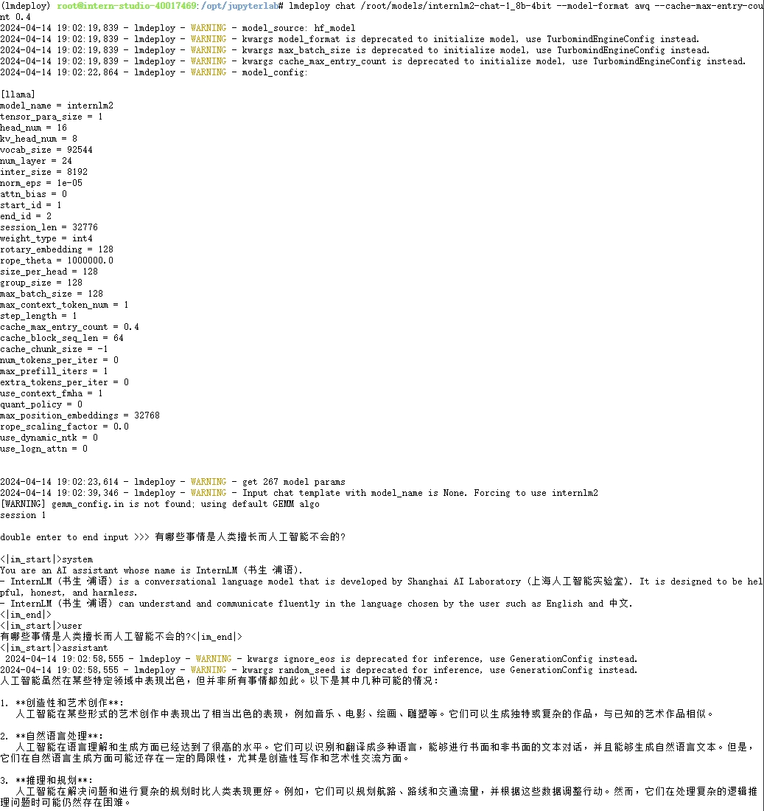
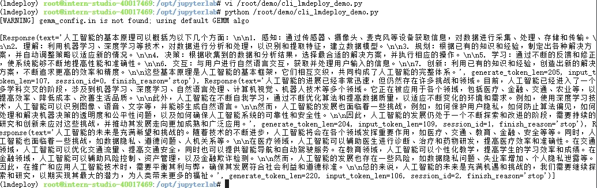
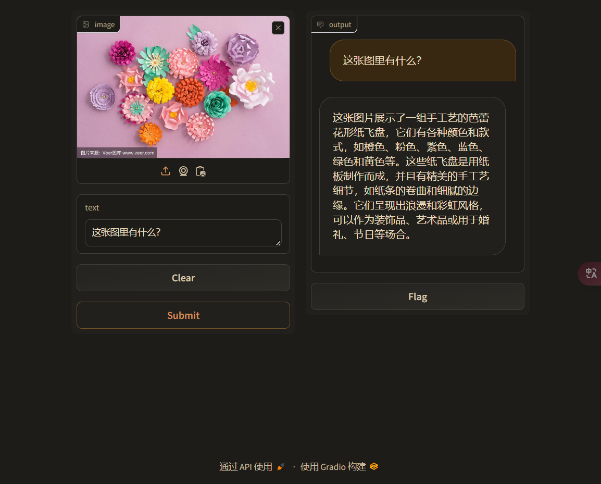

# LMDeploy 量化部署 LLM 实践

## 一、模型部署概述
大语言模型（Large Language Models，LLM）部署是指将训练好的大型语言模型集成到实际应用中，使其能够处理各种语言任务，如文本生成、问答、翻译等。大语言模型的部署是一个复杂的过程，需要考虑多个因素，包括模型的性能、精度、资源需求以及部署环境的选择。部署过程涉及到模型的优化、量化、以及在特定环境中的运行配置。以下是大语言模型部署的一些关键步骤和考虑因素：
> - 模型优化：在部署之前，可能需要对模型进行优化，以提高其性能和效率。这可能包括微调模型以适应特定任务，或使用量化技术来减小模型的大小和计算复杂度
> - 量化：量化是一种减小模型大小和计算复杂度的技术，通过将模型的权重从浮点数转换为低精度整数，可以显著减少模型的存储需求和计算资源消耗
> - 运行环境配置：部署大语言模型需要选择合适的运行环境，这可能包括云服务、本地服务器或边缘设备。选择的环境应能够满足模型的计算需求，并提供足够的存储和网络带宽
> - 服务名称和配置：在部署过程中，需要为模型服务定义一个自定义的服务名称，并配置相关的运行命令和参数。这些配置将决定模型如何被调用和运行
> - 部署：最后，通过配置好的环境和参数，将模型部署到选定的运行环境中。部署完成后，模型就可以开始处理实际的语言任务了

## 二、LMDeploy 基础环境部署
### A、创建 A100 10% Cuda12.2-conda 开发机

### B、安装基础环境，参考命令:
```bash
studio-conda -t lmdeploy -o pytorch-2.1.2
conda activate lmdeploy
pip install lmdeploy[all]==0.3.0
```

### C、验证安装结果：


## 三、模型部署测试
### A、名词释义说明：
> - HuggingFace: 一个针对深度学习模型和数据集的在线托管社区, 托管在 HuggingFace 社区的模型通常采用 HuggingFace 格式存储，简写为HF格式。Transformer 库是 Huggingface 社区推出的用于运行 HF 模型的官方库。
> - TurboMind: LMDeploy 团队开发的一款关于 LLM 推理的高效推理引擎，仅支持推理 TurboMind 格式的模型。TurboMind 在推理 HF 格式的模型时，会首先自动将 HF 格式模型转换为 TurboMind 格式的模型。

### B、Transformer 库运行 internlm2-chat-1.8b 模型
1、创建测试脚本 /root/demo/pipeline_transformer.py, 并粘贴以下代码
```python
import torch
from transformers import AutoTokenizer, AutoModelForCausalLM

tokenizer = AutoTokenizer.from_pretrained("/root/share/new_models/Shanghai_AI_Laboratory/internlm2-chat-1_8b", trust_remote_code=True)

# Set `torch_dtype=torch.float16` to load model in float16, otherwise it will be loaded as float32 and cause OOM Error.
model = AutoModelForCausalLM.from_pretrained("/root/share/new_models/Shanghai_AI_Laboratory/internlm2-chat-1_8b", torch_dtype=torch.float16, trust_remote_code=True).cuda()
model = model.eval()

inp = "hello"
print("[INPUT]", inp)
response, history = model.chat(tokenizer, inp, history=[])
print("[OUTPUT]", response)

inp = "please provide three suggestions about time management"
print("[INPUT]", inp)
response, history = model.chat(tokenizer, inp, history=history)
print("[OUTPUT]", response)
```

2、执行命令  `python /root/demo/pipeline_transformer.py` 等几分钟就可以看到以下输出


### C、使用 LMDeploy 运行 internlm2-chat-1.8b 模型
使用 LMDeploy 与模型进行对话的通用命令格式为 `lmdeploy chat [HF格式模型路径/TurboMind格式模型路径]`, 更多命令参数可以在命令后面加上参数 `-h` 来查看。参考命令：
```bash
lmdeploy chat /root/share/new_models/Shanghai_AI_Laboratory/internlm2-chat-1_8b
```
演示效果：


## 四、LMDeploy 模型量化测试
大语言模型量化是一种技术，它将模型参数（如权重和偏置）从浮点数转换为较低位精度的整数，例如将32位浮点数转换为8位整数。这种转换类似于将复杂的内容简化为更易于理解和传播的形式，但可能会丢失一些原始信息，因为用较低精度表示原始浮点数可能会丢失一些信息。例如，如果一个模型的完整能力为100分，推理时的大小和内存需求为100%。经过量化后，模型的能力可能会降低到90分，但其大小和内存需求可能会降至50%，这就是模型量化的意义。量化的主要目的包括：
> - 模型瘦身：通过量化，模型的大小显著减小，更易于部署在存储资源有限的设备上，如移动设备或嵌入式系统。
> - 加速计算：计算机对整数运算通常比浮点运算更快，特别是在没有专门的浮点硬件支持的设备上。
> - 减少能耗：在计算量相似的情况下，整数运算消耗的能源较少。

### A、量化前的资源消耗查看
LMDeploy 支持通过 KV Cache 缓存复用技术来提高性能和降低内存消耗，可以显著减少重复计算量从而提升模型的推理速度。理想情况下，KV Cache 全部存储于显存以加快访存速度。当显存空间不足时也可以将 KV Cache 放在内存，通过缓存管理器控制将当前需要使用的数据放入显存。

模型在运行时占用的显存可大致分为三部分：模型参数本身占用的显存、KV Cache 占用的显存，以及中间运算结果占用的显存。LMDeploy 的KV Cache 管理器可以通过设置 --cache-max-entry-count 参数，设置 KV Cache 占用剩余显存的最大比例。默认的比例为0.8。

1、不加 --cache-max-entry-count 参数（默认0.8），运行 internlm2-chat-1.8B 模型并查看资源消耗，参考命令：
```bash
lmdeploy chat /root/share/new_models/Shanghai_AI_Laboratory/internlm2-chat-1_8b
```
资源占用情况：
```bash
CPU 10.31%
内存 1.07 / 24 GB 4.47%
GPU-1: 10% Nvidia A10 00%
显存 7816 / 8182 MiB 95.53%
```
2、设置 --cache-max-entry-count=0.01（约等于禁止KV Cache占用显存），运行 internlm2-chat-1.8B 模型并查看资源消耗，参考命令：
```bash
lmdeploy chat /root/share/new_models/Shanghai_AI_Laboratory/internlm2-chat-1_8b --cache-max-entry-count 0.01
```
资源占用情况：
```bash
CPU 9.46%
内存 1.05 / 24 GB 4.39%
GPU-1: 10% Nvidia A10 00%
显存 4552 / 8182 MiB 55.63%
```

### B、使用 W4A16 量化 internlm2-chat-1.8B 模型与测试
LMDeploy 使用 AWQ 算法实现模型 4bit 权重量化，可以在推理引擎 TurboMind 实现 FP16 的 2.4 倍以上性能提升。参考命令：
```bash
pip install einops==0.7.0

lmdeploy lite auto_awq \
   /root/share/new_models/Shanghai_AI_Laboratory/internlm2-chat-1_8b \
  --calib-dataset 'ptb' \
  --calib-samples 128 \
  --calib-seqlen 1024 \
  --w-bits 4 \
  --w-group-size 128 \
  --work-dir /root/models/internlm2-chat-1_8b-4bit
```
运行时间较长，需要耐心等待。量化工作结束后，新的 HF 模型被保存到 /root/models/internlm2-chat-1_8b-4bit 目录。

1、不加 --cache-max-entry-count 参数（默认0.8），运行 internlm2-chat-1.8B-4bit 模型并查看资源消耗，参考命令：
```bash
lmdeploy chat /root/models/internlm2-chat-1_8b-4bit --model-format awq
```
资源占用情况：
```bash
CPU 9.41%
内存 1.75 / 24 GB 7.31%
GPU-1: 10% Nvidia A10 00%
显存 7396 / 8182 MiB 90.39%
```

2、设置 --cache-max-entry-count=0.01（约等于禁止KV Cache占用显存），运行 internlm2-chat-1.8B-4bit 模型并查看资源消耗，参考命令：
```bash
lmdeploy chat /root/models/internlm2-chat-1_8b-4bit --model-format awq --cache-max-entry-count 0.01
```
资源占用情况：
```bash
CPU 15.35%
内存 0.84 / 24 GB 3.48%
GPU-1: 10% Nvidia A10 00%
显存 2436 / 8182 MiB 29.77%
```

### C、量化前后对比
| | 模型大小 |显存消耗|
|---------|---------|---------|
|量化前| 3.6GiB | 4552MiB |
|量化后| 1.5GiB | 2436MiB |

> 总结:
> - 通过模型量化可以使用模型占用的存储空间与显存空间大大缩小，使模型加载速度与资源节约上有明显的提升
> - 虽然模型量化过程很慢，但与它带来的性能提升相比还是很值得尝试

## 五、LMDeploy 服务部署
通过前面的实例演示可以看到，我们都是在本地直接加载大模型推理，这在开发阶段比较方便，这也使模型与代码部署形成了强耦合。在生产环境下，为了更好的维护与成本考量，将大模型部署为服务供需要的业务来调用通常是更好的选择。从技术架构上推理服务包含以下模块：
> - 模型推理/服务: 主要提供模型本身的推理，一般来说可以和具体业务解耦，专注模型推理本身性能的优化
> - API Server: 中间协议层，把后端推理/服务通过 API 接口的形式提供给业务方调用
> - Client：推理客户端，通过调用 API 接口来使用推理服务

### A、本地直接加载大模型推理
可以通过以下命令直接使用大模型进行推理，参考命令：
```bash
conda activate lmdeploy
lmdeploy chat /root/models/internlm2-chat-1_8b-4bit --model-format awq --cache-max-entry-count 0.4
```
模型加载好后就会进入命令行聊天界面，演示效果如下：



### B、启动API服务器
通过以下命令启动 API 服务器：
```bash
lmdeploy serve api_server \
    /root/models/internlm2-chat-1_8b-4bit \
    --cache-max-entry-count 0.4 \
    --model-format awq \
    --quant-policy 4 \
    --server-name 0.0.0.0 \
    --server-port 23333 \
    --tp 1
```
参数说明：
```
/root/models/internlm2-chat-1_8b-4bit 模型路径
cache-max-entry-count                 设置 KV Cache 占用剩余显存的最大比例
model-format                          模型的存储格式
quant-policy                          模型的量化位数
server-name                           推理服务名称
server-port                           推理服务端口号
tp                                    并行数量（GPU数量）
```
更多推理服务配置参数可以通过命令 `lmdeploy serve api_server -h` 查看
> 说明：LMDeploy 默认是以 TurboMind 推理引擎运行，如果模型不是 TurboMind 格式，在启动时会有一个自动转换的过程，转换好后就会启动服务。如果只是测试，也可以通过指定参数 --backend pytorch 来直接运行推理模型。

推理服务启动过程输出信息参考：


### C、查看推理服务器接口文档
启动推理服务后就可以在浏览器访问推理接口服务页面，如下图所示：


> - 从界面看这是标准的 OpenAPI 界面，default 下面是支持调用的接口列表，unsupported 是不支持调用的接口列表，Schemas 是接口的参数数据结构。点击任意接口查看接口的详情，可以看到接口介绍、输入参数、输出参数，也可以在这里直接对接口进行调试。


### D、命令行客户端连接推理服务器
在推理服务器启动后可以用命令行客户端连接到服务器进行测试，参考命令：
```bash
conda activate lmdeploy
lmdeploy serve api_client http://localhost:23333
```
运行后，可以通过命令行窗口直接与模型对话：


### E、网页客户端连接推理服务器
使用 Gradio 作为前端启动网页客户端，参考命令：
```bash
lmdeploy serve gradio http://localhost:23333 \
    --server-name 0.0.0.0 \
    --server-port 6006
```
在浏览器访问网页端，并简单试用效果如下：


### F、以 Python 客户端库运行测试
创建脚本 `vi /root/demo/cli_lmdeploy_demo.py` 并粘贴以下代码：
```python
from lmdeploy import pipeline, TurbomindEngineConfig

# 调低 k/v cache内存占比调整为总显存的 40%
backend_config = TurbomindEngineConfig(cache_max_entry_count=0.4)

pipe = pipeline('/root/models/internlm2-chat-1_8b-4bit',
                backend_config=backend_config)
response = pipe(['人工智能的基本原理是什么？', '人工智能现在发展到什么阶段了？', '人工智能的未来是什么？'])
print(response)
```
执行命令 `python /root/demo/cli_lmdeploy_demo.py` 运行脚本，就可以看到输出结果：


### G、用 LMDeploy 运行视觉多模态大模型
LMDeploy 支持 llava 多模态模型，使用 pipeline 推理 llava-v1.6-7b 最低需要 A100 30% 的 InternStudio 开发机

1、安装 llava 依赖库，参考命令：
```bash
conda activate lmdeploy
pip install git+https://github.com/haotian-liu/LLaVA.git@4e2277a060da264c4f21b364c867cc622c945874
```

2、创建脚本 `vi /root/demo/cli_llava_web_demo.py`, 粘贴以下代码：
```python
import gradio as gr
from lmdeploy import pipeline, TurbomindEngineConfig


backend_config = TurbomindEngineConfig(session_len=8192) # 图片分辨率较高时请调高session_len
# pipe = pipeline('liuhaotian/llava-v1.6-vicuna-7b', backend_config=backend_config) 非开发机运行此命令
pipe = pipeline('/share/new_models/liuhaotian/llava-v1.6-vicuna-7b', backend_config=backend_config)

def model(image, text):
    if image is None:
        return [(text, "请上传一张图片。")]
    else:
        response = pipe((text, image)).text
        return [(text, response)]

demo = gr.Interface(fn=model, inputs=[gr.Image(type="pil"), gr.Textbox()], outputs=gr.Chatbot())
demo.launch()
```

3、启动网页服务端
参考命令 `python /root/demo/cli_llava_web_demo.py`，启动好后在浏览器打开页面，演示效果如下：



## 六、部署到 OpenXLab
### A、创建应用项目
1、在 Github 创建一个项目

先在 Github 创建一个新项目 internlm2_lmdeploy_demo，再按 openXLab 平台 Gradio 应用规范开发应用程序

2、在 openXLab 申请资源

在 openXLab 平台申请可以运行 internlm2_chat_1_8b 模型的硬件资源，如：4vCPU 16GB Nvidia vGPU 8GB

3、在 openXLab 创建 Gradio 应用

在 openXLab 平台创建一个 Gradio 应用，Github 项目地址填写上面的项目地址

4、发布项目

在 openXLab 平台测试应用，没问题就可以公开发布

### B、在线体验
在浏览器中打开 https://openxlab.org.cn/apps/detail/csg2008/internlm2_lmdeploy_demo


## 七、使用体会总结
首先，大语言模型的理解能力非常强大，能够理解复杂的语境、推理出隐含的含义，甚至能够生成连贯的文本，这使得在文本生成、问答、多模态等任务上表现出色。然而，使用大语言模型也存在一些挑战：
> - 模型的决策过程往往是黑箱的，这使得很难理解模型为什么会做出特定的决策。
> - 模型的性能往往取决于训练数据的质量和多样性，如果训练数据不足或者不准确，模型的性能可能会受到影响。

尽管如此，大语言模型的潜力和影响力还是无法忽视的，它正在改变我们与技术互动的方式。随着技术的不断发展，我相信大语言模型将继续推动我们的工作和生活方式。

部署总结：
> - 通过服务方式部署大模型，可以方便的对外提供模型推理服务，也可以使用模型部署与业务应用部署解耦，亦或直接使用第三方模型服务
> - 通过模型量化，可以在推理性能与推理成本之间进行平衡，让大模型以最优的方式应用到需要它的每个地方，让生活列精彩

未解疑问：
> - 在哪可以查到书生浦语系列不同参数大小的模型硬件需求？
> - LMDeploy 以 API 服务器方式部署模型，如何同时部署多个模型？每个模型启动一个服务吗？
> - LMDeploy 用 TurboMind 推理引擎启动时每次都会转换模型，对启动时间影响还是蛮大的，是否可以将转换后的模型缓存起来呢？