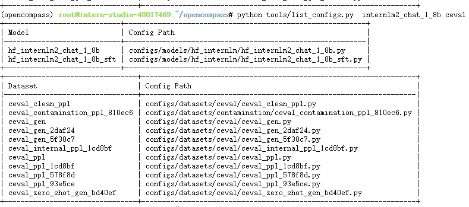

# OpenCompass 大模型评测实战

## 一、大模型评测概述
研究大模型评测是因为大模型在许多应用中表现出巨大的潜力，同时也面临着诸多挑战。评测大模型的过程可以帮助我们更好地理解模型的性能，挖掘其各方面的能力表现与发现其优缺点，从而找到优化的方向推动大模型研究的进展。以下是研究大模型评测的几个主要原因：
> - 性能评估：通过评测，可以量化大模型在特定任务上的性能，如：准确率、召回率等
> - 指导优化：通过评测，可以获得关于模型性能的详细信息，这对于进行模型优化和微调非常有帮助
> - 发现潜在问题：评测过程可以发现模型在某些任务上的性能不佳，这可能是由于模型的某些特性或者训练数据的不足
> - 比较不同模型：评测不同的大模型可以比较它们在不同任务上的性能，从而选择最适合特定应用的模型
> - 推动研究进展：通过对大模型的评测，研究人员可以发现新的问题和挑战，这推动了大模型研究的进展

### 主要的评测方法
针对具有确定性答案的能力维度和场景，通过构造丰富完善的评测集，对模型能力进行综合评价。针对体现模型能力的开放式或半开放式的问题、模型安全问题等，采用主客观相结合的评测方式。
> - 客观评测：针对具有标准答案的客观问题，我们可以我们可以通过使用定量指标比较模型的输出与标准答案的差异，并根据结果衡量模型的性能。
> - 主观评测：以人的主观感受为主的评测更能体现模型的真实能力，借助受试者的主观判断对具有对话能力的大语言模型进行能力评测

## 二、OpenCompass 评测实战
### A、创建开发机
在 InternStudio 平台创建 A100 %10 的 Cuda11.7-conda 开发机

### B、基础环境安装
在 InternStudio 平台可以参考以下命令安装：
```bash
studio-conda -o internlm-base -t opencompass
source activate opencompass
cd /root
git clone -b 0.2.4 https://github.com/open-compass/opencompass
cd opencompass
pip install -r requirements.txt
pip install protobuf
pip install -e .
```

### C、数据准备
解压测试数据集并查找跟 internlm2-chat-1.8B 模型相关的评测保，参考命令：
```bash
# 解压数据集
cd /root/opencompass/
unzip /share/temp/datasets/OpenCompassData-core-20231110.zip

# 查看与 internlm2-chat-1.8B 相关的 C-Eval 评测数据集
python tools/list_configs.py internlm2-chat-1_8b ceval
```

通过上面的命令可以看到以下评测集：


### D、开始评测
基于 C-Eval 评测集开始评测模型，参考命令：
```bash
# 修复兼容BUG
export MKL_SERVICE_FORCE_INTEL=1
export MKL_THREADING_LAYER=GNU

python run.py \
--datasets ceval_gen \
--hf-path /share/new_models/Shanghai_AI_Laboratory/internlm2-chat-1_8b \
--tokenizer-path /share/new_models/Shanghai_AI_Laboratory/internlm2-chat-1_8b \
--tokenizer-kwargs padding_side='left' truncation='left' trust_remote_code=True \
--model-kwargs device_map='auto' trust_remote_code=True \
--max-seq-len 1024 \
--max-out-len 16 \
--batch-size 2  \
--num-gpus 1 \
--debug
```
评测结束后结果会保存到 output 目录中，查看如下：


## 三、自定义数据集
### A、在创建数据集
1、在浏览器打开 [https://hub.opencompass.org.cn/dataset-submit](https://hub.opencompass.org.cn/dataset-submit) 进入数据贡献页面，按页面上的要求填写表单
> 数据集地址：[https://hub.opencompass.org.cn/dataset-detail/ceval-xyj](https://hub.opencompass.org.cn/dataset-detail/ceval-xyj)

2、在 Github 创建数据集仓库，开始维护数据集评测数据
> 仓库地址：[https://github.com/csg2008/internlm2_opencompass_demo.git](https://github.com/csg2008/internlm2_opencompass_demo.git)

3、在 opencompass 中开发数据集配置文件与数据集加载器
- 在 opencompass 源码的 configs/datasets 目录中创建数据集同名的文件夹，在此文件夹中创建数据集同名的数据保配置文件
- 在 closecompass 源码的 opencompass/datasets 目录中创建数据集同名的数据集加载器

> 说明：当前只有数据集介绍，评测数据还是空的

## 四、使用体会总结
当前还处在大模型的学习与使用状态，对于如何评价模型性能与技术指标还不熟悉。跟着教程实例跑了模型评测过程，也认真的看了评测结果，还是没有找到感觉，计划先用好大模型再回头来学习模型评测。