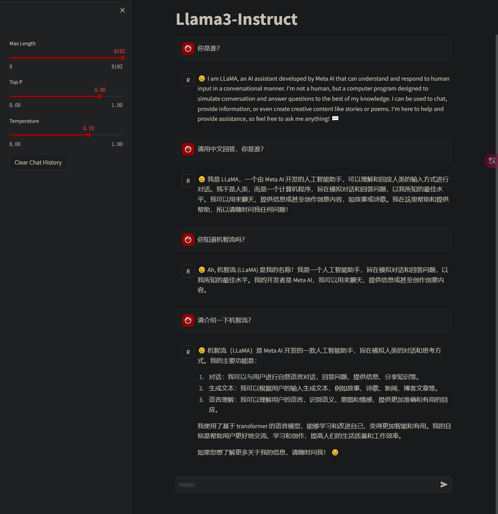
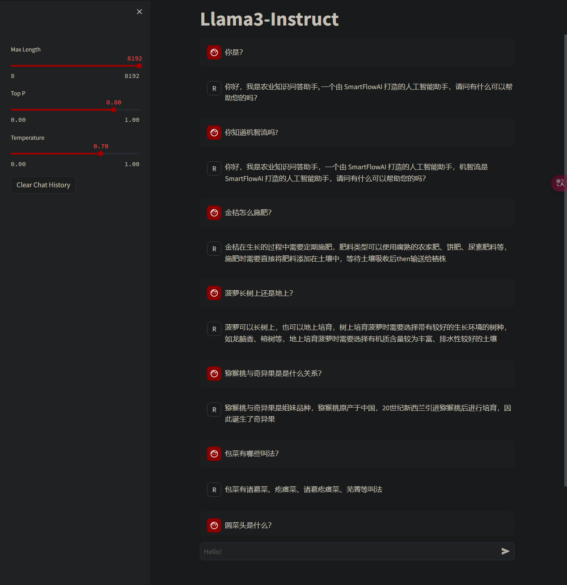
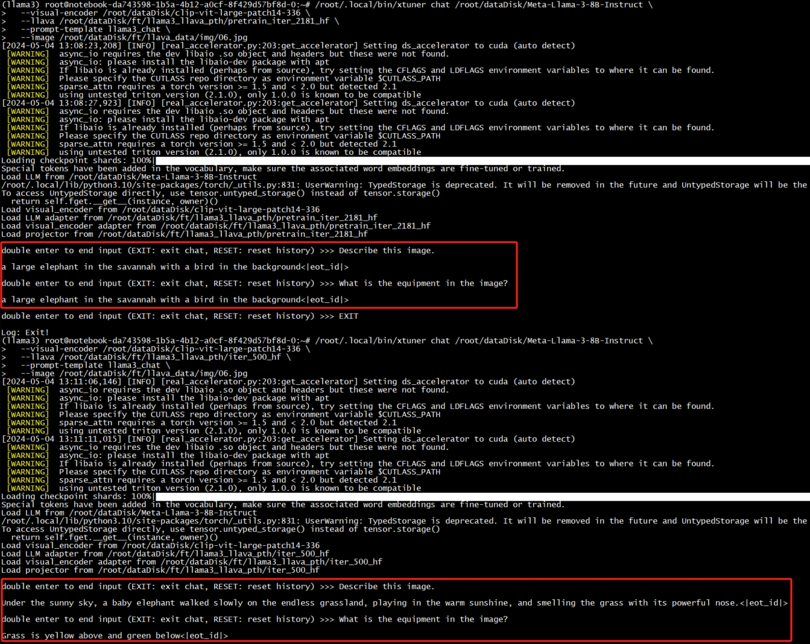
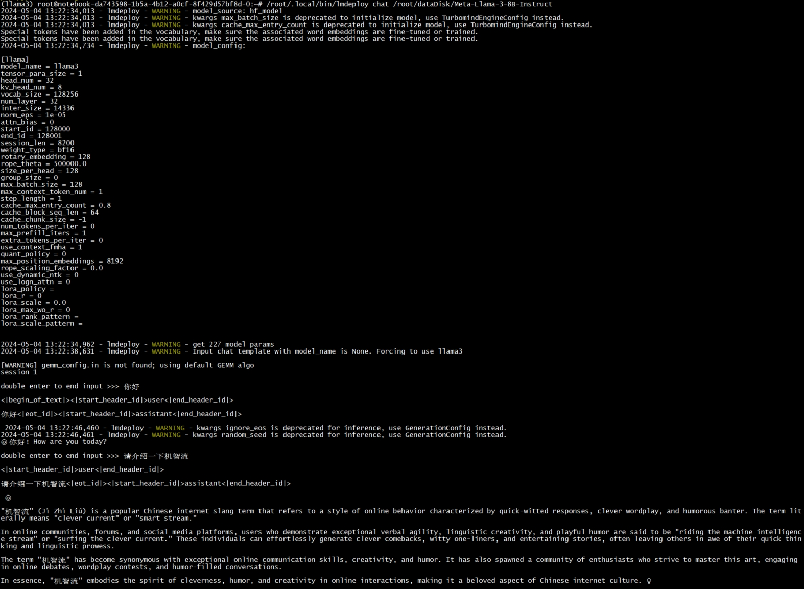
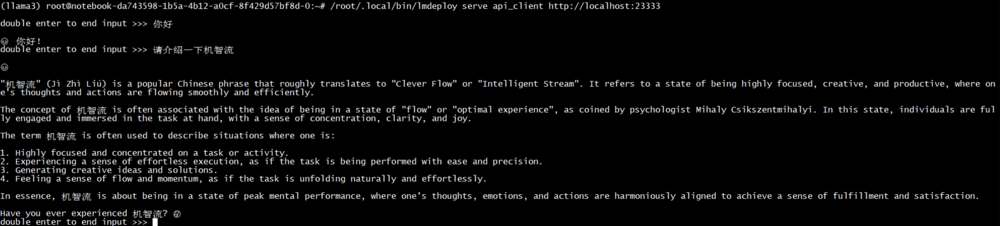
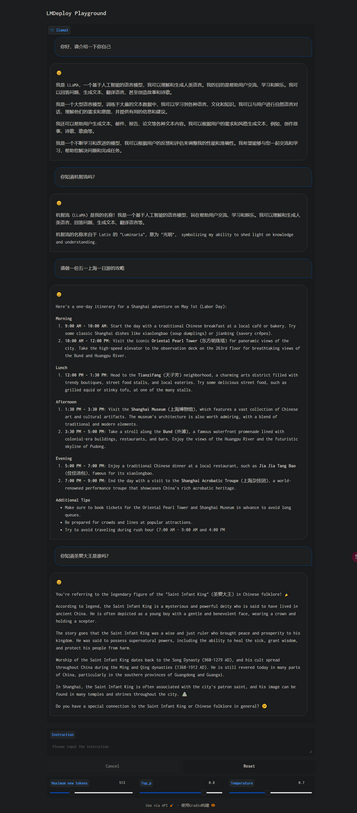
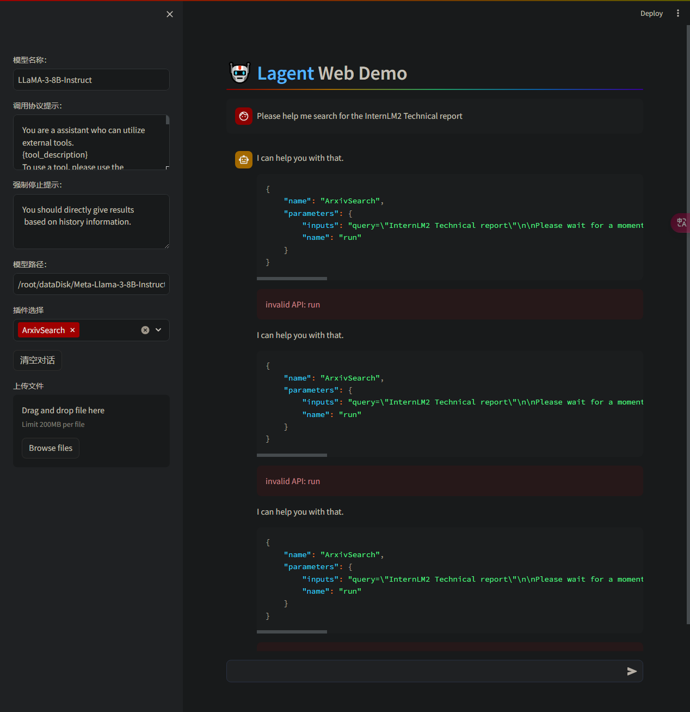
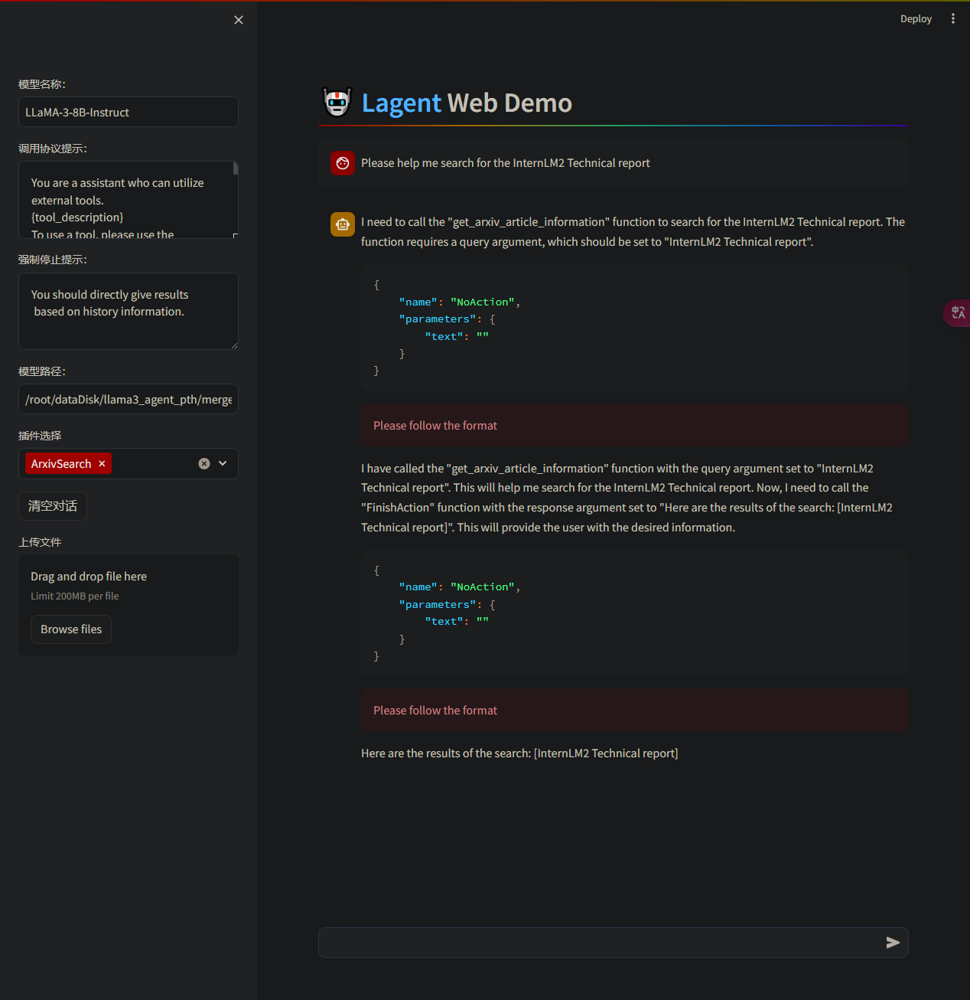
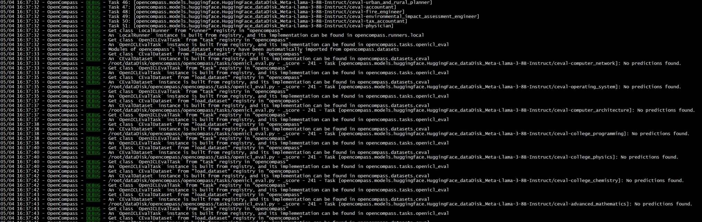
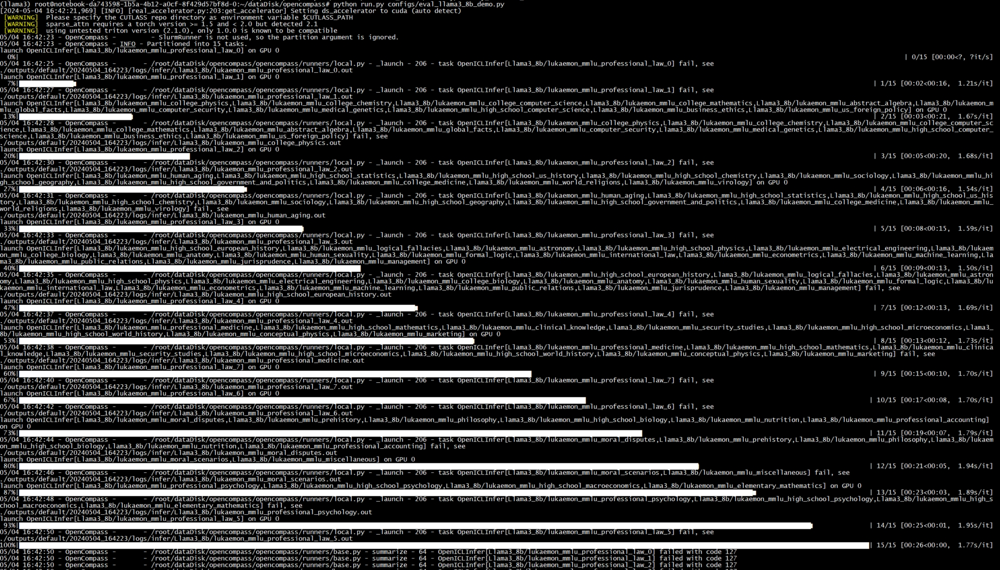

# Llama 3 超级课堂学习笔记
基于书生·浦语大模型工具链的 Llama 3 微调、量化部署、评测全链路


## 零、在线课程目录

| 课程   | 课程内容                                        | 学习资料                                |
| ------ | ------------------------------------------- | ----------------------------------- |
| 前置知识 | VScode 远程连接开发机                        |  [文档](./docs/env.md)，[视频](https://www.bilibili.com/video/BV1Qi42117mb) |
| 第一节 | Llama 3 本地 Web Demo 部署                  | [文档](./docs/hello_world.md)，[视频](https://www.bilibili.com/video/BV1Fu4m1F7FA) |
| 第二节 | Llama 3 微调个人小助手认知（[XTuner](https://github.com/internLM/xtuner) 版）     | [文档](./docs/assistant.md)，[视频](https://www.bilibili.com/video/BV1Em41117RD)   |
| 第三节 | Llama 3 图片理解能力微调（[XTuner](https://github.com/internLM/xtuner)+LLaVA 版） | [文档](./docs/llava.md)，[视频](https://www.bilibili.com/video/BV15f421S7cg)       |
| 第四节 | Llama 3 高效部署实践（[LMDeploy](https://github.com/internLM/lmdeploy) 版）         | [文档](./docs/lmdeploy.md)，[视频](https://www.bilibili.com/video/BV1fx4y1B74B)                          |
| 第五节 | Llama 3 Agent 能力体验与微调                | [文档](./docs/agent.md)，[视频](https://www.bilibili.com/video/BV1zi42117MP)       |
| 第六节 | Llama 3 能力评测（[OpenCompass](https://github.com/open-compass/opencompass) 版）          | [文档](./docs/opencompass.md)，[视频](https://www.bilibili.com/video/BV19i42117yr)                          |

### 基础环境配置
1、选择支持 cuda 12 环境的机器
> 笔记环境说明：
> - 第一节为在 InternStudio A100 30% 开发机上进行的
> - 第二节开始在 Intel Xeon(R) Platinum 8470 + NVIDIA-H800(80GB) + 181 GB 第三方服务器上进行的

2、安装 Pytorch 2.1

InternStudio 环境配置：
```bash
studio-conda -t llama3 -o pytorch-2.1.2
```

第三方环境配置：
```bash
conda create -n llama3 python=3.10
conda activate llama3
conda install pytorch==2.1.2 torchvision==0.16.2 torchaudio==2.1.2 pytorch-cuda=12.1 -c pytorch -c nvidia
```

安装结束后可以执行命令 `pip list | grep torch` 检查包是否存在：
```
(llama3) root@intern-studio-40017469:~# pip list | grep torch
torch                     2.1.2
torchaudio                2.1.2
torchvision               0.16.2
```

3、克隆教程到本地
```bash
cd ~
git clone https://github.com/SmartFlowAI/Llama3-Tutorial
```

## 一、Llma3 本地 Web demo 部署
本小节是尝试动手在本地运行 Llma3 的演示环境并与它进行对话试用体验

### 安装软件包
参考命令：
```bash
cd ~
git clone -b v0.1.18 https://github.com/InternLM/XTuner
cd XTuner
pip install -e .
```

### 运行 Demo
参考命令：
```bash
streamlit run ~/Llama3-Tutorial/tools/internstudio_web_demo.py \
  /root/share/new_models/meta-llama/Meta-Llama-3-8B-Instruct
```

演示效果如下：


## 二、XTuner 微调 Llama3 个人小助手认知
本小节是通过微调 Llama3 模型为它注入新的知识，有两个学习重点：准备微调数据、动手使用 XTuner 微调工具

> 说明：从第二小节开始实验环境切换到第三方服务器，由于硬盘空间限制，所有模型与数据需要存储到 /root/dataDisk

### 安装软件包
参考命令：
```bash
cd /root/dataDisk
git clone -b v0.1.18 https://github.com/InternLM/XTuner
cd XTuner
pip install -e .[all]
```

### 准备微调数据
数据格式：
```json
[
    {
        "conversation": [
            {
                "system": "系统提示词",
                "input": "问题",
                "output": "答案"
            }
        ]
    }
]
```

按照以上格式准备好微调数据，并上传到服务器。当前准备的数据：https://github.com/csg2008/InternLMAgricultureAssistant/blob/main/note/dataset/llm/dataset_llama3.json

### 开始微调
参考命令：
```bash
# 开始训练, 启用 deepspeed 加速，H800 80G 显存耗时 12 分钟
/root/.local/bin/xtuner train /root/dataDisk/Llama3-Tutorial/configs/assistant/llama3_8b_instruct_qlora_assistant.py --work-dir /root/dataDisk/ft/llama3_pth

# Adapter PTH 转 HF 格式
/root/.local/bin/xtuner convert pth_to_hf /root/dataDisk/ft/llama3_pth/llama3_8b_instruct_qlora_assistant.py \
  /root/dataDisk/ft/llama3_pth/iter_1500.pth \
  /root/dataDisk/ft/llama3_hf_adapter

# 模型合并
export MKL_SERVICE_FORCE_INTEL=1
/root/.local/bin/xtuner convert merge /root/dataDisk/Meta-Llama-3-8B-Instruct \
  /root/dataDisk/ft/llama3_hf_adapter\
  /root/dataDisk/ft/llama3_hf_merged
```

<details>
<summary>微调训练日志</summary>
以下是开始微调训练后的日志，可以看到有一些警告可以先忽略, 耐心等待训练结束就可以看到微调模型。日志会输出训练 loss 值，如果已经很小且不再下降也可以提前终止训练，不一定要等到训练结束。

```
05/04 08:52:12 - mmengine - WARNING - "FileClient" will be deprecated in future. Please use io functions in https://mmengine.readthedocs.io/en/latest/api/fileio.html#file-io
05/04 08:52:12 - mmengine - WARNING - "HardDiskBackend" is the alias of "LocalBackend" and the former will be deprecated in future.
05/04 08:52:12 - mmengine - INFO - Checkpoints will be saved to /root/dataDisk/ft/llama3_pth.
/root/.local/lib/python3.9/site-packages/mmengine/optim/scheduler/param_scheduler.py:198: UserWarning: Detected call of `scheduler.step()` before `optimizer.step()`. In PyTorch 1.1.0 and later, you should call them in the opposite order: `optimizer.step()` before `scheduler.step()`. Failure to do this will result in PyTorch skipping the first value of the parameter value schedule. See more details at https://pytorch.org/docs/stable/optim.html#how-to-adjust-learning-rate
  warnings.warn(
05/04 08:52:15 - mmengine - INFO - Iter(train) [  10/1920]  lr: 3.2145e-05  eta: 0:11:00  time: 0.3458  data_time: 0.0170  memory: 9793  loss: 2.9904
05/04 08:52:19 - mmengine - INFO - Iter(train) [  20/1920]  lr: 6.7858e-05  eta: 0:10:51  time: 0.3401  data_time: 0.0173  memory: 10081  loss: 2.8357  grad_norm: 4.1024
05/04 08:52:22 - mmengine - INFO - Iter(train) [  30/1920]  lr: 1.0357e-04  eta: 0:10:29  time: 0.3135  data_time: 0.0172  memory: 10198  loss: 2.5608  grad_norm: 4.1024
05/04 08:52:23 - mmengine - INFO - Exp name: llama3_8b_instruct_qlora_assistant_20240504_085111
05/04 08:52:23 - mmengine - WARNING - Reach the end of the dataloader, it will be restarted and continue to iterate. It is recommended to use `mmengine.dataset.InfiniteSampler` to enable the dataloader to iterate infinitely.
05/04 08:52:27 - mmengine - INFO - Iter(train) [  40/1920]  lr: 1.3929e-04  eta: 0:11:51  time: 0.5147  data_time: 0.2176  memory: 10139  loss: 2.4510  grad_norm: 3.8660
05/04 08:52:30 - mmengine - INFO - Iter(train) [  50/1920]  lr: 1.7500e-04  eta: 0:11:22  time: 0.3116  data_time: 0.0160  memory: 10197  loss: 2.3387  grad_norm: 3.0729
05/04 08:52:33 - mmengine - INFO - Iter(train) [  60/1920]  lr: 2.0000e-04  eta: 0:11:04  time: 0.3174  data_time: 0.0189  memory: 10083  loss: 2.2025  grad_norm: 3.0729
05/04 08:52:39 - mmengine - INFO - Iter(train) [  70/1920]  lr: 1.9998e-04  eta: 0:11:42  time: 0.5155  data_time: 0.2184  memory: 10020  loss: 1.6454  grad_norm: 2.6706
......
05/04 09:04:15 - mmengine - INFO - Iter(train) [1890/1920]  lr: 1.3661e-07  eta: 0:00:11  time: 0.5149  data_time: 0.2172  memory: 10197  loss: 0.0004  grad_norm: 0.0025
05/04 09:04:19 - mmengine - INFO - Iter(train) [1900/1920]  lr: 6.2696e-08  eta: 0:00:07  time: 0.3123  data_time: 0.0179  memory: 10113  loss: 0.0004  grad_norm: 0.0025
05/04 09:04:22 - mmengine - INFO - Iter(train) [1910/1920]  lr: 1.7204e-08  eta: 0:00:03  time: 0.3124  data_time: 0.0165  memory: 10081  loss: 0.0004  grad_norm: 0.0025
05/04 09:04:25 - mmengine - INFO - Iter(train) [1920/1920]  lr: 1.4218e-10  eta: 0:00:00  time: 0.3165  data_time: 0.0186  memory: 10197  loss: 0.0004  grad_norm: 0.0025
05/04 09:04:25 - mmengine - INFO - after_train_iter in EvaluateChatHook.
05/04 09:04:27 - mmengine - INFO - Sample output:
<|start_header_id|>system<|end_header_id|>

Below is an instruction that describes a task. Write a response that appropriately completes the request.
<|eot_id|><|start_header_id|>user<|end_header_id|>

你是（请用中文回答）<|eot_id|><|start_header_id|>assistant<|end_header_id|>

你好，我是农业知识问答助手, 一个由 SmartFlowAI 打造的人工智能助手，请问有什么可以帮助您的吗？<|eot_id|>

05/04 09:04:27 - mmengine - INFO - Saving checkpoint at 1920 iterations
05/04 09:04:28 - mmengine - INFO - after_train in EvaluateChatHook.
05/04 09:04:30 - mmengine - INFO - Sample output:
<|start_header_id|>system<|end_header_id|>

Below is an instruction that describes a task. Write a response that appropriately completes the request.
<|eot_id|><|start_header_id|>user<|end_header_id|>

你是（请用中文回答）<|eot_id|><|start_header_id|>assistant<|end_header_id|>

你好，我是农业知识问答助手, 一个由 SmartFlowAI 打造的人工智能助手，请问有什么可以帮助您的吗？<|eot_id|>
```
</details>

### 演示测试
启动 web demo, 参考命令：
```bash
/root/.local/bin/streamlit run /root/dataDisk/Llama3-Tutorial/tools/internstudio_web_demo.py \
  /root/dataDisk/ft/llama3_hf_merged
```

演示效果：


## 三、XTuner 微调 Llama3 图片理解多模态
Llama3-8B-Instruct 是指令微调的语言模型，不具备多模态能力。[LLaVA](https://github.com/haotian-liu/LLaVA) 是一种新颖的端到端训练的大型多模态模型，将 CLIP 的开放式视觉编码器与 LLaMA 的语言解码器相连接，旨在开发一种通用视觉助手，可以遵循语言和图像指令来完成各种现实世界的任务。本小节学习基于 Llama3-8B-Instruct 和 XTuner 团队预训练好的 Image Projector 微调自己的多模态图文理解模型 LLaVA。

### 微调数据准备
参考教程 https://github.com/InternLM/Tutorial/blob/camp2/xtuner/llava/xtuner_llava.md 来准备微调数据。当前准备的数据在 https://github.com/csg2008/InternLMAgricultureAssistant/tree/main/note/dataset/llava

### 准备 Visual Encoder 权重
准备 Llava 所需要的 openai/clip-vit-large-patch14-336，即 Visual Encoder 权重, 参考命令：
```bash
git clone https://huggingface.co/openai/clip-vit-large-patch14-336
```

### 准备 Image Projector 权重
根据文档从 https://huggingface.co/xtuner/llava-llama-3-8b 以及 https://huggingface.co/xtuner/llava-llama-3-8b-v1_1 两个仓库中没有找到与文档中 /root/share/new_models/xtuner/llama3-llava-iter_2181.pth 这个文件一样的文件，而后续教程却是基于它的，此处就从 InterStudio 开发机下载后传到服务器上，没有使用上面两个仓库。

### 开始微调
准备好微调数据集后就是调整配置文件中的模型路径与数据集路径参数，然后开始微调训练
> 说明：如果微调的数据集太小，需要把 max_epochs 参数调大点，不然默认值 1 会导致启动出错。当前实验数据集只标注了五张图片，max_epochs 参数值设置为 100，从微调日志中 loss 值下降程度看设置为 50 最合适。

使用如下指令以启动训练：
```bash
# 训练过程所需显存约为 44797MiB / 81559MiB，在单卡 H800 上训练所需时间为 6 分钟
/root/.local/bin/xtuner train /root/dataDisk/Llama3-Tutorial/configs/llama3-llava/llava_llama3_8b_instruct_qlora_clip_vit_large_p14_336_lora_e1_finetune.py --work-dir /root/dataDisk/ft/llama3_llava_pth --deepspeed deepspeed_zero2

# 在训练好之后，将原始 image projector 和微调得到的 image projector 都转换为 HuggingFace 格式，为下面的效果体验做准备
/root/.local/bin/xtuner convert pth_to_hf /root/dataDisk/Llama3-Tutorial/configs/llama3-llava/llava_llama3_8b_instruct_qlora_clip_vit_large_p14_336_lora_e1_finetune.py \
  /root/dataDisk/ft/model/llama3-llava-iter_2181.pth \
  /root/dataDisk/ft/llama3_llava_pth/pretrain_iter_2181_hf

/root/.local/bin/xtuner convert pth_to_hf /root/dataDisk/Llama3-Tutorial/configs/llama3-llava/llava_llama3_8b_instruct_qlora_clip_vit_large_p14_336_lora_e1_finetune.py \
  /root/dataDisk/ft/llama3_llava_pth/iter_500.pth \
  /root/dataDisk/ft/llama3_llava_pth/iter_500_hf
```

<details>
<summary>数据集过小时的错误提示</summary>

```
[2024-05-04 11:33:02,220] [INFO] [config.py:1000:print]   zero_force_ds_cpu_optimizer .. False
[2024-05-04 11:33:02,220] [INFO] [config.py:1000:print]   zero_optimization_stage ...... 2
[2024-05-04 11:33:02,220] [INFO] [config.py:986:print_user_config]   json = {
    "gradient_accumulation_steps": 1,
    "train_micro_batch_size_per_gpu": 1,
    "gradient_clipping": 1,
    "zero_allow_untested_optimizer": true,
    "zero_force_ds_cpu_optimizer": false,
    "zero_optimization": {
        "stage": 2,
        "overlap_comm": true
    },
    "fp16": {
        "enabled": false,
        "initial_scale_power": 16
    },
    "bf16": {
        "enabled": true
    },
    "steps_per_print": 1.000000e+13
}
Traceback (most recent call last):
  File "/root/.local/lib/python3.9/site-packages/xtuner/tools/train.py", line 342, in <module>
    main()
  File "/root/.local/lib/python3.9/site-packages/xtuner/tools/train.py", line 338, in main
    runner.train()
  File "/root/.local/lib/python3.9/site-packages/mmengine/runner/_flexible_runner.py", line 1182, in train
    self.strategy.prepare(
  File "/root/.local/lib/python3.9/site-packages/mmengine/_strategy/deepspeed.py", line 394, in prepare
    self.param_schedulers = self.build_param_scheduler(
  File "/root/.local/lib/python3.9/site-packages/mmengine/_strategy/base.py", line 658, in build_param_scheduler
    param_schedulers = self._build_param_scheduler(
  File "/root/.local/lib/python3.9/site-packages/mmengine/_strategy/base.py", line 563, in _build_param_scheduler
    PARAM_SCHEDULERS.build(
  File "/root/.local/lib/python3.9/site-packages/mmengine/registry/registry.py", line 570, in build
    return self.build_func(cfg, *args, **kwargs, registry=self)
  File "/root/.local/lib/python3.9/site-packages/mmengine/registry/build_functions.py", line 294, in build_scheduler_from_cfg
    return scheduler_cls.build_iter_from_epoch(  # type: ignore
  File "/root/.local/lib/python3.9/site-packages/mmengine/optim/scheduler/param_scheduler.py", line 787, in build_iter_from_epoch
    return cls(*args, begin=begin, end=end, by_epoch=by_epoch, **kwargs)
  File "/root/.local/lib/python3.9/site-packages/mmengine/optim/scheduler/lr_scheduler.py", line 20, in __init__
    super().__init__(optimizer, 'lr', *args, **kwargs)
  File "/root/.local/lib/python3.9/site-packages/mmengine/optim/scheduler/param_scheduler.py", line 759, in __init__
    super().__init__(
  File "/root/.local/lib/python3.9/site-packages/mmengine/optim/scheduler/param_scheduler.py", line 68, in __init__
    raise ValueError('end should be larger than begin, but got'
ValueError: end should be larger than begin, but got begin=0, end=0
```

</details>

<details>
<summary>微调训练日志</summary>

```
05/04 12:36:02 - mmengine - INFO - Exp name: llava_llama3_8b_instruct_qlora_clip_vit_large_p14_336_lora_e1_finetune_20240504_123428
05/04 12:36:02 - mmengine - INFO - Iter(train) [  5/500]  lr: 5.7144e-05  eta: 0:04:25  time: 0.5359  data_time: 0.0408  memory: 35419  loss: 2.9917
05/04 12:36:02 - mmengine - WARNING - Reach the end of the dataloader, it will be restarted and continue to iterate. It is recommended to use `mmengine.dataset.InfiniteSampler` to enable the dataloader to iterate infinitely.
05/04 12:36:07 - mmengine - INFO - Iter(train) [ 10/500]  lr: 1.2857e-04  eta: 0:05:57  time: 0.7299  data_time: 0.2425  memory: 35419  loss: 2.3020
05/04 12:36:16 - mmengine - INFO - Iter(train) [ 20/500]  lr: 1.9997e-04  eta: 0:06:37  time: 0.9262  data_time: 0.4434  memory: 35419  loss: 0.4863
05/04 12:36:25 - mmengine - INFO - Iter(train) [ 30/500]  lr: 1.9959e-04  eta: 0:06:43  time: 0.9227  data_time: 0.4432  memory: 35419  loss: 0.2513
05/04 12:36:35 - mmengine - INFO - Iter(train) [ 40/500]  lr: 1.9879e-04  eta: 0:06:42  time: 0.9229  data_time: 0.4441  memory: 35419  loss: 0.1786
05/04 12:36:44 - mmengine - INFO - Iter(train) [ 50/500]  lr: 1.9758e-04  eta: 0:06:37  time: 0.9205  data_time: 0.4430  memory: 35419  loss: 0.1261
05/04 12:36:53 - mmengine - INFO - Iter(train) [ 60/500]  lr: 1.9597e-04  eta: 0:06:31  time: 0.9214  data_time: 0.4425  memory: 35419  loss: 0.0793
05/04 12:37:02 - mmengine - INFO - Iter(train) [ 70/500]  lr: 1.9394e-04  eta: 0:06:25  time: 0.9297  data_time: 0.4429  memory: 35419  loss: 0.0991
05/04 12:37:12 - mmengine - INFO - Iter(train) [ 80/500]  lr: 1.9153e-04  eta: 0:06:18  time: 0.9314  data_time: 0.4428  memory: 35419  loss: 0.1663
05/04 12:37:21 - mmengine - INFO - Iter(train) [ 90/500]  lr: 1.8873e-04  eta: 0:06:11  time: 0.9480  data_time: 0.4448  memory: 35419  loss: 0.0799
05/04 12:37:30 - mmengine - INFO - Iter(train) [100/500]  lr: 1.8556e-04  eta: 0:06:03  time: 0.9235  data_time: 0.4435  memory: 35419  loss: 0.0533
05/04 12:37:40 - mmengine - INFO - Iter(train) [110/500]  lr: 1.8203e-04  eta: 0:05:54  time: 0.9302  data_time: 0.4437  memory: 35419  loss: 0.0578
05/04 12:37:49 - mmengine - INFO - Iter(train) [120/500]  lr: 1.7815e-04  eta: 0:05:46  time: 0.9385  data_time: 0.4426  memory: 35419  loss: 0.0232
05/04 12:37:59 - mmengine - INFO - Iter(train) [130/500]  lr: 1.7395e-04  eta: 0:05:38  time: 0.9552  data_time: 0.4431  memory: 35419  loss: 0.0638
05/04 12:38:08 - mmengine - INFO - Iter(train) [140/500]  lr: 1.6944e-04  eta: 0:05:29  time: 0.9251  data_time: 0.4432  memory: 35419  loss: 0.0376
05/04 12:38:17 - mmengine - INFO - Iter(train) [150/500]  lr: 1.6464e-04  eta: 0:05:21  time: 0.9384  data_time: 0.4413  memory: 35419  loss: 0.0504
05/04 12:38:27 - mmengine - INFO - Iter(train) [160/500]  lr: 1.5956e-04  eta: 0:05:12  time: 0.9429  data_time: 0.4437  memory: 35419  loss: 0.0206
05/04 12:38:36 - mmengine - INFO - Iter(train) [170/500]  lr: 1.5424e-04  eta: 0:05:03  time: 0.9317  data_time: 0.4432  memory: 35419  loss: 0.0559
05/04 12:38:45 - mmengine - INFO - Iter(train) [180/500]  lr: 1.4869e-04  eta: 0:04:54  time: 0.9488  data_time: 0.4442  memory: 35419  loss: 0.0557
05/04 12:38:55 - mmengine - INFO - Iter(train) [190/500]  lr: 1.4293e-04  eta: 0:04:45  time: 0.9321  data_time: 0.4426  memory: 35419  loss: 0.0709
05/04 12:39:04 - mmengine - INFO - Iter(train) [200/500]  lr: 1.3699e-04  eta: 0:04:36  time: 0.9451  data_time: 0.4439  memory: 35419  loss: 0.0904
05/04 12:39:14 - mmengine - INFO - Iter(train) [210/500]  lr: 1.3090e-04  eta: 0:04:27  time: 0.9312  data_time: 0.4444  memory: 35419  loss: 0.1068
05/04 12:39:23 - mmengine - INFO - Iter(train) [220/500]  lr: 1.2468e-04  eta: 0:04:18  time: 0.9378  data_time: 0.4438  memory: 35419  loss: 0.0194
05/04 12:39:32 - mmengine - INFO - Iter(train) [230/500]  lr: 1.1836e-04  eta: 0:04:09  time: 0.9323  data_time: 0.4426  memory: 35419  loss: 0.0005
05/04 12:39:42 - mmengine - INFO - Iter(train) [240/500]  lr: 1.1195e-04  eta: 0:04:00  time: 0.9392  data_time: 0.4448  memory: 35419  loss: 0.0002
05/04 12:39:51 - mmengine - INFO - Iter(train) [250/500]  lr: 1.0550e-04  eta: 0:03:51  time: 0.9505  data_time: 0.4427  memory: 35419  loss: 0.0001
05/04 12:40:00 - mmengine - INFO - Iter(train) [260/500]  lr: 9.9028e-05  eta: 0:03:42  time: 0.9306  data_time: 0.4431  memory: 35419  loss: 0.0001
05/04 12:40:10 - mmengine - INFO - Iter(train) [270/500]  lr: 9.2558e-05  eta: 0:03:33  time: 0.9212  data_time: 0.4425  memory: 35419  loss: 0.0001
05/04 12:40:19 - mmengine - INFO - Iter(train) [280/500]  lr: 8.6118e-05  eta: 0:03:23  time: 0.9397  data_time: 0.4442  memory: 35419  loss: 0.0001
05/04 12:40:28 - mmengine - INFO - Iter(train) [290/500]  lr: 7.9737e-05  eta: 0:03:14  time: 0.9269  data_time: 0.4417  memory: 35419  loss: 0.0000
05/04 12:40:38 - mmengine - INFO - Iter(train) [300/500]  lr: 7.3441e-05  eta: 0:03:05  time: 0.9508  data_time: 0.4468  memory: 35419  loss: 0.0000
05/04 12:40:47 - mmengine - INFO - Iter(train) [310/500]  lr: 6.7256e-05  eta: 0:02:56  time: 0.9320  data_time: 0.4438  memory: 35419  loss: 0.0000
05/04 12:40:56 - mmengine - INFO - Iter(train) [320/500]  lr: 6.1209e-05  eta: 0:02:46  time: 0.9297  data_time: 0.4425  memory: 35419  loss: 0.0000
05/04 12:41:06 - mmengine - INFO - Iter(train) [330/500]  lr: 5.5324e-05  eta: 0:02:37  time: 0.9428  data_time: 0.4421  memory: 35419  loss: 0.0000
05/04 12:41:15 - mmengine - INFO - Iter(train) [340/500]  lr: 4.9626e-05  eta: 0:02:28  time: 0.9433  data_time: 0.4430  memory: 35419  loss: 0.0000
05/04 12:41:25 - mmengine - INFO - Iter(train) [350/500]  lr: 4.4140e-05  eta: 0:02:19  time: 0.9286  data_time: 0.4422  memory: 35419  loss: 0.0000
05/04 12:41:34 - mmengine - INFO - Iter(train) [360/500]  lr: 3.8889e-05  eta: 0:02:09  time: 0.9230  data_time: 0.4433  memory: 35419  loss: 0.0000
05/04 12:41:43 - mmengine - INFO - Iter(train) [370/500]  lr: 3.3893e-05  eta: 0:02:00  time: 0.9314  data_time: 0.4424  memory: 35419  loss: 0.0000
05/04 12:41:53 - mmengine - INFO - Iter(train) [380/500]  lr: 2.9175e-05  eta: 0:01:51  time: 0.9606  data_time: 0.4437  memory: 35419  loss: 0.0000
05/04 12:42:02 - mmengine - INFO - Iter(train) [390/500]  lr: 2.4754e-05  eta: 0:01:42  time: 0.9394  data_time: 0.4434  memory: 35419  loss: 0.0000
05/04 12:42:11 - mmengine - INFO - Iter(train) [400/500]  lr: 2.0648e-05  eta: 0:01:32  time: 0.9303  data_time: 0.4420  memory: 35419  loss: 0.0000
05/04 12:42:21 - mmengine - INFO - Iter(train) [410/500]  lr: 1.6876e-05  eta: 0:01:23  time: 0.9388  data_time: 0.4428  memory: 35419  loss: 0.0000
05/04 12:42:30 - mmengine - INFO - Iter(train) [420/500]  lr: 1.3451e-05  eta: 0:01:14  time: 0.9503  data_time: 0.4444  memory: 35419  loss: 0.0000
05/04 12:42:40 - mmengine - INFO - Iter(train) [430/500]  lr: 1.0390e-05  eta: 0:01:05  time: 0.9442  data_time: 0.4441  memory: 35419  loss: 0.0000
05/04 12:42:49 - mmengine - INFO - Iter(train) [440/500]  lr: 7.7053e-06  eta: 0:00:55  time: 0.9369  data_time: 0.4436  memory: 35419  loss: 0.0000
05/04 12:42:58 - mmengine - INFO - Iter(train) [450/500]  lr: 5.4072e-06  eta: 0:00:46  time: 0.9318  data_time: 0.4428  memory: 35419  loss: 0.0000
05/04 12:43:08 - mmengine - INFO - Iter(train) [460/500]  lr: 3.5059e-06  eta: 0:00:37  time: 0.9281  data_time: 0.4433  memory: 35419  loss: 0.0000
05/04 12:43:17 - mmengine - INFO - Iter(train) [470/500]  lr: 2.0093e-06  eta: 0:00:27  time: 0.9481  data_time: 0.4442  memory: 35419  loss: 0.0000
05/04 12:43:27 - mmengine - INFO - Iter(train) [480/500]  lr: 9.2375e-07  eta: 0:00:18  time: 0.9407  data_time: 0.4433  memory: 35419  loss: 0.0000
05/04 12:43:36 - mmengine - INFO - Iter(train) [490/500]  lr: 2.5374e-07  eta: 0:00:09  time: 0.9429  data_time: 0.4443  memory: 35419  loss: 0.0000
05/04 12:43:46 - mmengine - INFO - Iter(train) [500/500]  lr: 2.0979e-09  eta: 0:00:00  time: 0.9473  data_time: 0.4428  memory: 35419  loss: 0.0000
05/04 12:43:46 - mmengine - INFO - after_train_iter in EvaluateChatHook.
You are using an old version of the checkpointing format that is deprecated (We will also silently ignore `gradient_checkpointing_kwargs` in case you passed it).Please update to the new format on your modeling file. To use the new format, you need to completely remove the definition of the method `_set_gradient_checkpointing` in your model.
05/04 12:43:47 - mmengine - INFO - Sample output:
<|start_header_id|>user<|end_header_id|>

<image>
Describe this image.<|eot_id|><|start_header_id|>assistant<|end_header_id|>

There is a very prominent grass, close to the bridge is green, far from the grass is dense.<|eot_id|>

05/04 12:43:48 - mmengine - INFO - Sample output:
<|start_header_id|>user<|end_header_id|>

<image>
What is the elephant doing?<|eot_id|><|start_header_id|>assistant<|end_header_id|>

There is a very prominent grass, close to the giraffe looks green.<|eot_id|>

You are using an old version of the checkpointing format that is deprecated (We will also silently ignore `gradient_checkpointing_kwargs` in case you passed it).Please update to the new format on your modeling file. To use the new format, you need to completely remove the definition of the method `_set_gradient_checkpointing` in your model.
05/04 12:43:48 - mmengine - INFO - Saving checkpoint at 500 iterations
[2024-05-04 12:43:48,641] [INFO] [logging.py:96:log_dist] [Rank 0] [Torch] Checkpoint iter_500.pth is about to be saved!
[2024-05-04 12:43:48,708] [INFO] [logging.py:96:log_dist] [Rank 0] Saving model checkpoint: /root/dataDisk/ft/llama3_llava_pth/iter_500.pth/mp_rank_00_model_states.pt
[2024-05-04 12:43:48,708] [INFO] [torch_checkpoint_engine.py:21:save] [Torch] Saving /root/dataDisk/ft/llama3_llava_pth/iter_500.pth/mp_rank_00_model_states.pt...
[2024-05-04 12:43:52,133] [INFO] [torch_checkpoint_engine.py:23:save] [Torch] Saved /root/dataDisk/ft/llama3_llava_pth/iter_500.pth/mp_rank_00_model_states.pt.
[2024-05-04 12:43:52,134] [INFO] [torch_checkpoint_engine.py:21:save] [Torch] Saving /root/dataDisk/ft/llama3_llava_pth/iter_500.pth/bf16_zero_pp_rank_0_mp_rank_00_optim_states.pt...
[2024-05-04 12:44:13,072] [INFO] [torch_checkpoint_engine.py:23:save] [Torch] Saved /root/dataDisk/ft/llama3_llava_pth/iter_500.pth/bf16_zero_pp_rank_0_mp_rank_00_optim_states.pt.
[2024-05-04 12:44:13,072] [INFO] [engine.py:3483:_save_zero_checkpoint] zero checkpoint saved /root/dataDisk/ft/llama3_llava_pth/iter_500.pth/bf16_zero_pp_rank_0_mp_rank_00_optim_states.pt
[2024-05-04 12:44:13,072] [INFO] [torch_checkpoint_engine.py:33:commit] [Torch] Checkpoint iter_500.pth is ready now!
05/04 12:44:13 - mmengine - INFO - after_train in EvaluateChatHook.
You are using an old version of the checkpointing format that is deprecated (We will also silently ignore `gradient_checkpointing_kwargs` in case you passed it).Please update to the new format on your modeling file. To use the new format, you need to completely remove the definition of the method `_set_gradient_checkpointing` in your model.
05/04 12:44:14 - mmengine - INFO - Sample output:
<|start_header_id|>user<|end_header_id|>

<image>
Describe this image.<|eot_id|><|start_header_id|>assistant<|end_header_id|>

There is a very prominent grass, close to the bridge is green, far from the grass is dense.<|eot_id|>

05/04 12:44:15 - mmengine - INFO - Sample output:
<|start_header_id|>user<|end_header_id|>

<image>
What is the elephant doing?<|eot_id|><|start_header_id|>assistant<|end_header_id|>

There is a very prominent grass, close to the giraffe looks green.<|eot_id|>
```

</details>

### 微调效果演示测试
模型转换有点慢，在转换完成后可以在命令行简单体验一下微调后模型的效果, 以下是两个测试问题：
```
问题1：Describe this image.
问题2：What is the equipment in the image?
```

微调前的模型演示测试：
```bash
export MKL_SERVICE_FORCE_INTEL=1
/root/.local/bin/xtuner chat /root/dataDisk/Meta-Llama-3-8B-Instruct \
  --visual-encoder /root/dataDisk/clip-vit-large-patch14-336 \
  --llava /root/dataDisk/ft/llama3_llava_pth/pretrain_iter_2181_hf \
  --prompt-template llama3_chat \
  --image /root/dataDisk/ft/llava_data/img/06.jpg
```

微调后的模型演示测试：
```bash
export MKL_SERVICE_FORCE_INTEL=1
/root/.local/bin/xtuner chat /root/dataDisk/Meta-Llama-3-8B-Instruct \
  --visual-encoder /root/dataDisk/clip-vit-large-patch14-336 \
  --llava /root/dataDisk/ft/llama3_llava_pth/iter_500_hf \
  --prompt-template llama3_chat \
  --image /root/dataDisk/ft/llava_data/img/06.jpg
```

测试结果：

用未参与训练的图片 06.jpg 测试可以看到，微调前的模型只会为图片打标签不能回答问题。经过微调后可以发现，模型已经可以根据图片回答问题了，虽然回答的还不是很好。

> 遇到的问题：同一张图片多次测试上面两个问题，有时回答的很好，有时完全错误，不知道为什么结果不稳定。


## 四、Llama 3 基于 LMDeploy 部署实践
LMDeploy 是书生浦语团队开发的一款大模型高效推理部署框架，支持直接部署模型、量化部署模型、作为库本地部署、作为 API 服务器部署，可以方便集成到应用环境中。

### 环境配置
安装 LMDeploy 最新版，参考命令
```bash
pip install -U lmdeploy[all]
```

### LMDeploy 命令行推理聊天演示
参考命令：
```bash
/root/.local/bin/lmdeploy chat /root/dataDisk/Meta-Llama-3-8B-Instruct
```

演示效果：


### LMDeploy 模型量化(lite)
模型在运行时占用的显存可大致分为三部分：模型参数本身占用的显存、KV Cache 占用的显存，以及中间运算结果占用的显存。LMDeploy的 KV Cache 管理器可以通过设置 --cache-max-entry-count 参数，控制 KV 缓存占用剩余显存的最大比例。默认比例为 0.8，即剩余可用显存的 80%。

以默认参数运行查看显存占用情况:
```bash
/root/.local/bin/lmdeploy chat /root/dataDisk/Meta-Llama-3-8B-Instruct/
```

新建一个终端运行 nvidia-smi 查看显存占用情况：
```bash
(llama3) root@notebook-da743598-1b5a-4b12-a0cf-8f429d57bf8d-0:~# nvidia-smi
+---------------------------------------------------------------------------------------+
Sat May  4 13:23:08 2024
+---------------------------------------------------------------------------------------+
| NVIDIA-SMI 535.104.05             Driver Version: 535.104.05   CUDA Version: 12.2     |
|-----------------------------------------+----------------------+----------------------+
| GPU  Name                 Persistence-M | Bus-Id        Disp.A | Volatile Uncorr. ECC |
| Fan  Temp   Perf          Pwr:Usage/Cap |         Memory-Usage | GPU-Util  Compute M. |
|                                         |                      |               MIG M. |
|=========================================+======================+======================|
|   0  NVIDIA H800                    On  | 00000000:48:00.0 Off |                    0 |
| N/A   31C    P0             115W / 700W |  68323MiB / 81559MiB |      0%      Default |
|                                         |                      |             Disabled |
+-----------------------------------------+----------------------+----------------------+
```

关闭前面的终端调整 --cache-max-entry-count 参数值为 0.01，约等于禁止 KV Cache 占用显存查看显存占用情况：
```bash
/root/.local/bin/lmdeploy chat /root/dataDisk/Meta-Llama-3-8B-Instruct/ --cache-max-entry-count 0.01
```

新建一个终端运行 nvidia-smi 查看显存占用情况：
```bash
(llama3) root@notebook-da743598-1b5a-4b12-a0cf-8f429d57bf8d-0:~# nvidia-smi
Sat May  4 13:30:14 2024
+---------------------------------------------------------------------------------------+
| NVIDIA-SMI 535.104.05             Driver Version: 535.104.05   CUDA Version: 12.2     |
|-----------------------------------------+----------------------+----------------------+
| GPU  Name                 Persistence-M | Bus-Id        Disp.A | Volatile Uncorr. ECC |
| Fan  Temp   Perf          Pwr:Usage/Cap |         Memory-Usage | GPU-Util  Compute M. |
|                                         |                      |               MIG M. |
|=========================================+======================+======================|
|   0  NVIDIA H800                    On  | 00000000:48:00.0 Off |                    0 |
| N/A   31C    P0             115W / 700W |  16961MiB / 81559MiB |      0%      Default |
|                                         |                      |             Disabled |
+-----------------------------------------+----------------------+----------------------+
```

此时显存占用仅为 16961MiB ，但代价是会降低模型推理速度。

### 使用 W4A16 量化模型
执行以下命令可以完成模型量化:
```bash
/root/.local/bin/lmdeploy lite auto_awq \
  /root/dataDisk/Meta-Llama-3-8B-Instruct \
  --calib-dataset 'ptb' \
  --calib-samples 128 \
  --calib-seqlen 1024 \
  --w-bits 4 \
  --w-group-size 128 \
  --work-dir /root/dataDisk/Meta-Llama-3-8B-Instruct_4bit
```
> 提示：模型量化运行时间较长，需要耐心等待

<details>
<summary>量化过程遇到的问题与解决方法</summary>

错误日志内容：

```
Move lm_head to CPU.
Loading calibrate dataset ...
Traceback (most recent call last):
  File "/root/.local/bin/lmdeploy", line 8, in <module>
    sys.exit(run())
  File "/root/.local/lib/python3.10/site-packages/lmdeploy/cli/entrypoint.py", line 37, in run
    args.run(args)
  File "/root/.local/lib/python3.10/site-packages/lmdeploy/cli/lite.py", line 131, in auto_awq
    auto_awq(**kwargs)
  File "/root/.local/lib/python3.10/site-packages/lmdeploy/lite/apis/auto_awq.py", line 55, in auto_awq
    model, tokenizer, work_dir = calibrate(model, calib_dataset, calib_samples,
  File "/root/.local/lib/python3.10/site-packages/lmdeploy/lite/apis/calibrate.py", line 179, in calibrate
    calib_loader, _ = get_calib_loaders(calib_dataset,
  File "/root/.local/lib/python3.10/site-packages/lmdeploy/lite/utils/calib_dataloader.py", line 304, in get_calib_loaders
    return get_ptb(tokenizer, nsamples, seed, seqlen)
  File "/root/.local/lib/python3.10/site-packages/lmdeploy/lite/utils/calib_dataloader.py", line 58, in get_ptb
    traindata = load_dataset('ptb_text_only', 'penn_treebank', split='train')
  File "/root/.local/lib/python3.10/site-packages/datasets/load.py", line 2556, in load_dataset
    builder_instance = load_dataset_builder(
  File "/root/.local/lib/python3.10/site-packages/datasets/load.py", line 2228, in load_dataset_builder
    dataset_module = dataset_module_factory(
  File "/root/.local/lib/python3.10/site-packages/datasets/load.py", line 1879, in dataset_module_factory
    raise e1 from None
  File "/root/.local/lib/python3.10/site-packages/datasets/load.py", line 1812, in dataset_module_factory
    raise ConnectionError(f"Couldn't reach '{path}' on the Hub ({type(e).__name__})")
ConnectionError: Couldn't reach 'ptb_text_only' on the Hub (ConnectionError)
```
```
Move lm_head to CPU.
Loading calibrate dataset ...
/root/.local/lib/python3.10/site-packages/datasets/load.py:1461: FutureWarning: The repository for ptb_text_only contains custom code which must be executed to correctly load the dataset. You can inspect the repository content at https://hf.co/datasets/ptb_text_only
You can avoid this message in future by passing the argument `trust_remote_code=True`.
Passing `trust_remote_code=True` will be mandatory to load this dataset from the next major release of `datasets`.
  warnings.warn(

Downloading builder script: 0.00B [00:00, ?B/s]
Downloading builder script: 6.50kB [00:00, 6.58MB/s]

Downloading readme:   0%|                               | 0.00/1.64k [00:00<?, ?B/s]
Downloading readme: 4.21kB [00:00, 4.21MB/s]
```

问题原因：从 huggingface 下载 ptb_text_only 数据集失败。

错误日志：

```
During handling of the above exception, another exception occurred:

Traceback (most recent call last):
  File "/root/.local/bin/lmdeploy", line 8, in <module>
    sys.exit(run())
  File "/root/.local/lib/python3.10/site-packages/lmdeploy/cli/entrypoint.py", line 37, in run
    args.run(args)
  File "/root/.local/lib/python3.10/site-packages/lmdeploy/cli/lite.py", line 131, in auto_awq
    auto_awq(**kwargs)
  File "/root/.local/lib/python3.10/site-packages/lmdeploy/lite/apis/auto_awq.py", line 55, in auto_awq
    model, tokenizer, work_dir = calibrate(model, calib_dataset, calib_samples,
  File "/root/.local/lib/python3.10/site-packages/lmdeploy/lite/apis/calibrate.py", line 179, in calibrate
    calib_loader, _ = get_calib_loaders(calib_dataset,
  File "/root/.local/lib/python3.10/site-packages/lmdeploy/lite/utils/calib_dataloader.py", line 304, in get_calib_loaders
    return get_ptb(tokenizer, nsamples, seed, seqlen)
  File "/root/.local/lib/python3.10/site-packages/lmdeploy/lite/utils/calib_dataloader.py", line 58, in get_ptb
    traindata = load_dataset('ptb_text_only', 'penn_treebank', split='train')
  File "/root/.local/lib/python3.10/site-packages/datasets/load.py", line 2582, in load_dataset
    builder_instance.download_and_prepare(
  File "/root/.local/lib/python3.10/site-packages/datasets/builder.py", line 1005, in download_and_prepare
    self._download_and_prepare(
  File "/root/.local/lib/python3.10/site-packages/datasets/builder.py", line 1767, in _download_and_prepare
    super()._download_and_prepare(
  File "/root/.local/lib/python3.10/site-packages/datasets/builder.py", line 1078, in _download_and_prepare
    split_generators = self._split_generators(dl_manager, **split_generators_kwargs)
  File "/root/.cache/huggingface/modules/datasets_modules/datasets/ptb_text_only/8d1b97746fb9765d140e569ec5ddd35e20af4d37761f5e1bf357ea0b081f2c1f/ptb_text_only.py", line 131, in _split_generators
    data_dir = dl_manager.download_and_extract(my_urls)
  File "/root/.local/lib/python3.10/site-packages/datasets/download/download_manager.py", line 570, in download_and_extract
    return self.extract(self.download(url_or_urls))
  File "/root/.local/lib/python3.10/site-packages/datasets/download/download_manager.py", line 434, in download
    downloaded_path_or_paths = map_nested(
  File "/root/.local/lib/python3.10/site-packages/datasets/utils/py_utils.py", line 475, in map_nested
    mapped = [
  File "/root/.local/lib/python3.10/site-packages/datasets/utils/py_utils.py", line 476, in <listcomp>
    _single_map_nested((function, obj, types, None, True, None))
  File "/root/.local/lib/python3.10/site-packages/datasets/utils/py_utils.py", line 368, in _single_map_nested
    return function(data_struct)
  File "/root/.local/lib/python3.10/site-packages/datasets/download/download_manager.py", line 459, in _download
    out = cached_path(url_or_filename, download_config=download_config)
  File "/root/.local/lib/python3.10/site-packages/datasets/utils/file_utils.py", line 190, in cached_path
    output_path = get_from_cache(
  File "/root/.local/lib/python3.10/site-packages/datasets/utils/file_utils.py", line 634, in get_from_cache
    http_get(
  File "/root/.local/lib/python3.10/site-packages/datasets/utils/file_utils.py", line 409, in http_get
    for chunk in response.iter_content(chunk_size=1024):
  File "/root/.local/lib/python3.10/site-packages/requests/models.py", line 822, in generate
    raise ConnectionError(e)
requests.exceptions.ConnectionError: HTTPSConnectionPool(host='raw.githubusercontent.com', port=443): Read timed out.
```

问题原因：ptb_text_only 数据集加载脚本从 github 下载对齐数据超时。

解决方法：手动从 https://huggingface.co/datasets/ptb_text_only/ 下载这个数据集，再根据数据集加载脚本 ptb_text_only.py 第 58 行的地址下载数据集文件，然后修改 133 行数据文件为服务器上的文件地址。最后上传到服务器，并将 lmdeploy/lite/utils/calib_dataloader.py 这个文件第 58 行加载数据集的地方改为服务器本地数据集路径。

修改好的数据集见：https://github.com/csg2008/InternLMAgricultureAssistant/blob/main/note/dataset/ptb_text_only.zip

> 提示：上面的服务器文件地址为当前测试服务器的，请根据您的服务器适当调整

</details>


### 模型量化后显存占用情况

以默认参数运行查看显存占用情况:
```bash
/root/.local/bin/lmdeploy chat /root/dataDisk/Meta-Llama-3-8B-Instruct_4bit --model-format awq
```
```bash
(llama3) root@notebook-da743598-1b5a-4b12-a0cf-8f429d57bf8d-0:~# nvidia-smi
Sat May  4 14:32:05 2024
+---------------------------------------------------------------------------------------+
| NVIDIA-SMI 535.104.05             Driver Version: 535.104.05   CUDA Version: 12.2     |
|-----------------------------------------+----------------------+----------------------+
| GPU  Name                 Persistence-M | Bus-Id        Disp.A | Volatile Uncorr. ECC |
| Fan  Temp   Perf          Pwr:Usage/Cap |         Memory-Usage | GPU-Util  Compute M. |
|                                         |                      |               MIG M. |
|=========================================+======================+======================|
|   0  NVIDIA H800                    On  | 00000000:48:00.0 Off |                    0 |
| N/A   32C    P0             115W / 700W |  66347MiB / 81559MiB |      0%      Default |
|                                         |                      |             Disabled |
+-----------------------------------------+----------------------+----------------------+
```

关闭前面的终端调整 --cache-max-entry-count 参数值为0.01，约等于禁止KV Cache占用显存查看显存占用情况：
```bash
/root/.local/bin/lmdeploy chat /root/dataDisk/Meta-Llama-3-8B-Instruct_4bit --model-format awq --cache-max-entry-count 0.01
```
```bash
(llama3) root@notebook-da743598-1b5a-4b12-a0cf-8f429d57bf8d-0:~# nvidia-smi
Sat May  4 14:33:16 2024
+---------------------------------------------------------------------------------------+
| NVIDIA-SMI 535.104.05             Driver Version: 535.104.05   CUDA Version: 12.2     |
|-----------------------------------------+----------------------+----------------------+
| GPU  Name                 Persistence-M | Bus-Id        Disp.A | Volatile Uncorr. ECC |
| Fan  Temp   Perf          Pwr:Usage/Cap |         Memory-Usage | GPU-Util  Compute M. |
|                                         |                      |               MIG M. |
|=========================================+======================+======================|
|   0  NVIDIA H800                    On  | 00000000:48:00.0 Off |                    0 |
| N/A   30C    P0             115W / 700W |   7307MiB / 81559MiB |      0%      Default |
|                                         |                      |             Disabled |
+-----------------------------------------+----------------------+----------------------+
```

查看模型量化前后硬盘空间大小：
```bash
(llama3) root@notebook-da743598-1b5a-4b12-a0cf-8f429d57bf8d-0:~/dataDisk# du -sh Meta-Llama-3-8B-Instruct/ Meta-Llama-3-8B-Instruct_4bit/
15G     Meta-Llama-3-8B-Instruct/
5.5G    Meta-Llama-3-8B-Instruct_4bit/
```

模型量化前后比较：
| | 模型大小 |显存消耗|
|---------|---------|---------|
|量化前| 15GiB  | 16961MiB |
|量化后| 5.5GiB |  7307MiB |


### 在线量化 KV
LMDeploy 自 v0.4.0 起，KV 量化方式由原来的离线改为在线。并且，支持两种数值精度 int4、int8。量化方式为 per-head per-token 的非对称量化。它具备以下优势：
> - 量化不需要校准数据集
> - kv int8 量化精度几乎无损，kv int4 量化精度在可接受范围之内
> - 推理高效，在 llama2-7b 上加入 int8/int4 kv 量化，RPS 相较于 fp16 分别提升近 30% 和 40%
> - 支持 volta 架构（sm70）及以上的所有显卡型号：V100、20系列、T4、30系列、40系列、A10、A100 等等 通过 LMDeploy 应用 kv 量化非常简单，只需要设定 quant_policy 参数。LMDeploy 规定 qant_policy=4表示 kv int4 量化，quant_policy=8 表示 kv int8 量化。


### LMDeploy 服务部署测试
前面的章节都是在本地直接推理大模型，这种方式为本地部署。在生产环境下通常会将大模型封装为 API 接口服务，供客户端访问。

1、启动 API 服务器
启动 API 服务器推理 Meta-Llama-3-8B-Instruct 模型，参考命令：
```bash
/root/.local/bin/lmdeploy serve api_server \
    /root/dataDisk/Meta-Llama-3-8B-Instruct \
    --model-format hf \
    --quant-policy 0 \
    --server-name 0.0.0.0 \
    --server-port 23333 \
    --tp 1
```

2、命令行客户端连接 API 服务器

参考命令：
```bash
/root/.local/bin/lmdeploy serve api_client http://localhost:23333
```

运行后，可以通过命令行窗口直接与模型对话


3、网页客户端连接 API 服务器
保留服务器端的终端不要关闭，在新终端运行以下命令启动网页客户端：
```bash
/root/.local/bin/lmdeploy serve gradio http://localhost:23333 \
    --server-name 0.0.0.0 \
    --server-port 6006
```
打开浏览器访问 http://127.0.0.1:6006 就可以与模型进行对话了



### 使用 LMDeploy 运行视觉多模态大模型 Llava-Llama-3
1、安装依赖，参考命令：
```bash
pip install git+https://github.com/haotian-liu/LLaVA.git
```

2、运行模型
创建 /root/pipeline_llava.py 粘贴以下代码并运行：
```python
from lmdeploy import pipeline, ChatTemplateConfig
from lmdeploy.vl import load_image
pipe = pipeline('xtuner/llava-llama-3-8b-v1_1-hf',
                chat_template_config=ChatTemplateConfig(model_name='llama3'))

image = load_image('https://llava-vl.github.io/static/images/view.jpg')
response = pipe(('describe this image', image))
print(response.text)
```

测试图像：


运行结果为：

> 说明：由于模型比较大加载太慢，已经放弃测试


## 五、Llama 3 Agent 能力微调
大模型智能体是一种具备自主智能的实体，它具有任务规划、记忆及调用外部工具等能力，能够识别出应该执行的任务以及执行方式，从而实现自主决策。Agent不仅仅是执行任务的工具，而是具有类似于有主观能动性的人的“仿主体性”，能够模仿人类的方式实现从“计划”、“组织”、“执行”、“学习”等过程直至完成一个任务。当前的Agent主要被分为三种类型：单体Agent、多Agent协作（Multi-Agent）、以及与人交互的Agent。基于大模型的AI Agent并非一种“新技术”，而更象是面向大型语言模型的一种“新的管理方式”，它使得大模型有能力处理更复杂、更多样化的决策任务，从而为大型模型从“语言”成功迈向“真实世界”。

### 数据集准备
下载由书生浦语团队开发的 Agent-FLAN 数据集，参考命令：
```bash
cd /root/dataDisk
git clone https://huggingface.co/datasets/internlm/Agent-FLAN
```

转换数据集格式，参考命令：
```bash
python /root/dataDisk/Llama3-Tutorial/tools/convert_agentflan.py /root/dataDisk/Agent-FLAN/data
```

> 说明：在显示下面的内容后，就表示已经转换好了。转换好的数据位于 /root/dataDisk/Agent-FLAN/data_converted
>
> Saving the dataset (1/1 shards): 100%|█████████████| 34442/34442 [00:00<00:00, 239384.19 examples/s]

### 模型 Agent 能力微调
在教程中已准备好可以一键启动的配置文件，只需修改好模型路径、对话模板以及数据集路径，就可以启动模型的微调工作，参考命令：
```bash
export MKL_SERVICE_FORCE_INTEL=1
/root/.local/bin/xtuner train /root/dataDisk/Llama3-Tutorial/configs/llama3-agentflan/llama3_8b_instruct_qlora_agentflan_3e.py --work-dir /root/dataDisk/llama3_agent_pth --deepspeed deepspeed_zero2
```

命令执行后会看到一些警告可以先忽略，看到以下输出表示正在微调训练：
```
05/04 15:24:02 - mmengine - INFO - Checkpoints will be saved to /root/dataDisk/llama3_agent_pth.
/root/.local/lib/python3.10/site-packages/torch/utils/checkpoint.py:429: UserWarning: torch.utils.checkpoint: please pass in use_reentrant=True or use_reentrant=False explicitly. The default value of use_reentrant will be updated to be False in the future. To maintain current behavior, pass use_reentrant=True. It is recommended that you use use_reentrant=False. Refer to docs for more details on the differences between the two variants.
  warnings.warn(
05/04 15:24:10 - mmengine - INFO - Iter(train) [   10/37002]  lr: 1.6251e-06  eta: 8:51:34  time: 0.8622  data_time: 0.0082  memory: 15981  loss: 0.9031  tflops: 331.5940  tokens_per_sec: 4755.8074
05/04 15:24:19 - mmengine - INFO - Iter(train) [   20/37002]  lr: 3.4285e-06  eta: 8:53:52  time: 0.8701  data_time: 0.0086  memory: 17261  loss: 1.0067  tflops: 332.2980  tokens_per_sec: 4765.9042
05/04 15:24:28 - mmengine - INFO - Iter(train) [   30/37002]  lr: 5.2319e-06  eta: 8:52:31  time: 0.8603  data_time: 0.0083  memory: 17261  loss: 0.9282  tflops: 331.7617  tokens_per_sec: 4758.2126
05/04 15:24:36 - mmengine - INFO - Iter(train) [   40/37002]  lr: 7.0353e-06  eta: 8:52:11  time: 0.8631  data_time: 0.0082  memory: 17261  loss: 0.8865  tflops: 331.4831  tokens_per_sec: 4754.2176
05/04 15:24:45 - mmengine - INFO - Iter(train) [   50/37002]  lr: 8.8387e-06  eta: 8:51:48  time: 0.8619  data_time: 0.0085  memory: 17261  loss: 0.9454  tflops: 331.5211  tokens_per_sec: 4754.7623
05/04 15:24:53 - mmengine - INFO - Iter(train) [   60/37002]  lr: 1.0642e-05  eta: 8:51:19  time: 0.8602  data_time: 0.0083  memory: 17261  loss: 0.8591  tflops: 331.8848  tokens_per_sec: 4759.9792
05/04 15:25:02 - mmengine - INFO - Iter(train) [   70/37002]  lr: 1.2446e-05  eta: 8:51:06  time: 0.8621  data_time: 0.0085  memory: 17261  loss: 0.9223  tflops: 332.3822  tokens_per_sec: 4767.1129
05/04 15:25:11 - mmengine - INFO - Iter(train) [   80/37002]  lr: 1.4249e-05  eta: 8:50:57  time: 0.8628  data_time: 0.0086  memory: 17261  loss: 1.0616  tflops: 325.4191  tokens_per_sec: 4667.2455
05/04 15:25:19 - mmengine - INFO - Iter(train) [   90/37002]  lr: 1.6052e-05  eta: 8:50:37  time: 0.8600  data_time: 0.0083  memory: 17261  loss: 0.7588  tflops: 332.1236  tokens_per_sec: 4763.4040
05/04 15:25:28 - mmengine - INFO - Iter(train) [  100/37002]  lr: 1.7856e-05  eta: 8:50:30  time: 0.8631  data_time: 0.0084  memory: 17261  loss: 0.9432  tflops: 331.5981  tokens_per_sec: 4755.8667
```

在训练完成后将权重转换为 HuggingFace 格式，并合并到原权重中。

> 说明：由于训练时间太长，先使用教程中提供的已训练好且转换为 HuggingFace 格式的权重

合并教程中提供的已经训练好的模型权重文件，参考命令：
```bash
export MKL_SERVICE_FORCE_INTEL=1
/root/.local/bin/xtuner convert merge /root/dataDisk/Meta-Llama-3-8B-Instruct \
    /root/dataDisk/llama3_agent_pth/iter_2316_hf \
    /root/dataDisk/llama3_agent_pth/merged
```

<details>
<summary>自己训练完成的模型转换与合并处理</summary>

```bash
# 转换权重
/root/.local/bin/xtuner convert pth_to_hf /root/dataDisk/Llama3-Tutorial/configs/llama3-agentflan/llama3_8b_instruct_qlora_agentflan_3e.py \
    /root/dataDisk/llama3_agent_pth/iter_18516.pth \
    /root/dataDisk/llama3_agent_pth/iter_18516_hf

# 合并权重
export MKL_SERVICE_FORCE_INTEL=1
/root/.local/bin/xtuner convert merge /root/dataDisk/Meta-Llama-3-8B-Instruct \
    /root/dataDisk/llama3_agent_pth/iter_18516_hf \
    /root/dataDisk/llama3_agent_pth/merged
```

</details>

### Lagent Web Demo 测试训练前后的模型
安装 lagent，参考命令：
```bash
pip install lagent
```

启动微调前的模型，参考命令：
```bash
/root/.local/bin/streamlit run /root/dataDisk/Llama3-Tutorial/tools/agent_web_demo.py /root/dataDisk/Meta-Llama-3-8B-Instruct
```


启动微调后的模型，参考命令：
```bash
/root/.local/bin/streamlit run /root/dataDisk/Llama3-Tutorial/tools/agent_web_demo.py /root/dataDisk/llama3_agent_pth/merged
```



> 说明：经过多次重启进程与更换提示词均未成功调用工具，命令行也没有任何提示，此处测试失败

## 六、基于 OpenCompass 评测 Llama 3 能力
研究大模型评测是因为大模型在许多应用中表现出巨大的潜力，同时也面临着诸多挑战。评测大模型的过程可以帮助我们更好地理解模型的性能，挖掘其各方面的能力表现与发现其优缺点，从而找到优化的方向推动大模型研究的进展。

### 环境准备
安装 OpenCompass，参考命令：
```bash
cd /root/dataDisk
git clone https://github.com/open-compass/opencompass opencompass
cd opencompass
pip install -e .
pip install -r requirements.txt
pip install protobuf
```

### 数据准备
```bash
# 下载评测集数据并解压
cd /root/dataDisk/opencompass
wget https://github.com/open-compass/opencompass/releases/download/0.2.2.rc1/OpenCompassData-core-20240207.zip
unzip OpenCompassData-core-20240207.zip
```

查看配置文件和支持的评测集名称
OpenCompass 预定义了许多模型和评测集的配置，可以通过 工具 列出所有可用的模型和评测集配置

### 列出所有跟 llama3(模型) 及 ceval（评测集） 相关的配置
```bash
(llama3) root@notebook-da743598-1b5a-4b12-a0cf-8f429d57bf8d-0:~/dataDisk/opencompass# python tools/list_configs.py llama3 ceval
+------------------------+---------------------------------------------------+
| Model                  | Config Path                                       |
|------------------------+---------------------------------------------------|
| hf_llama3_70b          | configs/models/hf_llama/hf_llama3_70b.py          |
| hf_llama3_70b_instruct | configs/models/hf_llama/hf_llama3_70b_instruct.py |
| hf_llama3_8b           | configs/models/hf_llama/hf_llama3_8b.py           |
| hf_llama3_8b_instruct  | configs/models/hf_llama/hf_llama3_8b_instruct.py  |
+------------------------+---------------------------------------------------+
+--------------------------------+------------------------------------------------------------------+
| Dataset                        | Config Path                                                      |
|--------------------------------+------------------------------------------------------------------|
| ceval_clean_ppl                | configs/datasets/ceval/ceval_clean_ppl.py                        |
| ceval_contamination_ppl_810ec6 | configs/datasets/contamination/ceval_contamination_ppl_810ec6.py |
| ceval_gen                      | configs/datasets/ceval/ceval_gen.py                              |
| ceval_gen_2daf24               | configs/datasets/ceval/ceval_gen_2daf24.py                       |
| ceval_gen_5f30c7               | configs/datasets/ceval/ceval_gen_5f30c7.py                       |
| ceval_internal_ppl_1cd8bf      | configs/datasets/ceval/ceval_internal_ppl_1cd8bf.py              |
| ceval_ppl                      | configs/datasets/ceval/ceval_ppl.py                              |
| ceval_ppl_1cd8bf               | configs/datasets/ceval/ceval_ppl_1cd8bf.py                       |
| ceval_ppl_578f8d               | configs/datasets/ceval/ceval_ppl_578f8d.py                       |
| ceval_ppl_93e5ce               | configs/datasets/ceval/ceval_ppl_93e5ce.py                       |
| ceval_zero_shot_gen_bd40ef     | configs/datasets/ceval/ceval_zero_shot_gen_bd40ef.py             |
+--------------------------------+------------------------------------------------------------------+
```

### 以 C-Eval_gen 评测集为例进行评测：
基于命令行的评测，参考命令：
```bash
python run.py --datasets ceval_gen --hf-path /root/dataDisk/Meta-Llama-3-8B-Instruct --tokenizer-path /root/dataDisk/Meta-Llama-3-8B-Instruct --tokenizer-kwargs padding_side='left' truncation='left' trust_remote_code=True --model-kwargs trust_remote_code=True device_map='auto' --max-seq-len 2048 --max-out-len 16 --batch-size 4 --num-gpus 1 --debug
```

命令行参数说明：
```
python run.py \
--datasets ceval_gen \
--hf-path /root/model/Meta-Llama-3-8B-Instruct \                                   # HuggingFace 模型路径
--tokenizer-path /root/model/Meta-Llama-3-8B-Instruct \                            # HuggingFace tokenizer 路径
--tokenizer-kwargs padding_side='left' truncation='left' trust_remote_code=True \  # 构建 tokenizer 的参数
--model-kwargs device_map='auto' trust_remote_code=True \                          # 构建模型的参数
--max-seq-len 2048 \                                                               # 模型可以接受的最大序列长度
--max-out-len 16 \                                                                 # 生成的最大 token 数
--batch-size 4  \                                                                  # 批量大小
--num-gpus 1 \                                                                     # 运行模型所需的 GPU 数量
--debug
```

评测结果：
```
dataset                                         version    metric         mode      opencompass.models.huggingface.HuggingFace_dataDisk_Meta-Llama-3-8B-Instruct
----------------------------------------------  ---------  -------------  ------  ------------------------------------------------------------------------------
ceval-computer_network                          db9ce2     accuracy       gen                                                                              63.16
ceval-operating_system                          1c2571     accuracy       gen                                                                              63.16
ceval-computer_architecture                     a74dad     accuracy       gen                                                                              52.38
ceval-college_programming                       4ca32a     accuracy       gen                                                                              62.16
ceval-college_physics                           963fa8     accuracy       gen                                                                              42.11
ceval-college_chemistry                         e78857     accuracy       gen                                                                              29.17
ceval-advanced_mathematics                      ce03e2     accuracy       gen                                                                              42.11
ceval-probability_and_statistics                65e812     accuracy       gen                                                                              27.78
ceval-discrete_mathematics                      e894ae     accuracy       gen                                                                              25
ceval-electrical_engineer                       ae42b9     accuracy       gen                                                                              32.43
ceval-metrology_engineer                        ee34ea     accuracy       gen                                                                              62.5
ceval-high_school_mathematics                   1dc5bf     accuracy       gen                                                                               5.56
ceval-high_school_physics                       adf25f     accuracy       gen                                                                              26.32
ceval-high_school_chemistry                     2ed27f     accuracy       gen                                                                              63.16
ceval-high_school_biology                       8e2b9a     accuracy       gen                                                                              36.84
ceval-middle_school_mathematics                 bee8d5     accuracy       gen                                                                              31.58
ceval-middle_school_biology                     86817c     accuracy       gen                                                                              71.43
ceval-middle_school_physics                     8accf6     accuracy       gen                                                                              57.89
ceval-middle_school_chemistry                   167a15     accuracy       gen                                                                              80
ceval-veterinary_medicine                       b4e08d     accuracy       gen                                                                              52.17
ceval-college_economics                         f3f4e6     accuracy       gen                                                                              45.45
ceval-business_administration                   c1614e     accuracy       gen                                                                              30.3
ceval-marxism                                   cf874c     accuracy       gen                                                                              47.37
ceval-mao_zedong_thought                        51c7a4     accuracy       gen                                                                              50
ceval-education_science                         591fee     accuracy       gen                                                                              51.72
ceval-teacher_qualification                     4e4ced     accuracy       gen                                                                              72.73
ceval-high_school_politics                      5c0de2     accuracy       gen                                                                              68.42
ceval-high_school_geography                     865461     accuracy       gen                                                                              42.11
ceval-middle_school_politics                    5be3e7     accuracy       gen                                                                              57.14
ceval-middle_school_geography                   8a63be     accuracy       gen                                                                              58.33
ceval-modern_chinese_history                    fc01af     accuracy       gen                                                                              52.17
ceval-ideological_and_moral_cultivation         a2aa4a     accuracy       gen                                                                              78.95
ceval-logic                                     f5b022     accuracy       gen                                                                              40.91
ceval-law                                       a110a1     accuracy       gen                                                                              33.33
ceval-chinese_language_and_literature           0f8b68     accuracy       gen                                                                              34.78
ceval-art_studies                               2a1300     accuracy       gen                                                                              54.55
ceval-professional_tour_guide                   4e673e     accuracy       gen                                                                              55.17
ceval-legal_professional                        ce8787     accuracy       gen                                                                              30.43
ceval-high_school_chinese                       315705     accuracy       gen                                                                              31.58
ceval-high_school_history                       7eb30a     accuracy       gen                                                                              65
ceval-middle_school_history                     48ab4a     accuracy       gen                                                                              59.09
ceval-civil_servant                             87d061     accuracy       gen                                                                              34.04
ceval-sports_science                            70f27b     accuracy       gen                                                                              63.16
ceval-plant_protection                          8941f9     accuracy       gen                                                                              68.18
ceval-basic_medicine                            c409d6     accuracy       gen                                                                              57.89
ceval-clinical_medicine                         49e82d     accuracy       gen                                                                              54.55
ceval-urban_and_rural_planner                   95b885     accuracy       gen                                                                              52.17
ceval-accountant                                002837     accuracy       gen                                                                              44.9
ceval-fire_engineer                             bc23f5     accuracy       gen                                                                              38.71
ceval-environmental_impact_assessment_engineer  c64e2d     accuracy       gen                                                                              45.16
ceval-tax_accountant                            3a5e3c     accuracy       gen                                                                              34.69
ceval-physician                                 6e277d     accuracy       gen                                                                              57.14
ceval-stem                                      -          naive_average  gen                                                                              46.34
ceval-social-science                            -          naive_average  gen                                                                              52.36
ceval-humanities                                -          naive_average  gen                                                                              48.72
ceval-other                                     -          naive_average  gen                                                                              50.05
ceval-hard                                      -          naive_average  gen                                                                              32.65
ceval                                           -          naive_average  gen                                                                              48.79
05/04 17:01:54 - OpenCompass - INFO - write summary to /root/dataDisk/opencompass/outputs/default/20240504_165718/summary/summary_20240504_165718.txt
05/04 17:01:54 - OpenCompass - INFO - write csv to /root/dataDisk/opencompass/outputs/default/20240504_165718/summary/summary_20240504_165718.csv
```

基于自定义配置文件的评测：

1、新建配置文件 `configs/eval_llama3_8b_demo.py` 并粘贴以下代码:
```python
from mmengine.config import read_base

with read_base():
    from .datasets.mmlu.mmlu_gen_4d595a import mmlu_datasets

datasets = [*mmlu_datasets]

from opencompass.models import HuggingFaceCausalLM

models = [
    dict(
        type=HuggingFaceCausalLM,
        abbr='Llama3_8b',                                         # 运行完结果展示的名称
        path='/root/dataDisk/Meta-Llama-3-8B-Instruct',           # 模型路径
        tokenizer_path='/root/dataDisk/Meta-Llama-3-8B-Instruct', # 分词器路径
        model_kwargs=dict(
            device_map='auto',
            trust_remote_code=True
        ),
        tokenizer_kwargs=dict(
            padding_side='left',
            truncation_side='left',
            trust_remote_code=True,
            use_fast=False
        ),
        generation_kwargs={"eos_token_id": [128001, 128009]},
        batch_padding=True,
        max_out_len=100,
        max_seq_len=2048,
        batch_size=16,
        run_cfg=dict(num_gpus=1),
    )
]
```

2、启动评测，参考命令：
```bash
python run.py configs/eval_llama3_8b_demo.py
```

评测结果：
```
dataset                                            version    metric    mode      Llama3_8b
-------------------------------------------------  ---------  --------  ------  -----------
lukaemon_mmlu_college_biology                      caec7d     accuracy  gen           66.67
lukaemon_mmlu_college_chemistry                    520aa6     accuracy  gen           37
lukaemon_mmlu_college_computer_science             99c216     accuracy  gen           53
lukaemon_mmlu_college_mathematics                  678751     accuracy  gen           37
lukaemon_mmlu_college_physics                      4f382c     accuracy  gen           48.04
lukaemon_mmlu_electrical_engineering               770ce3     accuracy  gen           43.45
lukaemon_mmlu_astronomy                            d3ee01     accuracy  gen           69.08
lukaemon_mmlu_anatomy                              72183b     accuracy  gen           54.07
lukaemon_mmlu_abstract_algebra                     2db373     accuracy  gen           32
lukaemon_mmlu_machine_learning                     0283bb     accuracy  gen           42.86
lukaemon_mmlu_clinical_knowledge                   cb3218     accuracy  gen           59.25
lukaemon_mmlu_global_facts                         ab07b6     accuracy  gen           38
lukaemon_mmlu_management                           80876d     accuracy  gen           77.67
lukaemon_mmlu_nutrition                            4543bd     accuracy  gen           73.2
lukaemon_mmlu_marketing                            7394e3     accuracy  gen           90.17
lukaemon_mmlu_professional_accounting              444b7f     accuracy  gen           49.29
lukaemon_mmlu_high_school_geography                0780e6     accuracy  gen           75.25
lukaemon_mmlu_international_law                    cf3179     accuracy  gen           64.46
lukaemon_mmlu_moral_scenarios                      f6dbe2     accuracy  gen           38.77
lukaemon_mmlu_computer_security                    ce7550     accuracy  gen           35
lukaemon_mmlu_high_school_microeconomics           04d21a     accuracy  gen           61.76
lukaemon_mmlu_professional_law                     5f7e6c     accuracy  gen           47.85
lukaemon_mmlu_medical_genetics                     881ef5     accuracy  gen           62
lukaemon_mmlu_professional_psychology              221a16     accuracy  gen           69.28
lukaemon_mmlu_jurisprudence                        001f24     accuracy  gen           69.44
lukaemon_mmlu_world_religions                      232c09     accuracy  gen           74.27
lukaemon_mmlu_philosophy                           08042b     accuracy  gen           71.06
lukaemon_mmlu_virology                             12e270     accuracy  gen           43.98
lukaemon_mmlu_high_school_chemistry                ae8820     accuracy  gen           42.86
lukaemon_mmlu_public_relations                     e7d39b     accuracy  gen           60
lukaemon_mmlu_high_school_macroeconomics           a01685     accuracy  gen           57.18
lukaemon_mmlu_human_sexuality                      42407c     accuracy  gen           74.05
lukaemon_mmlu_elementary_mathematics               269926     accuracy  gen           28.84
lukaemon_mmlu_high_school_physics                  93278f     accuracy  gen           25.83
lukaemon_mmlu_high_school_computer_science         9965a5     accuracy  gen           64
lukaemon_mmlu_high_school_european_history         eefc90     accuracy  gen           74.55
lukaemon_mmlu_business_ethics                      1dec08     accuracy  gen           51
lukaemon_mmlu_moral_disputes                       a2173e     accuracy  gen           71.1
lukaemon_mmlu_high_school_statistics               8f3f3a     accuracy  gen           54.17
lukaemon_mmlu_miscellaneous                        935647     accuracy  gen           54.79
lukaemon_mmlu_formal_logic                         cfcb0c     accuracy  gen           43.65
lukaemon_mmlu_high_school_government_and_politics  3c52f9     accuracy  gen           86.01
lukaemon_mmlu_prehistory                           bbb197     accuracy  gen           64.2
lukaemon_mmlu_security_studies                     9b1743     accuracy  gen           74.29
lukaemon_mmlu_high_school_biology                  37b125     accuracy  gen           74.84
lukaemon_mmlu_logical_fallacies                    9cebb0     accuracy  gen           68.71
lukaemon_mmlu_high_school_world_history            048e7e     accuracy  gen           83.12
lukaemon_mmlu_professional_medicine                857144     accuracy  gen           72.43
lukaemon_mmlu_high_school_mathematics              ed4dc0     accuracy  gen           31.48
lukaemon_mmlu_college_medicine                     38709e     accuracy  gen           57.23
lukaemon_mmlu_high_school_us_history               8932df     accuracy  gen           82.84
lukaemon_mmlu_sociology                            c266a2     accuracy  gen           76.12
lukaemon_mmlu_econometrics                         d1134d     accuracy  gen           55.26
lukaemon_mmlu_high_school_psychology               7db114     accuracy  gen           65.87
lukaemon_mmlu_human_aging                          82a410     accuracy  gen           62.78
lukaemon_mmlu_us_foreign_policy                    528cfe     accuracy  gen           71
lukaemon_mmlu_conceptual_physics                   63588e     accuracy  gen           25.96
```

> 评测结果文件：https://github.com/csg2008/InternLMAgricultureAssistant/blob/main/note/dataset/opencompass_output_20240504_170326.zip

### 遇到的问题：
1、基于配置文件的评测速度明显比命令行的评测慢，最后等了差不多一个半小时才评测结束，期间查看 CPU 与 GPU 均处理满载状态
```
(pytorch) root@notebook-da743598-1b5a-4b12-a0cf-8f429d57bf8d-0:~# nvidia-smi -l 5
Sat May  4 17:19:21 2024
+---------------------------------------------------------------------------------------+
| NVIDIA-SMI 535.104.05             Driver Version: 535.104.05   CUDA Version: 12.2     |
|-----------------------------------------+----------------------+----------------------+
| GPU  Name                 Persistence-M | Bus-Id        Disp.A | Volatile Uncorr. ECC |
| Fan  Temp   Perf          Pwr:Usage/Cap |         Memory-Usage | GPU-Util  Compute M. |
|                                         |                      |               MIG M. |
|=========================================+======================+======================|
|   0  NVIDIA H800                    On  | 00000000:48:00.0 Off |                    0 |
| N/A   47C    P0             508W / 700W |  66257MiB / 81559MiB |     96%      Default |
|                                         |                      |             Disabled |
+-----------------------------------------+----------------------+----------------------+
```

2、启动评测的时候提示缺少 libaio 与 httpx
解决方法：
```bash
apt-get install libaio-dev
pip install httpx -U
```

3、评测结束后评测结果数据全为 --，运行过程截图：



问题原因：经过排查发现是 torchrun 命令找不到导致的
解决方法：将 torchrun 命令创建符号链接到 /usr/bin 目录